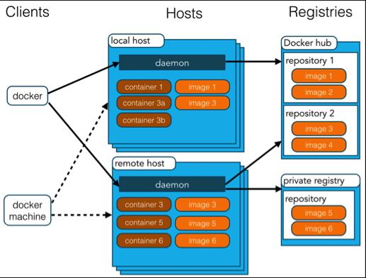

# 参考资料
> [https://www.runoob.com/docker/docker-tutorial.html](https://www.runoob.com/docker/docker-tutorial.html)
> [https://www.runoob.com/docker/docker-resources.html](https://www.runoob.com/docker/docker-resources.html)

# Docker 简介
Docker 是一个开源的应用容器引擎，基于 Go 语言 并遵从 Apache2.0 协议开源。

Docker 可以让开发者打包他们的应用以及依赖包到一个轻量级、可移植的容器中，然后发布到任何流行的 Linux 机器上，也可以实现虚拟化。

容器是完全使用沙箱机制，相互之间不会有任何接口（类似 iPhone 的 app）,更重要的是容器性能开销极低。

Docker 从 17.03 版本之后分为 CE（Community Edition: 社区版） 和 EE（Enterprise Edition: 企业版），我们用社区版就可以了。

# Docker 应用场景
+ Web 应用的自动化打包和发布。
+ 自动化测试和持续集成、发布。
+ 在服务型环境中部署和调整数据库或其他的后台应用。
+ 从头编译或者扩展现有的 OpenShift 或 Cloud Foundry 平台来搭建自己的 PaaS 环境。

# Docker 的优点
Docker 是一个用于开发，交付和运行应用程序的开放平台。
Docker 使您能够将应用程序与基础架构分开，从而可以快速交付软件。
借助 Docker，可以用管理应用程序相同的方式来管理基础架构。
通过利用 Docker 的方法来快速交付，测试和部署代码，您可以大大减少编写代码和在生产环境中运行代码之间的延迟。

## 快速，一致地交付您的应用程序
Docker 允许开发人员使用您提供的应用程序或服务的本地容器在标准化环境中工作，从而简化了开发的生命周期。

容器非常适合持续集成和持续交付（CI / CD）工作流程，请考虑以下示例方案：
+ 您的开发人员在本地编写代码，并使用 Docker 容器与同事共享他们的工作。
+ 他们使用 Docker 将其应用程序推送到测试环境中，并执行自动或手动测试。
+ 当开发人员发现错误时，他们可以在开发环境中对其进行修复，然后将其重新部署到测试环境中，以进行测试和验证。
+ 测试完成后，将修补程序推送给生产环境，就像将更新的镜像推送到生产环境一样简单。

## 响应式部署和扩展
Docker 是基于容器的平台，允许高度可移植的工作负载。
Docker 容器可以在开发人员的本机上，数据中心的物理或虚拟机上，云服务上或混合环境中运行。
Docker 的可移植性和轻量级的特性，还可以使您轻松地完成动态管理的工作负担，并根据业务需求指示，实时扩展或拆除应用程序和服务。

## 在同一硬件上运行更多工作负载
Docker 轻巧快速。它为基于虚拟机管理程序的虚拟机提供了可行、经济、高效的替代方案，因此您可以利用更多的计算能力来实现业务目标。
Docker 非常适合于高密度环境以及中小型部署，而您可以用更少的资源做更多的事情。

# Docker 架构
## Docker 包括三个基本概念:
+ 镜像（Image）：Docker 镜像（Image），就相当于是一个 root 文件系统。比如官方镜像 ubuntu:16.04 就包含了完整的一套 Ubuntu16.04 最小系统的 root 文件系统。
+ 容器（Container）：镜像（Image）和容器（Container）的关系，就像是面向对象程序设计中的类和实例一样，镜像是静态的定义，容器是镜像运行时的实体。
+ 仓库（Repository）：仓库可看成一个代码控制中心，用来保存镜像。


+ Docker 仓库中心(Registry)：
	Docker 仓库用来保存镜像，可以理解为代码控制中的代码仓库。
	Docker Hub(https://hub.docker.com) 提供了庞大的镜像集合供使用。
	一个 Docker Registry 中可以包含多个仓库（Repository）；每个仓库可以包含多个标签（Tag）；每个标签对应一个镜像。
	通常，一个仓库会包含同一个软件不同版本的镜像，而标签就常用于对应该软件的各个版本。
	我们可以通过 <仓库名>:<标签> 的格式来指定具体是这个软件哪个版本的镜像。
	如果不给出标签，将以 latest 作为默认标签。

+ Docker 镜像(Images)：
	Docker 镜像是用于创建 Docker 容器的模板，比如 Ubuntu 系统。

+ Docker 容器(Container)：
	容器是独立运行的一个或一组应用，是镜像运行时的实体。

+ Docker 主机(Host)：
	一个物理或者虚拟的机器用于执行 Docker 守护进程和容器。
	
+ Docker 客户端(Client)：
	Docker 客户端通过命令行或者其他工具使用 Docker SDK (https://docs.docker.com/develop/sdk/) 与 Docker 的守护进程通信。

+ Docker Machine：
	Docker Machine是一个简化Docker安装的命令行工具，通过一个简单的命令行即可在相应的平台上安装Docker，比如VirtualBox、 Digital Ocean、Microsoft Azure。
	
# Docker 安装
+ [在Windows上安装Docker Desktop](https://docs.docker.com/docker-for-windows/install/)
+ [在Windows Home上安装Docker Desktop](https://docs.docker.com/docker-for-windows/install-windows-home/)
+ [在Mac上安装Docker Desktop](https://docs.docker.com/docker-for-mac/install/)

Windows 10 Home机器必须满足以下要求才能安装Docker Desktop：
+ 安装Windows 10版本2004或更高版本。参考 [Windows 10 更新助手](https://support.microsoft.com/zh-cn/help/3159635/windows-10-update-assistant)。
+ 在Windows上启用WSL 2功能。有关详细说明，请参阅Microsoft文档 [适用于 Linux 的 Windows 子系统安装指南](https://docs.microsoft.com/zh-cn/windows/wsl/install-win10)。
+ 要在Windows 10 Home上成功运行WSL 2，需要满足以下硬件先决条件：
	+ 具有二级地址转换（SLAT）的 64位处理器
	+ 4GB系统内存
	+ 必须在BIOS设置中启用BIOS级硬件虚拟化支持。有关更多信息，请参见 虚拟化。参考[启动BIOS的虚拟化设置](https://jingyan.baidu.com/article/ab0b56305f2882c15afa7dda.html)。
+ 下载并安装 [Linux内核更新程序包](https://docs.microsoft.com/zh-cn/windows/wsl/wsl2-kernel)。

# Docker 镜像加速器
## 镜像加速器地址
+ 官方中国加速器：https://registry.docker-cn.com
+ 阿里云的加速器：https://help.aliyun.com/document_detail/60750.html
+ 网易加速器：http://hub-mirror.c.163.com
+ ustc 的镜像：https://docker.mirrors.ustc.edu.cn
+ daocloud：https://www.daocloud.io/mirror#accelerator-doc（注册后使用）

阿里云镜像获取地址：https://cr.console.aliyun.com/cn-hangzhou/instances/mirrors，登陆后，左侧菜单选中镜像加速器就可以看到你的专属地址了。

## 配置镜像加速器
### Windows 10
对于使用 Windows 10 的系统，在系统右下角托盘 Docker 图标内右键菜单选择 Settings，打开配置窗口后左侧导航菜单选择 Daemon。
在 Registrymirrors 一栏中填写加速器地址 https://registry.docker-cn.com ，之后点击 Apply 保存后 Docker 就会重启并应用配置的镜像地址了。


### Mac OS X
对于使用 Mac OS X 的用户，在任务栏点击 Docker for mac 应用图标-> Perferences...-> Daemon-> Registrymirrors。
在列表中填写加速器地址 https://reg-mirror.qiniu.com 。修改完成之后，点击 Apply&Restart 按钮，Docker 就会重启并应用配置的镜像地址了。

## 检查镜像加速器是否生效
检查加速器是否生效配置加速器之后，如果拉取镜像仍然十分缓慢，请手动检查加速器配置是否生效，在命令行执行 docker info，如果从结果中看到了如下内容，说明配置成功。
```
$ docker info
Registry Mirrors:
    https://reg-mirror.qiniu.com
```
