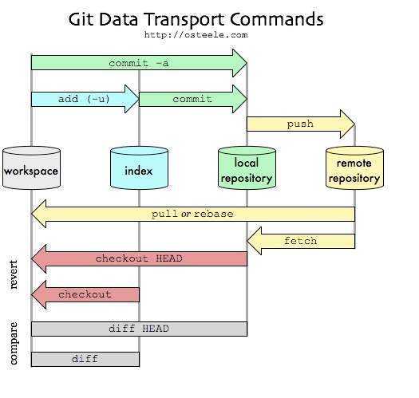
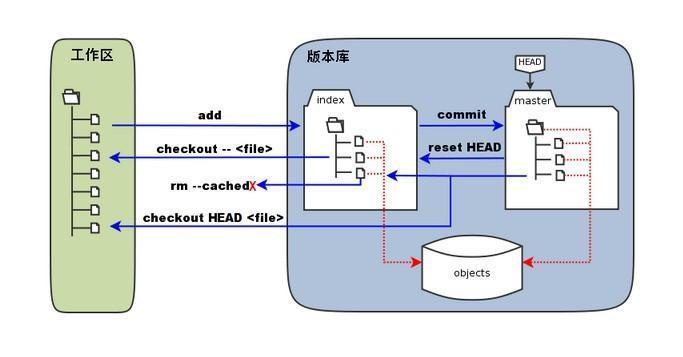

# Git 安装配置
在使用Git前我们需要先安装 Git。Git 目前支持 Linux/Unix、Solaris、Mac和 Windows 平台上运行。

Git 各平台安装包下载地址为：http://git-scm.com/downloads。

# Git 工作流程
一般工作流程如下：
- 克隆 Git 资源作为工作目录。
- 在克隆的资源上添加或修改文件。
- 如果其他人修改了，你可以更新资源。
- 在提交前查看修改。!!!
- 提交修改。
- 在修改完成后，如果发现错误，可以撤回提交并再次修改并提交。

操作流程指令图：


# Git 工作区、暂存区和版本库

## 基本概念
- 工作区：就是你在电脑里能看到的目录。
- 暂存区：英文叫stage, 或index。一般存放在 ".git目录下" 下的index文件（.git/index）中，所以我们把暂存区有时也叫作索引（index）。
- 版本库：工作区有一个隐藏目录.git，这个不算工作区，而是Git的版本库。

## 工作区、版本库中的暂存区和版本库之间的关系：
![工作区、版本库中的暂存区和版本库之间的关系]
- 图中左侧为工作区，右侧为版本库。在版本库中标记为 "index" 的区域是暂存区（stage, index），标记为 "master" 的是 master 分支所代表的目录树。
- 图中我们可以看出此时 "HEAD" 实际是指向 master 分支的一个"游标"。所以图示的命令中出现 HEAD 的地方可以用 master 来替换。
- 图中的 objects 标识的区域为 Git 的对象库，实际位于 ".git/objects" 目录下，里面包含了创建的各种对象及内容。
- 当对工作区修改（或新增）的文件执行 "git add" 命令时，暂存区的目录树被更新，同时工作区修改（或新增）的文件内容被写入到对象库中的一个新的对象中，而该对象的ID被记录在暂存区的文件索引中。
- 当执行提交操作（git commit）时，暂存区的目录树写到版本库（对象库）中，master 分支会做相应的更新。即 master 指向的目录树就是提交时暂存区的目录树。
- 当执行 "git reset HEAD" 命令时，暂存区的目录树会被重写，被 master 分支指向的目录树所替换，但是工作区不受影响。
- 当执行 "git rm --cached <file>" 命令时，会直接从暂存区删除文件，工作区则不做出改变。
- 当执行 "git checkout ." 或者 "git checkout -- <file>" 命令时，会用暂存区全部或指定的文件替换工作区的文件。这个操作很危险，会清除工作区中未添加到暂存区的改动。
- 当执行 "git checkout HEAD ." 或者 "git checkout HEAD <file>" 命令时，会用 HEAD 指向的 master 分支中的全部或者部分文件替换暂存区和以及工作区中的文件。这个命令也是极具危险性的，因为不但会清除工作区中未提交的改动，也会清除暂存区中未提交的改动。

# Git 基本操作
## git init
用 git init 在目录中创建新的 Git 仓库。 你可以在任何时候、任何目录中这么做，完全是本地化的。
```
$ git init
$ git init newrepo
```

## git clone
使用 git clone 拷贝一个 Git 仓库到本地，让自己能够查看该项目，或者进行修改。
```
$ git clone <repo> <directory>
$ git clone git://github.com/schacon/grit.git
$ git clone git://github.com/schacon/grit.git mygrit
$ git clone git@github.com:fsliurujie/test.git        --SSH协议
$ git clone git://github.com/fsliurujie/test.git          --GIT协议
$ git clone https://github.com/fsliurujie/test.git      --HTTPS协议
```

## git status
git status 以查看在你上次提交之后是否有修改。

加了 -s 参数，获得简短的结果输出。
```
$ git status
$ git status -s
```

## git diff
执行 git diff 来查看执行 git status 的结果的详细信息。

git diff 命令显示已写入缓存与已修改但尚未写入缓存的改动的区别。git diff 有两个主要的应用场景。
- 尚未缓存的改动：git diff
- 查看已缓存的改动： git diff --cached
- 查看已缓存的与未缓存的所有改动：git diff HEAD
- 显示摘要而非整个 diff：git diff --stat

```
$ git diff
```

## git add
git add 命令可将该文件添加到缓存。
```
$ touch README
$ touch hello.php
$ ls
README        hello.php

$ git status -s
?? README
?? hello.php
$ git add README hello.php

或者

$ git add .
$ git status -s
A  README
A  hello.php
```

## 配置名字与电子邮箱地址
Git 为你的每一个提交都记录你的名字与电子邮箱地址，所以第一步需要配置用户名和邮箱地址。

```
$ git config --global user.name 'runoob'
$ git config --global user.email test@runoob.com
```

## git commit
使用 git add 命令将想要快照的内容写入缓存区， 而执行 git commit 将缓存区内容添加到仓库中。

使用 -m 选项以在命令行中提供提交注释。
```
$ git commit -m '第一次版本提交'
```

如果觉得 git add 提交缓存的流程太过繁琐，Git 也允许你用 -a 选项跳过这一步。
```
$ git commit -am '修改 hello.php 文件'
```

## git reset HEAD
git reset HEAD 命令用于取消已缓存(已add)的内容。

```
$ git status -s
M README
M hello.php

$ git add .
$ git status -s
M  README
M  hello.php

$ git reset HEAD hello.php
```

## git rm
如果只是简单地从工作目录中手工删除文件，运行 git status 时就会在 Changes not staged for commit 的提示。

要从 Git 中移除某个文件，就必须要从已跟踪文件清单中移除，然后提交。
```
git rm <file>
```

如果删除之前修改过并且已经放到暂存区域的话，则必须要用强制删除选项 -f
```
git rm -f <file>
```

如果把文件从暂存区域移除，但仍然希望保留在当前工作目录中，换句话说，仅是从跟踪清单中删除，使用 --cached 选项即可
```
git rm --cached <file>
```

## git mv
git mv 命令用于移动或重命名一个文件、目录、软连接。

# Git 分支管理
## 列出分支
列出分支基本命令：
```
git branch
```

没有参数时，git branch 会列出你在本地的分支。

```
$ git branch
* master
```

此例的意思就是，我们有一个叫做 master 的分支，并且该分支是当前分支。

当你执行 git init 的时候，缺省情况下 Git 就会为你创建 master 分支。

## 创建分支
```
git branch (branchname)
```

## 切换分支
```
git checkout (branchname)
```

## 合并分支
```
git merge
```

```
$ git branch
* master
  newtest

$ git merge newtest
```

## 删除分支
删除分支命令：
```
git branch -d (branchname)
```

## 合并冲突

# Git 查看提交历史
```
$ git log
```

# Git 标签
## 列出标签
```
$ git tag
```

## 创建标签
```
git tag <tagname>
```

标签默认打在HEAD，即最新提交的commit id：
```
$ git tag v1.0
```

指定commit id：
```
$ git tag v0.9 f52c633
```

创建带有说明的标签，用-a指定标签名，-m指定说明文字：
```
$ git tag -a v0.1 -m "version 0.1 released" 1094adb
```

推送标签到远程仓库：
```
$ git push origin v1.0
```

# Git 远程仓库(Github)
## 配置验证信息
由于你的本地 Git 仓库和 GitHub 仓库之间的传输是通过SSH加密的，所以我们需要配置验证信息，使用以下命令生成 SSH Key：
```
$ ssh-keygen -t rsa -C "youremail@example.com"
```

后面的 your_email@youremail.com 改为你在 Github 上注册的邮箱，之后会要求确认路径和输入密码，我们这使用默认的一路回车就行。成功的话会在 ~/ 下生成 .ssh 文件夹，进去，打开 id_rsa.pub，复制里面的 key。回到 github 上，进入 Account => Settings（账户配置）。

为了验证是否成功，输入以下命令：

```
$ ssh -T git@github.com
Hi tianqixin! You've successfully authenticated, but GitHub does not provide shell access.
```

## 查看远程库
```
git remote
```

执行时加上 -v 参数，你还可以看到每个别名的实际链接地址。

```
$ git remote
origin
$ git remote -v
origin    git@github.com:tianqixin/runoob-git-test.git (fetch)
origin    git@github.com:tianqixin/runoob-git-test.git (push)
```

## 添加远程库
要添加一个新的远程仓库，可以指定一个简单的名字，以便将来引用,命令格式如下：
```
git remote add [shortname] [url]
```

```
$ git remote add origin git@github.com:tianqixin/runoob-git-test.git # 添加远程库
$ git push -u origin master # 提交到 Github
$ git push origin master
```

## 删除远程仓库
删除远程仓库你可以使用命令：

```
git remote rm [别名]
```

```
添加仓库 origin2
$ git remote add origin2 git@github.com:tianqixin/runoob-git-test.git
删除仓库 origin2
$ git remote rm origin2
```

## 提取远程仓库
Git 有两个命令用来提取远程仓库的更新。

1、从远程仓库下载新分支与数据：

```
git fetch
```

该命令执行完后需要执行git merge 远程分支到你所在的分支。

2、从远端仓库提取数据并尝试合并到当前分支：
```
git merge
```

该命令就是在执行 git fetch 之后紧接着执行 git merge 远程分支到你所在的任意分支。

假设你配置好了一个远程仓库，并且你想要提取更新的数据，你可以首先执行 git fetch [alias] 告诉 Git 去获取它有你没有的数据，然后你可以执行 git merge [alias]/[branch] 以将服务器上的任何更新（假设有人这时候推送到服务器了）合并到你的当前分支。

```
$ git fetch origin
$ git merge origin/master
```

## 推送到远程仓库
推送你的新分支与数据到某个远端仓库命令:

```
git push [alias] [branch]
```

以上命令将你的 [branch] 分支推送成为 [alias] 远程仓库上的 [branch] 分支，实例如下。

```
$ git push origin master    # 推送到 Github
```

## 从远程仓库更新

要更新你的本地仓库至最新改动，执行：

```
git pull [alias] [branch]
```

以在你的工作目录中 获取（fetch） 并 合并（merge） 远端的改动。

要合并其他分支到你的当前分支（例如 master），执行：

```
git merge <branch>
```

在这两种情况下，git 都会尝试去自动合并改动。遗憾的是，这可能并非每次都成功，并可能出现冲突（conflicts）。 这时候就需要你修改这些文件来手动合并这些冲突（conflicts）。改完之后，你需要执行如下命令以将它们标记为合并成功：

```
git add <filename>
```

在合并改动之前，你可以使用如下命令预览差异：

```
git diff <source_branch> <target_branch>
```

## 替换本地改动
假如你操作失误（当然，这最好永远不要发生），你可以使用如下命令替换掉本地改动：

```
git checkout -- <filename>
```

此命令会使用 HEAD 中的最新内容替换掉你的工作目录中的文件。已添加到暂存区的改动以及新文件都不会受到影响。

假如你想丢弃你在本地的所有改动与提交，可以到服务器上获取最新的版本历史，并将你本地主分支指向它：

```
git fetch origin
git reset --hard origin/master
```