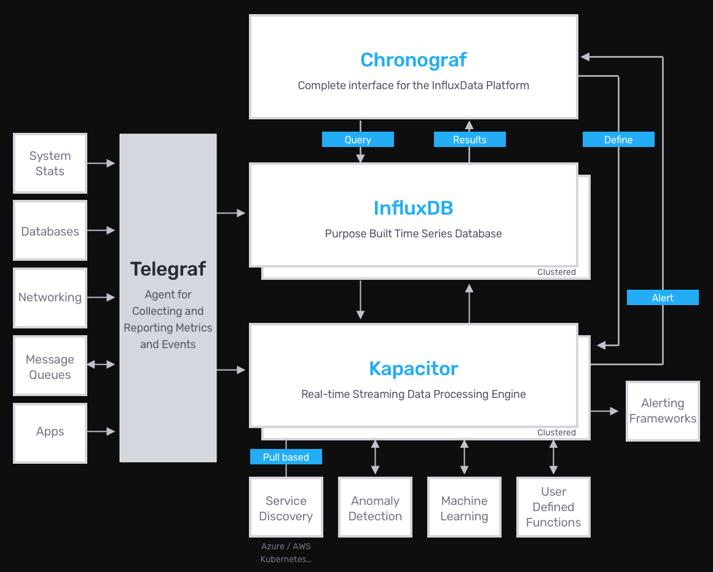

# 参考资料
+ [influxdata 介绍](https://www.influxdata.com/products/)
+ [influxdata 文档](https://docs.influxdata.com)
+ [telegraf 介绍](https://www.influxdata.com/time-series-platform/telegraf/)
+ [telegraf 文档](https://docs.influxdata.com/telegraf/v1.13/)
+ [telegraf 下载](https://www.influxdata.com/get-influxdb/)

2020-01-20T09:25:12Z^rtc^call^10.10.112.162^1^call_end^1579512312247^tid123^1^7b7a53e239400a13bd6be6c91c4f6c4e^789704014323510800^5d807fcdac9ed83aa1826b28^1^1^0x0^0^789704014323510800

# Telegraf概述
Telegraf是开源服务器代理，可从堆栈，传感器和系统中收集指标。

## Telegraf介绍
Telegraf是一个插件驱动的服务器代理，用于从数据库，系统和IoT传感器收集和发送指标和事件。 

Telegraf是用Go语言编写的，可以编译成一个没有外部依赖性的二进制文件，并且占用的内存非常少。

Telegraf是influxdata公司的时间序列平台TICK技术栈中的“T”，主要用于收集时间序列型数据，比如服务器CPU指标、内存指标、各种IoT设备产生的数据等等。



## Telegraf优势
收集并发送各种数据：
+ 数据库：连接到MongoDB，MySQL，Redis等数据源，以收集和发送指标。
+ 系统：从现代的云平台，容器和业务流程堆栈中收集指标。
+ 物联网传感器：从物联网传感器和设备收集关键的状态数据（压力水平，温度水平等）。

代理：
Telegraf可以从各种各样的输入中收集指标并将其写入各种各样的输出中。
它是由插件驱动的，用于数据的收集和输出，因此易于扩展。
它是用Go语言编写的，这意味着它是一个编译的独立二进制文件，可以在任何系统上执行，而无需外部依赖，不需要npm，pip，gem或其他程序包管理工具。

覆盖范围：
主题专家已针对社区中的数据编写了200多个插件，可以轻松地从端点开始收集指标。
更好的是，插件开发的简便性意味着您可以构建自己的插件来满足您的监视需求。
您甚至可以使用Telegraf将输入数据格式解析为指标。其中包括：InfluxDB线路协议，JSON，石墨，Value，Nagios和Collected。

灵活：
Telegraf插件体系结构支持您的流程，不会强迫您更改工作流程以使用该技术。
无论您是需要将其放置在边缘还是集中放置，它都只适合您的体系结构，而不是相反。
Telegraf的灵活性使其易于实施。

# Filebeat下载
OS X (via Homebrew)
```
brew update
brew install telegraf
```

Docker Image
```
docker pull telegraf
```

Ubuntu & Debian SHA256: 7b857c955f2f83085d8419c58a0cfb83e5e0263736144227a94aed05f04f5168
```
wget https://dl.influxdata.com/telegraf/releases/telegraf_1.13.1-1_amd64.deb
sudo dpkg -i telegraf_1.13.1-1_amd64.deb
```

RedHat & CentOS SHA256: 2a7abddeea7c200dc7d9d23a5eb97d5c0d8d45dad105555b6e250a048a78a70a
```
wget https://dl.influxdata.com/telegraf/releases/telegraf-1.13.1-1.x86_64.rpm
sudo yum localinstall telegraf-1.13.1-1.x86_64.rpm
```

Windows Binaries (64-bit) SHA256: 469b43411e844368db8c81c1b09136e6b52ac4a853bda7894bbfb903e3a05975
```
wget https://dl.influxdata.com/telegraf/releases/telegraf-1.13.1_windows_amd64.zip
unzip telegraf-1.13.1_windows_amd64.zip
```

Linux Binaries (64-bit) SHA256: 6f47a744d67dae70df6a46998db7b7deb34776f7478a3e08a40a8ede49224858
```
wget https://dl.influxdata.com/telegraf/releases/telegraf-1.13.1_linux_amd64.tar.gz
tar xf telegraf-1.13.1_linux_amd64.tar.gz
```

Linux Binaries (32-bit) SHA256: 2c3aaa21786d67e24067a06e54f552c099e15ba106ac8881f59f64cbb9ed1099
```
wget https://dl.influxdata.com/telegraf/releases/telegraf-1.13.1_linux_i386.tar.gz
tar xf telegraf-1.13.1_linux_i386.tar.gz
```

Linux Binaries (ARM) SHA256: 4f4af3a94a4c158519d392aa258ef748b9ef21917549a4f7477cdb86f598227e
```
wget https://dl.influxdata.com/telegraf/releases/telegraf-1.13.1_linux_armhf.tar.gz
tar xf telegraf-1.13.1_linux_armhf.tar.gz
```

# Filebeat命令
## 语法
```
telegraf [commands|flags]
```

## 指令和参数
config              print out full sample configuration to stdout
version             print the version to stdout

--aggregator-filter <filter>   filter the aggregators to enable, separator is :
--config <file>                configuration file to load
--config-directory <directory> directory containing additional *.conf files
--debug                        turn on debug logging
--input-filter <filter>        filter the inputs to enable, separator is :
--input-list                   print available input plugins.
--output-filter <filter>       filter the outputs to enable, separator is :
--output-list                  print available output plugins.
--pidfile <file>               file to write our pid to
--pprof-addr <address>         pprof address to listen on, don't activate pprof if empty
--processor-filter <filter>    filter the processors to enable, separator is :
--quiet                        run in quiet mode
--sample-config                print out full sample configuration
--section-filter               filter config sections to output, separator is :
                               Valid values are 'agent', 'global_tags', 'outputs',
                               'processors', 'aggregators' and 'inputs'
--test                         gather metrics, print them out, and exit;
                               processors, aggregators, and outputs are not run
--test-wait                    wait up to this many seconds for service
                               inputs to complete in test mode
--usage <plugin>               print usage for a plugin, ie, 'telegraf --usage mysql'
--version                      display the version and exit

--console                      run as console application (windows only)
--service <service>            operate on the service (windows only)
--service-name                 service name (windows only)
--service-display-name         service display name (windows only)

## 示列
生成配置文件
```
telegraf config > telegraf.conf
```

生成配置文件，只定义cpu输入插件和influxdb输出插件
```
telegraf --input-filter cpu --output-filter influxdb config > telegraf-test.conf
```

运行telegraf，将数据输出到stdout
```
telegraf --config telegraf.conf --test
```

运行telegraf，使用配置文件中定义的所有插件
```
telegraf --config telegraf.conf
```

运行telegraf，启用cpu和内存输入以及influxdb输出插件
```
telegraf --config telegraf.conf --input-filter cpu:mem --output-filter influxdb
```

运行telegraf，使用pprof
```
telegraf --config telegraf.conf --pprof-addr localhost:6060
```

运行telegraf，在没有服务控制器的情况下
```
telegraf --console install --config "C:\Program Files\Telegraf\telegraf.conf"
```

安装telegraf服务
```
telegraf --service install --config "C:\Program Files\Telegraf\telegraf.conf"
```

安装telegraf服务，使用自定义名称
```
telegraf --service install --service-name=my-telegraf --service-display-name="My Telegraf"
```
