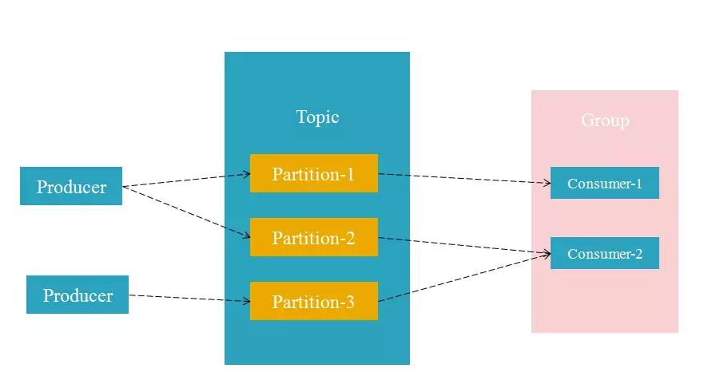

# 参考连接
[在Windows下安装使用Kafka](https://www.jianshu.com/p/ce203d4e2f41)

# Kafka简介
Kafka异军突起，是近来非常火热的一款**消息中间件**。消息中间件的作用非常多，常用作系统业务的解耦。例如最常听到的秒杀业务，我们也能使用消息中间件对业务进行解耦，用户发起秒杀请求后，系统首先会将该请求转发到中间件中，然后返回一个等待的结果(用户界面显示正在抢购，请耐心等待)，而我们系统会有监听器去接收这些秒杀请求进行对应的业务处理，最重要的是，整个系统的扩展显得非常简单，我们只需要部署Kafka的集群，以及后台的负载均衡就能快速提高系统的访问并发量。

Kafka的最大的特点就是**高吞吐量**以及**可水平扩展**，正因这两点Kafka非常适合处理数据量庞大的业务，例如使用Kafka做日志分析、数据计算。新版本Kafka也推出了Stream API，可以更好的支持数据流处理。基于这些特性我们可以实现非常多的系统功能。

# Kafka安装
## 下载
下载地址: [http://kafka.apache.org/downloads.html](http://kafka.apache.org/downloads.html)

## 安装
注意：**安装目录不可以有空格**

# Kafka使用

# 消息系统
- 点对点
- 发布订阅

## 点对点消息系统
以下模型为点对点消息系统的模型，简单来说就是生产者（Producer）发送消息到队列，消费者（Consumer）从队列中取出消息。这种模型的特点就是一条消息只会被一个消费者接收，一但有消费者消费了这条消息，其他消费者就没办法重复消费了。

## 发布-订阅消息系统
发布订阅的模型也比较好理解，首先消费者需要订阅这个队列，生产者只要发送一条消息到队列中，所有已订阅该队列的的消费者都能接收到该消息，未订阅的用户则无法接收。就像我们的微信关注微信公众号一样，只有关注了的用户才会收到公众号推送的消息。

# Kafka几个主要的概念

## Broker
Broker为节点的意思，我们启动的单个Kafka实例则为一个Broker，多个Broker可以组成Kafka集群

## Topic
Topic为主题的意思，也就是相当于消息系统中的队列(queue)，一个Topic中存在多个Partition

## Partition
Partition为分区的意思，是构成Kafka存储结构的最小单位

## Partition offset
offset为消息偏移量，以Partition为单位，即使在同一个Topic中，不同Partition的offset也是重新开始计算(也就是会重复)

## Group
Group为消费者组的意思，一个Group里面包含多个消费者

## Message
Message为消息的意思，是队列中消息的承载体，也就是通信的基本单位，Producer可以向Topic中发送Message

## 这里就需要说说为什么这样设计了：
首先Topic中有分区的概念，每个分区保存各自的数据，而我们的Group这对应着Topic，也就是这个Topic中的数据都是由该Group去消费，也就是允许多个消费者同时消费，这样能大大提高Kafka的吞吐量。不过这样的设计也会带来不少的不便，比如特定场景下你需要去维护多个Partition之间的关系。这里就不多讲了。