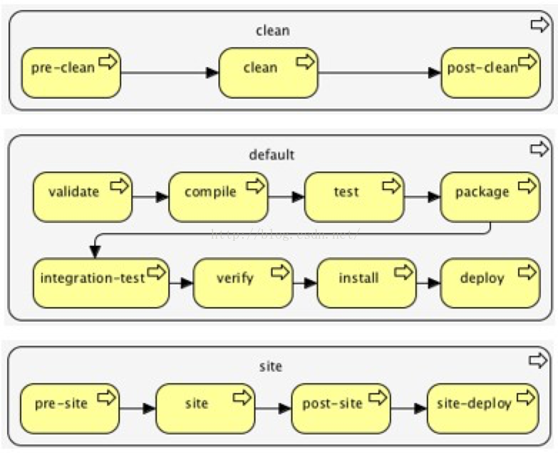

# Maven 生命周期
我们在开发项目的时候，不断地在编译、测试、打包、部署等过程，maven的生命周期就是对所有构建过程抽象与统一。
生命周期包含项目的清理、初始化、编译、测试、打包、集成测试、验证、部署、站点生成等几乎所有的过程。

Maven有三套**相互独立**的生命周期，请注意这里说的是“三套”，而且“相互独立”。这三套生命周期分别是：
- CleanLifecycle 在进行真正的构建之前进行一些清理工作。
- DefaultLifecycle 构建的核心部分，编译，测试，打包，部署等等。
- SiteLifecycle 生成项目报告，站点，发布站点。

再次强调一下它们是相互独立的，可以仅仅调用clean来清理工作目录，仅仅调用site来生成站点。
当然也可以直接运行**“mvn clean install site”**运行所有这三套生命周期。

每套生命周期都由一组阶段(Phase)组成，我们平时在命令行输入的命令总会对应于一个特定的阶段。
maven中所有的执行动作(goal)都需要指明自己在这个过程中的执行位置，然后maven执行的时候，就依照过程的发展依次调用这些goal进行各种处理。

**有一些与 Maven 生命周期相关的重要概念需要说明：**
- 当一个阶段通过 Maven 命令调用时，例如 mvn compile，只有该阶段之前以及包括该阶段在内的所有阶段会被执行。
- 不同的 maven 目标将根据打包的类型（JAR / WAR / EAR），被绑定到不同的 Maven 生命周期阶段。

# Clean 生命周期
Clean生命周期一共包含了三个阶段：
- pre-clean：执行一些需要在clean之前完成的工作
- clean：移除所有上一次构建生成的文件
- post-clean：执行一些需要在clean之后立刻完成的工作

命令“mvn clean”中的就是代表执行上面的clean阶段。

在一个生命周期中，运行某个阶段的时候，它之前的所有阶段都会被运行。

也就是说，“mvn clean” 等同于 “mvn pre-clean clean” ，如果我们运行“mvn post-clean” ，那么 “pre-clean”，“clean” 都会被运行。

# Default (Build) 生命周期
Maven最重要就是的Default生命周期，也称构建生命周期，绝大部分工作都发生在这个生命周期中，每个阶段的名称与功能如下：
validate：验证项目是否正确，以及所有为了完整构建必要的信息是否可用
generate-sources：生成所有需要包含在编译过程中的源代码
process-sources：处理源代码，比如过滤一些值
generate-resources：生成所有需要包含在打包过程中的资源文件
process-resources：复制并处理资源文件至目标目录，准备打包
compile：编译项目的源代码
process-classes：后处理编译生成的文件，例如对Java类进行字节码增强（bytecode enhancement）
generate-test-sources：生成所有包含在测试编译过程中的测试源码
process-test-sources：处理测试源码，比如过滤一些值
generate-test-resources

生成测试需要的资源文件

process-test-resources

复制并处理测试资源文件至测试目标目录

test-compile

编译测试源码至测试目标目录

test

使用合适的单元测试框架运行测试。这些测试应

该不需要代码被打包或发布

prepare-package

在真正的打包之前，执行一些准备打包必要的操

作

package

将编译好的代码打包成可分发的格式，如

JAR，WAR，或者EAR

pre-integration-test

执行一些在集成测试运行之前需要的动作。如建

立集成测试需要的环境

integration-test

如果有必要的话，处理包并发布至集成测试可以

运行的环境

post-integration-test

执行一些在集成测试运行之后需要的动作。如清

理集成测试环境。

verify

执行所有检查，验证包是有效的，符合质量规范

install

安装包至本地仓库，以备本地的其它项目作为依

赖使用

deploy

复制最终的包至远程仓库，共享给其它开发人员

# Site 生命周期
Maven Site 插件一般用来创建新的报告文档、部署站点等。
- pre-site：执行一些需要在生成站点文档之前完成的工作
- site：生成项目的站点文档
- post-site： 执行一些需要在生成站点文档之后完成的工作，并且为部署做准备
- site-deploy：将生成的站点文档部署到特定的服务器上