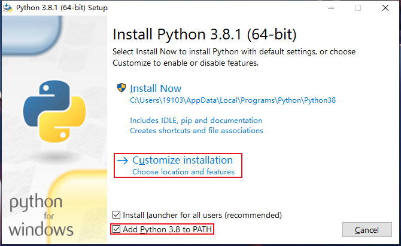
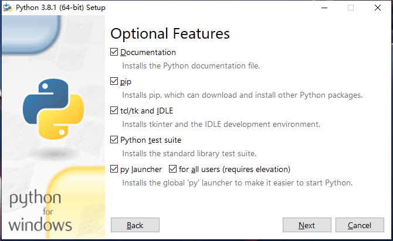
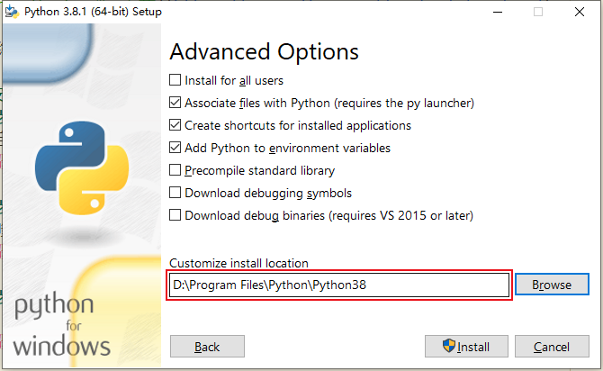
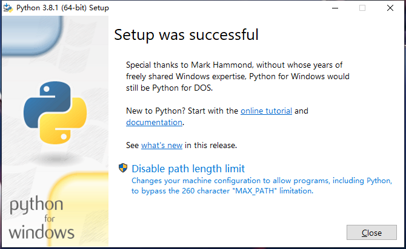
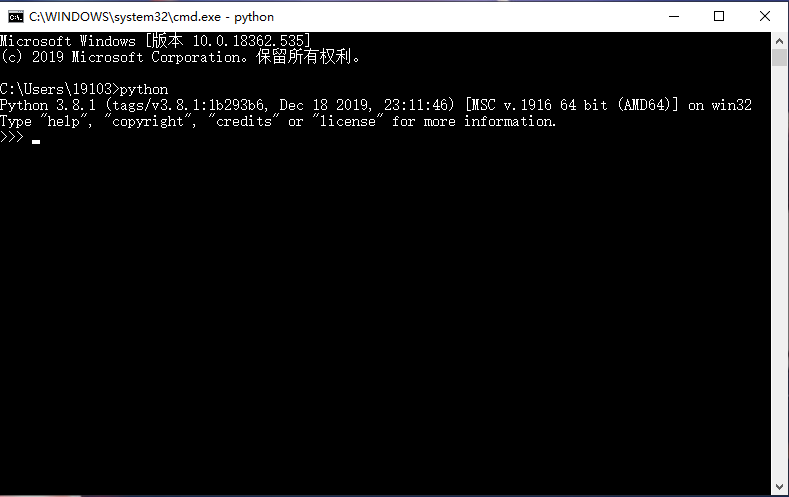
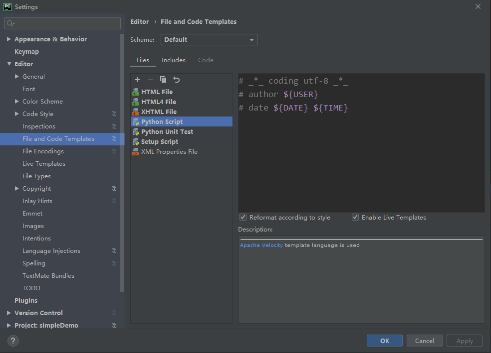
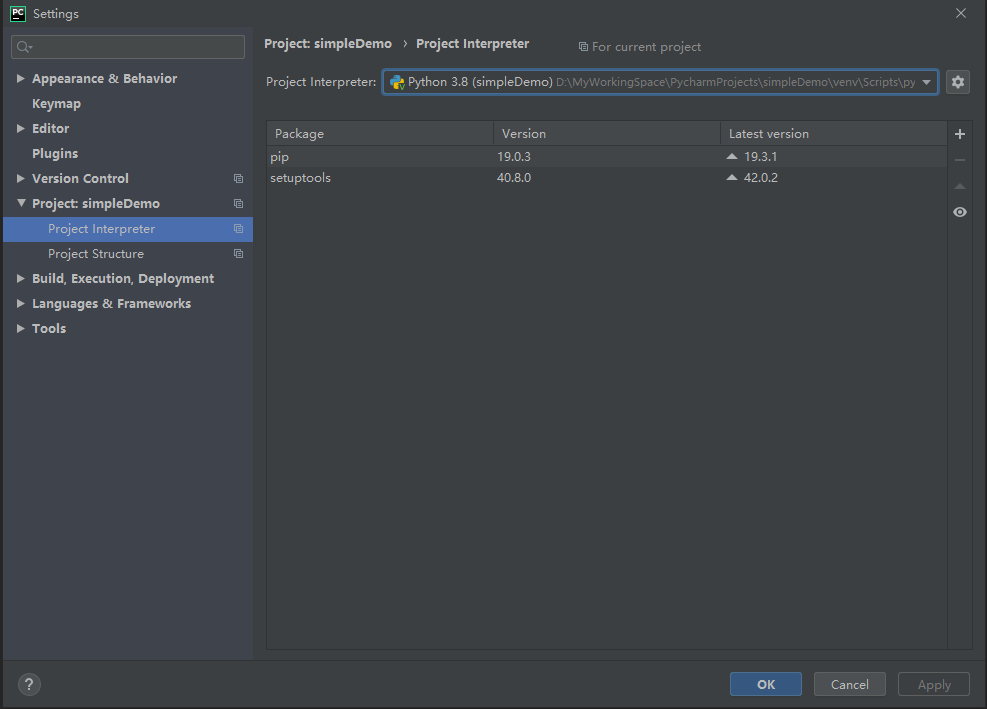

# 参考资料
+ [Python语言 2019年最新入门教程](https://www.bilibili.com/video/av76655827)

# Python概述
Python是面向对象的、解释型的程序设计语言。

## 设计理念
优雅、明确、简单。

人生苦短，我用Python。

## 特色
python拥有丰富强大的类库，而且能够将复杂的应用程序粘贴在一起，常作为“胶水”语言。

## 发展史
+ 1989年，Python种子播下。
+ 1991年，发布第一个正式版本。
+ 1994年，发布Python1.0。
+ 2000年，发布Python2.0。
+ 2008年，发布Python3.0。
+ 2018年8月，Python2.0更新至Python2.7.15版本，Python3.0更新至Python3.7版本。

## 版本选择
+ Python语言是**非向下兼容**的，Python2代码不能直接在Python3上运行。
+ Python3对标准库进行了重新拆分和整合。
+ Python3解决了Python2对中文支持不好的问题。
+ Python2只支持到2020年。

综上，推荐Python3。

## 应用领域
+ Web开发
+ 爬虫
+ 云计算
+ 人工智能
+ 大数据处理
+ 自动化运维开发
+ 游戏开发

# Python开发环境搭建
## 查看操作系统位数

## 下载Python安装包
[Python官网](https://www.python.org/)

[Python-Windows版-下载](https://www.python.org/downloads/windows/)

下载稳定版、离线版、安装版。示列：**Windows x86-64 executable installer**

## 安装步骤
### 步骤1 
选择自定义安装 Customize installation，并勾选 添加PATH。



### 步骤2
无需修改。



### 步骤3
修改安装路径。



### 步骤4
安装完成



### 步骤5
验证是否安装成功。

打开命令行，输入 python，出现如下提示即可。



同时，这个界面也是**交互式python解释器**。

# Python开发工具
## IDLE
安装python时，同时自动安装的Python Shell工具。

## PyCharm IDE
PyCharm IDE，即是PyCharm集成开发环境。

### PyCharm功能
+ 语法高亮显示
+ 代码跳转
+ 代码智能提示
+ 代码自动完成
+ 单元测试和版本控制
+ 代码调试
+ 支持Django框架下的web开发

### PyCharm下载
[jetbrains官网](https://www.jetbrains.com/)

[jetbrains官网（中文）](https://www.jetbrains.com/zh-cn/)

[pycharm下载](https://www.jetbrains.com/pycharm/)

选择下载社区版（免费），
**Community：For pure Python developmen**

### PyCharm安装
默认配置即可。

### PyCharm配置
#### 配置开发人员信息
打开Settings > File and Code Templates，为Python Script 添加模板，并启用模板。
```
# _*_ coding utf-8 _*_
# author ${USER}
# date ${DATE} ${TIME}
```


#### 设置Python解释器
打开Settings > Project > Project Interpreter，选择解释器版本。

