# 参考资料
> [Redis使用手册 黄健宏 2019-09](https://weread.qq.com/web/reader/75732070719551157574079)

# Redis简介
Redis是一个主要由Salvatore Sanfilippo（Antirez）开发的开源内存数据结构存储器，经常用作数据库、缓存以及消息代理等。

# Redis特色
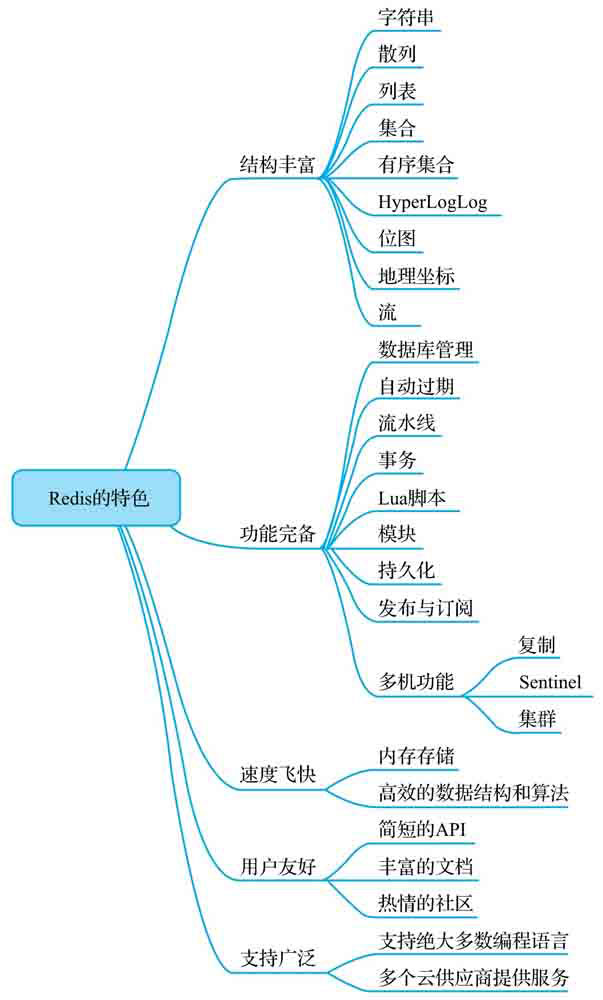

## 结构丰富
+ 字符串
+ 散列
+ 列表
+ 集合
+ 有序集合
+ HyperLogLog
+ 位图
+ 流
+ 地理坐标

## 功能完备
+ 数据库管理
+ 自动过期
+ 流水线
+ 事物
+ Lua脚本
+ 模块
+ 持久化
+ 发布与订阅
+ 多机功能
	+ 复制
	+ Sentinel（哨兵）
	+ 集群

## 速度飞快
+ 内存存储
+ 高效的数据结构和算法

## 用户友好
+ 简短的API
+ 丰富的文档
+ 热情的社区

## 支持广泛
+ 支持绝大多数编程语言
+ 多个云供应商提供服务

# 数据结构--------------------------------------------------

# 字符串 string
字符串（string）键是Redis最基本的键值对类型，这种类型的键值对会在数据库中把单独的一个键和单独的一个值关联起来，**被关联的键和值既可以是普通的文字数据，也可以是图片、视频、音频、压缩文件等更为复杂的二进制数据**。

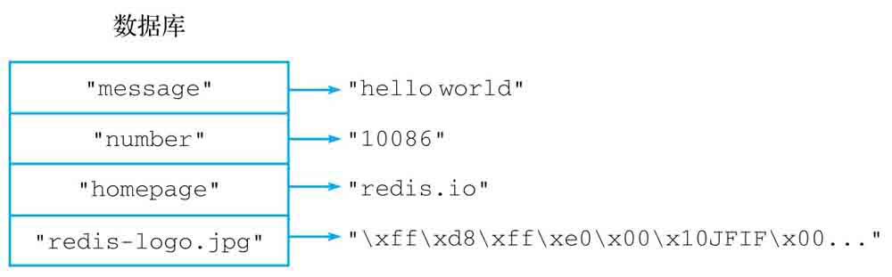

## SET 为字符串键设置值
创建字符串键最常用的方法就是使用SET命令，这个命令可以为一个字符串键设置相应的值。
```
SET key value
```
+ 这里的**键和值既可以是文字也可以是二进制数据**。
+ SET命令在成功创建字符串键之后将返回OK作为结果。

### 改变覆盖规则
在默认情况下，对一个已经设置了值的字符串键执行SET命令将导致键的旧值被新值覆盖。

从Redis 2.6.12版本开始，用户可以通过向SET命令提供可选的**NX选项或者XX选项**来指示SET命令是否要覆盖一个已经存在的值：
```
SET key value [NX|XX]
```
+ NX，SET命令只会在键没有值的情况下执行设置操作，并返回OK表示设置成功
+ XX，SET命令只会在键已经有值的情况下执行设置操作，并返回OK表示设置成功

复杂度：O(1)。

版本要求：不带任何可选项的SET命令从Redis 1.0.0版本开始可用；带有NX、XX等可选项的SET命令从Redis 2.6.12版本开始可用。

## GET：获取字符串键的值
用户可以使用GET命令从数据库中获取指定字符串键的值：
```
GET key
```
+ GET命令接受一个字符串键作为参数，然后返回与该键相关联的值
+ 给定的字符串键在数据库中并没有与之相关联的值，那么GET命令将返回一个空值(nil)

复杂度：O(1)。

版本要求：GET命令从Redis 1.0.0开始可用。

## GETSET：获取旧值并设置新值
GETSET命令就像GET命令和SET命令的组合版本，GETSET首先获取字符串键目前已有的值，接着为键设置新值，最后把之前获取到的旧值返回给用户：
```
GETSET key new_value
```
+ 如果被设置的键并不存在于数据库，那么GETSET命令将返回空值作为键的旧值

复杂度：O(1)。

版本要求：GETSET命令从Redis 1.0.0开始可用。

## MSET：一次为多个字符串键设置值
MSET命令可以一次为多个字符串键设置值：
```
MSET key value [key value ...]
```
+ MSET命令也会在执行设置操作之后返回OK表示设置成功
+ 如果给定的字符串键已经有相关联的值，那么MSET命令也会直接使用新值去覆盖已有的旧值

复杂度：O(N)，其中N为用户给定的字符串键数量。

版本要求：MSET命令从Redis 1.0.1开始可用。

## MGET：一次获取多个字符串键的值
MGET接受一个或多个字符串键作为参数，并返回这些字符串键的值：
```
MGET key [key ...]
```
+ MGET命令返回一个列表作为结果，这个列表按照用户执行命令时给定键的顺序排列各个键的值
+ 与GET命令一样，MGET命令在碰到不存在的键时也会返回空值

复杂度：O(N)，其中N为用户给定的字符串键数量。

版本要求：MGET命令从Redis 1.0.0开始可用。

## MSETNX：只在键不存在的情况下，一次为多个字符串键设置值
MSETNX命令与MSET命令一样，都可以对多个字符串键进行设置：
```
MSETNX key value [key value ...]
```
+ MSETNX命令在成功执行设置操作时返回1，在放弃执行设置操作时则返回0
+ MSETNX只会在所有给定键都不存在的情况下对键进行设置，而不会像MSET那样直接覆盖键已有的值

复杂度：O(N)，其中N为用户给定的字符串键数量。

版本要求：MSETNX命令从Redis 1.0.1开始可用。

## STRLEN：获取字符串值的字节长度
通过对字符串键执行STRLEN命令，用户可以取得字符串键存储的值的字节长度：
```
STRLEN key
```
+ 对于不存在的键，STRLEN命令将返回0

复杂度：O(1)。

版本要求：STRLEN命令从Redis 2.2.0开始可用。

## GETRANGE：获取字符串值指定索引范围上的内容
通过使用GETRANGE命令，用户可以获取字符串值从start索引开始，直到end索引为止的所有内容：
```
GETRANGE key start end
```
+ GETRANGE命令接受的是闭区间索引范围，也就是说，位于start索引和end索引上的值也会被包含在命令返回的内容当中

复杂度：O(N)，其中N为被返回内容的长度。

版本要求：GETRANGE命令从Redis 2.4.0开始可用。

## SETRANGE：对字符串值的指定索引范围进行设置
通过使用SETRANGE命令，用户可以将字符串键的值从索引index开始的部分替换为指定的新内容，被替换内容的长度取决于新内容的长度：
```
SETRANGE key index substitute
```
+ SETRANGE命令在执行完设置操作之后，会返回字符串值当前的长度作为结果
+ 当用户给定的新内容比被替换的内容更长时，SETRANGE命令就会自动扩展被修改的字符串值，从而确保新内容可以顺利写入
+ 当用户给定的index索引超出字符串值的长度时，字符串值末尾直到索引index-1之间的部分将使用空字节进行填充，换句话说，这些字节的所有二进制位都会被设置为0

复杂度：O(N)，其中N为被修改内容的长度。

版本要求：SETRANGE命令从Redis 2.2.0开始可用。

## APPEND：追加新内容到值的末尾
通过调用APPEND命令，用户可以将给定的内容追加到字符串键已有值的末尾：
```
APPEND key suffix
```
+ APPEND命令在执行追加操作之后，会返回字符串值当前的长度作为命令的返回值
+ 如果用户给定的键并不存在，那么APPEND命令会先将键的值初始化为空字符串""，然后再执行追加操作

复杂度：O(N)，其中N为新追加内容的长度。

版本要求：APPEND命令从Redis 2.0.0开始可用。

## INCRBY、DECRBY：对整数值执行加法操作和减法操作
INCRBY命令用于为整数值加上指定的整数增量，并返回键在执行加法操作之后的值：
```
INCRBY key increment
```
DECRBY命令用于为整数值减去指定的整数减量，并返回键在执行减法操作之后的值：
```
DECRBY key increment
```
+ 当字符串键的值不能被Redis解释为整数时，对键执行INCRBY命令或是DECRBY命令将返回一个错误
+ INCRBY和DECRBY的增量和减量也必须能够被Redis解释为整数，使用其他类型的值作为增量或减量将返回一个错误
+ 当INCRBY命令或DECRBY命令遇到不存在的键时，命令会先将键的值初始化为0，然后再执行相应的加法操作或减法操作

复杂度：O(1)。

版本要求：INCRBY命令和DECRBY命令从Redis 1.0.0开始可用。

## INCR、DECR：对整数值执行加1操作和减1操作
INCR命令的作用就是将字符串键存储的整数值加上1，效果相当于执行INCRBYkey 1：
```
INCR key
```
DECR命令的作用就是将字符串键存储的整数值减去1，效果相当于执行DECRBYkey 1：
```
DECR key
```

复杂度：O(1)。

版本要求：INCR命令和DECR命令从Redis 1.0.0开始可用。

## INCRBYFLOAT：对数字值执行浮点数加法操作
Redis还提供了用于执行浮点数加法操作的INCRBYFLOAT命令：
```
INCRBYFLOAT key increment
```
+ INCRBYFLOAT命令在遇到不存在的键时，会先将键的值初始化为0，然后再执行相应的加法操作
+ Redis没有INCRBYFLOAT命令相应的减法版本，因此用户只能通过给INCRBYFLOAT命令传入负数增量来执行浮点数减法操作
+ INCRBYFLOAT命令既可用于浮点数值，也可以用于整数值
+ INCRBYFLOAT命令的增量既可以是浮点数，也可以是整数
+ 当INCRBYFLOAT命令的执行结果可以表示为整数时，命令的执行结果将以整数形式存储
+ 使用INCRBYFLOAT命令处理浮点数的时候，命令最多只会保留计算结果小数点后的17位数字，超过这个范围的小数将被截断

复杂度：O(1)。

版本要求：INCRBYFLOAT命令从Redis 2.6.0开始可用。

## 字符串值的索引
因为每个字符串都是由一系列连续的字节组成的，所以字符串中的每个字节实际上都拥有与之相对应的索引。

Redis为字符串键提供了一系列索引操作命令，这些命令允许用户通过正数索引或者负数索引，对字符串值的某个字节或者某个部分进行处理，其中：
+ 字符串值的正数索引以0为开始，从字符串的开头向结尾不断递增
+ 字符串值的负数索引以-1为开始，从字符串的结尾向开头不断递减

字符串的索引示例：

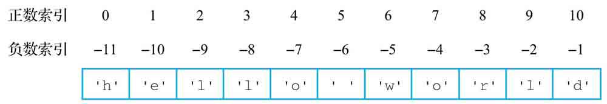

## 使用字符串键存储数字值
每当用户将一个值存储到字符串键里面的时候，Redis都会对这个值进行检测，如果这个值能够被解释为以下两种类型的其中一种，那么Redis就会把这个值当作数字来处理：
+ 第一种类型是能够使用C语言的long long int类型存储的整数，在大多数系统中，这种类型存储的都是64位长度的有符号整数，取值范围介于-9223372036854775808和9223372036854775807之间。
+ 第二种类型是能够使用C语言的long double类型存储的浮点数，在大多数系统中，这种类型存储的都是128位长度的有符号浮点数，取值范围介于3.36210314311209350626e-4932和1.18973149535723176502e+4932L之间。

# 散列 hash
Redis的散列键会将一个键和一个散列在数据库里关联起来，用户可以在散列中为任意多个字段（field）设置值。
与字符串键一样，**散列的字段和值既可以是文本数据，也可以是二进制数据**。

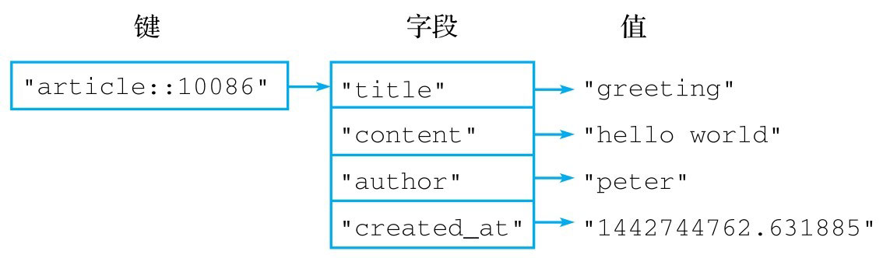

## HSET：为字段设置值
用户可以通过执行HSET命令为散列中的指定字段设置值：
```
HSET hash field value
```
+ 如果给定字段并不存在于散列当中，那么这次设置就是一次创建操作，命令将在散列里面关联起给定的字段和值，然后返回1
+ 如果给定的字段原本已经存在于散列里面，那么这次设置就是一次更新操作，命令将使用用户给定的新值去覆盖字段原有的旧值，然后返回0

复杂度：O(1)。

版本要求：HSET命令从Redis 2.0.0版本开始可用。

## HSETNX：只在字段不存在的情况下为它设置值
HSETNX命令只会在指定字段不存在的情况下执行设置操作：
```
HSETNX hash field value
```
+ HSETNX命令在字段不存在并且成功为它设置值时返回1，在字段已经存在并导致设置操作未能成功执行时返回0

复杂度：O(1)。

版本要求：HSETNX命令从Redis 2.0.0版本开始可用。

## HGET：获取字段的值
HGET命令可以根据用户给定的字段，从散列中获取该字段的值：
```
HGET hash field
```
+ 如果用户给定的字段并不存在于散列当中，那么HGET命令将返回一个空值
+ 从一个不存在的散列里面获取一个不存在的字段值，那么HGET命令也将返回一个空值

复杂度：O(1)。

版本要求：HGET命令从Redis 2.0.0版本开始可用。

## HINCRBY：对字段存储的整数值执行加法或减法操作
如果散列的字段里面存储着能够被Redis解释为整数的数字，那么用户就可以使用HINCRBY命令为该字段的值加上指定的整数增量：
```
HINCRBY hash field increment
```
+ HINCRBY命令在成功执行加法操作之后将返回字段当前的值作为命令的结果
+ 如果用户需要对字段存储的整数值执行减法操作，就需要将一个负数增量传给HINCRBY命令，从而达到对值执行减法计算的目的
+ 只能对存储着整数值的字段执行HINCRBY命令
+ 给定的增量也必须为整数

复杂度：O(1)。

版本要求：HINCRBY命令从Redis 2.0.0版本开始可用。

## HINCRBYFLOAT：对字段存储的数字值执行浮点数加法或减法操作
HINCRBYFLOAT命令不仅可以使用整数作为增量，还可以使用浮点数作为增量：
```
HINCRBYFLOAT hash field increment
```
+ HINCRBYFLOAT命令在成功执行加法操作之后，将返回给定字段的当前值作为结果
+ 想要对字段存储的数字值执行浮点数减法操作，那么只能通过向HINCRBYFLOAT命令传入负值浮点数来实现
+ HINCRBYFLOAT命令不仅可以使用浮点数作为增量，还可以使用整数作为增量

复杂度：O(1)。

版本要求：HINCRBYFLOAT命令从Redis 2.0.0版本开始可用。

## HSTRLEN：获取字段值的字节长度
用户可以使用HSTRLEN命令获取给定字段值的字节长度：
```
HSTRLEN hash field
```
+ 如果给定的字段或散列并不存在，那么HSTRLEN命令将返回0作为结果

复杂度：O(1)。

版本要求：HSTRLEN命令从Redis 3.2.0版本开始可用。

## HEXISTS：检查字段是否存在
HEXISTS命令可用于检查用户给定的字段是否存在于散列当中：
```
HEXISTS hash field
```
+ 如果散列包含了给定的字段，那么命令返回1，否则命令返回0
+ 如果用户给定的散列并不存在，那么HEXISTS命令对于这个散列所有字段的检查结果都是不存在

复杂度：O(1)。

版本要求：HEXISTS命令从Redis 2.0.0版本开始可用。

## HDEL：删除字段
HDEL命令用于删除散列中的指定字段及其相关联的值：
```
HDEL hash field
```
+ 当给定字段存在于散列当中并且被成功删除时，命令返回1
+ 如果给定字段并不存在于散列当中，那么命令将返回0表示删除失败
+ 如果给定的散列并不存在，那么命令将返回0表示删除失败

复杂度：O(1)。

版本要求：HDEL命令从Redis 2.0.0版本开始可用。

## HLEN：获取散列包含的字段数量
用户可以通过使用HLEN命令获取给定散列包含的字段数量：
```
HLEN hash
```
+ 如果用户给定的散列并不存在，那么HLEN命令将返回0作为结果

复杂度：O(1)。

版本要求：HLEN命令从Redis 2.0.0版本开始可用。

## HMSET：一次为多个字段设置值
用户可以使用HMSET命令一次为散列中的多个字段设置值：
```
HMSET hash field value [field value ...]
```
+ HMSET命令在设置成功时返回OK
+ 如果用户给定的字段已经存在于散列当中，那么HMSET命令将使用用户给定的新值去覆盖字段已有的旧值

复杂度：O(N)，其中N为被设置的字段数量。

版本要求：HMSET命令从Redis 2.0.0版本开始可用。

## HMGET：一次获取多个字段的值
通过使用HMGET命令，用户可以一次从散列中获取多个字段的值：
```
HMGET hash field [field ...]
```
+ HMGET命令将按照用户给定字段的顺序依次返回与之对应的值
+ 如果用户向HMGET命令提供的字段不存在，那么HMGET命令将返回空值作为结果
+ 如果用户向HMGET命令提供的散列不存在，那么HMGET命令将返回空值作为结果

复杂度：O(N)，其中N为用户给定的字段数量。

版本要求：HMGET命令从Redis 2.0.0版本开始可用。

## HKEYS、HVALS、HGETALL：获取所有字段、所有值、所有字段和值
使用HKEYS命令去获取它包含的所有字段：
```
HKEYS hash
```
使用HVALS命令去获取它包含的所有值:
```
HVALS hash
```
可以使用HGETALL命令去获取它包含的所有字段和值:
```
HGETALL hash
```
+ 在HGETALL命令返回的结果列表当中，每两个连续的元素就代表了散列中的一对字段和值，其中奇数位置上的元素为字段，偶数位置上的元素则为字段的值
+ 如果用户给定的散列并不存在，那么HKEYS、HVALS和HGETALL都将返回一个空列表

复杂度：HKEYS命令、HVALS命令和HGETALL命令的复杂度都为O(N)，其中N为散列包含的字段数量。

版本要求：HKEYS命令、HVALS命令和HGETALL命令都从Redis 2.0.0版本开始可用。

## 散列与字符串
### 散列键的优点

### 字符串键的优点

### 字符串键和散列键的选择
+ 如果程序需要为每个数据项单独设置过期时间，那么使用字符串键。
+ 如果程序需要对数据项执行诸如SETRANGE、GETRANGE或者APPEND等操作，那么优先考虑使用字符串键。
+ 如果程序需要存储的数据项比较多，并且你希望尽可能地减少存储数据所需的内存，就应该优先考虑使用散列键。
+ 如果多个数据项在逻辑上属于同一组或者同一类，那么应该优先考虑使用散列键。

# 列表 list
Redis的列表（list）是一种线性的有序结构，可以按照元素被推入列表中的顺序来存储元素，**这些元素既可以是文字数据，又可以是二进制数据**，并且列表中的元素可以重复出现。

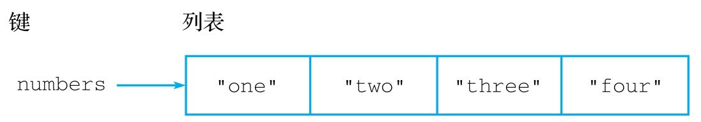

## LPUSH：将元素推入列表左端
用户可以通过LPUSH命令，将一个或多个元素推入给定列表的左端：
```
LPUSH list item [item item ...]
```
+ 在推入操作执行完毕之后，LPUSH命令会返回列表当前包含的元素数量作为返回值
+ 在执行LPUSH命令时给定了多个元素，那么LPUSH命令将按照元素给定的顺序，从左到右依次将所有给定元素推入列表左端
+ 如果给定的列表并不存在，那么命令将自动创建一个空列表，并将元素推入刚刚创建的列表中

复杂度：O(N)，其中N为被推入列表的元素数量。

版本要求：LPUSH命令从Redis 1.0.0版本开始可用，但是只有Redis 2.4.0或以上版本的LPUSH命令可以一次推入多个元素，Redis 2.4.0以下版本的LPUSH命令每次只能推入一个元素。

## RPUSH：将元素推入列表右端
RPUSH命令和LPUSH命令类似，区别就在于LPUSH命令会将元素推入列表左端，而RPUSH命令会将元素推入列表右端：
```
RPUSH list item [item item ...]
```
+ 在推入操作执行完毕之后，RPUSH命令会返回列表当前包含的元素数量作为返回
+ 执行RPUSH命令时给定了多个元素，那么RPUSH命令将按照元素给定的顺序，从左到右依次将所有给定元素推入列表右端
+ 如果给定的列表并不存在，那么命令将自动创建一个空列表，并将元素推入刚刚创建的列表中

复杂度：O(N)，其中N为被推入列表的元素数量。

版本要求：RPUSH命令从Redis 1.0.0版本开始可用，但是只有Redis 2.4.0或以上版本的RPUSH命令可以一次推入多个元素，Redis 2.4.0以下版本的RPUSH命令每次只能推入一个元素。

## LPUSHX、RPUSHX：只对已存在的列表执行推入操作
除了LPUSH命令和RPUSH命令之外，Redis还提供了LPUSHX命令和RPUSHX命令：
```
LPUSHX list item
RPUSHX list item
```
+ LPUSHX命令和RPUSHX命令在成功执行推入操作之后，将返回列表当前的长度作为返回值，如果推入操作未能成功执行，那么命令将返回0作为结果
+ LPUSHX命令只会在列表已经存在的情况下，将元素推入列表左端；RPUSHX命令只会在列表已经存在的情况下，将元素推入列表右端
+ LPUSHX命令和RPUSHX命令每次只能推入一个元素

复杂度：O(1)。

版本要求：LPUSHX命令和RPUSHX命令从Redis 2.2.0版本开始可用。

## LPOP：弹出列表最左端的元素
用户可以通过LPOP命令移除位于列表最左端的元素，并将被移除的元素返回给用户：
```
LPOP list
```
+ 如果用户给定的列表并不存在，那么LPOP命令将返回一个空值

复杂度：O(1)。版

本要求：LPOP命令从Redis 1.0.0版本开始可用。

## RPOP：弹出列表最右端的元素
用户可以通过RPOP命令移除位于列表最右端的元素，并将被移除的元素返回给用户：
```
RPOP list
```
+ 如果用户给定的列表并不存在，那么RPOP命令将返回一个空值

复杂度：O(1)。

版本要求：RPOP命令从Redis 1.0.0版本开始可用。

## RPOPLPUSH：将右端弹出的元素推入左端
RPOPLPUSH命令，首先使用RPOP命令将**源列表**最右端的元素弹出，然后使用LPUSH命令将被弹出的元素推入**目标列表**左端，使之成为目标列表的最左端元素：
```
RPOPLPUSH source target
```
+ RPOPLPUSH命令会返回被弹出的元素作为结果
+ RPOPLPUSH命令将源列表和目标列表设置为同一个列表，相当于将列表最右端的元素变成列表最左端的元素
+ 如果源列表并不存在，那么RPOPLPUSH命令将放弃执行弹出和推入操作，只返回一个空值表示命令执行失败
+ 如果源列表非空，但是目标列表为空，那么RPOPLPUSH命令将正常执行弹出操作和推入操作

复杂度：O(1)。

版本要求：RPOPLPUSH命令从Redis 1.2.0版本开始可用。

## LLEN：获取列表的长度
用户可以通过执行LLEN命令来获取列表的长度，即列表包含的元素数量：
```
LLEN list
```
+ 对于不存在的列表，LLEN命令将返回0作为结果

复杂度：O(1)。

版本要求：LLEN命令从Redis 1.0.0版本开始可用。

## LINDEX：获取指定索引上的元素
Redis列表包含的每个元素都有与之对应的正数索引和负数索引：
+ 正数索引从列表的左端开始计算，依次向右端递增：最左端元素的索引为0，左端排行第二的元素索引为1，左端排行第三的元素索引为2，以此类推。最大的正数索引为列表长度减1，即N-1。
+ 负数索引从列表的右端开始计算，依次向左端递减：最右端元素的索引为-1，右端排行第二的元素索引为-2，右端排行第三的元素索引为-3，以此类推。最大的负数索引为列表长度的负数，即-N。

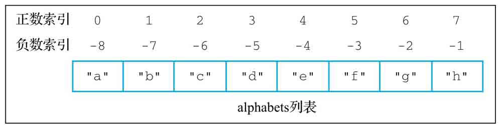

为了让用户可以方便地取得索引对应的元素，Redis提供了LINDEX命令：
```
LINDEX list index
```
+ 这个命令接受一个列表和一个索引作为参数，然后返回列表在给定索引上的元素
+ 其中给定索引既可以是正数，也可以是负数
+ 如果索引超出了范围，那么LINDEX命令将返回空值，以此来表示给定索引上并不存在任何元素

复杂度：O(N)，其中N为给定列表的长度。

版本要求：LINDEX命令从Redis 1.0.0版本开始可用。

## LRANGE：获取指定索引范围上的元素
用户除了可以使用LINDEX命令获取给定索引上的单个元素之外，还可以使用LRANGE命令获取给定索引范围上的多个元素：
```
LRANGE list start end
```
+ LRANGE命令接受一个列表、一个开始索引和一个结束索引作为参数，然后依次返回列表从开始索引到结束索引范围内的所有元素
+ 开始索引和结束索引对应的元素也会被包含在命令返回的元素当中
+ 一个快捷地获取列表包含的所有元素的方法，就是使用**0作为起始索引、-1作为结束索引**去调用LRANGE命令
+ 如果起始索引和结束索引都超出了范围，那么LRANGE命令将返回空列表作为结果
+ 如果超出范围的是起始索引，会被修正为0，然后再执行实际的范围获取操作
+ 如果超出范围的是结束索引，会被修正为-1，然后再执行实际的范围获取操作

复杂度：O(N)，其中N为给定列表的长度。

版本要求：LRANGE命令从Redis 1.0.0开始可用。

## LSET：为指定索引设置新元素
用户可以通过LSET命令，为列表的指定索引设置新元素：
```
LSET list index new_item
```
+ LSET命令在设置成功时将返回OK
+ 如果给定的索引超出了列表的有效索引范围，那么LSET命令将返回一个错误

复杂度：O(N)，其中N为给定列表的长度。

版本要求：LSET命令从Redis 1.0.0版本开始可用。

## LINSERT：将元素插入列表
通过使用LINSERT命令，用户可以将一个新元素插入列表某个指定元素的前面或者后面：
```
LINSERT list BEFORE|AFTER target_item new_item
```
+ LINSERT命令第二个参数的值可以是BEFORE或者AFTER，它们分别用于指示命令将新元素插入目标元素的前面或者后面
+ 命令在完成插入操作之后会返回列表当前的长度
+ 如果用户给定的目标元素并不存在，那么LINSERT命令将返回-1，表示插入失败

复杂度：O(N)，其中N为给定列表的长度。

版本要求：LINSERT命令从Redis 2.2.0版本开始可用。

## LTRIM：修剪列表
LTRIM命令接受一个列表和一个索引范围作为参数，并移除列表中位于给定索引范围之外的所有元素，只保留给定范围之内的元素：
```
LTRIM list start end
```
+ LTRIM命令在执行完移除操作之后将返回OK作为结果
+ LTRIM命令不仅可以处理正数索引，还可以处理负数索引

复杂度：O(N)，其中N为给定列表的长度。

版本要求：LTRIM命令从Redis 1.0.0版本开始可用。

## LREM：从列表中移除指定元素
用户可以通过LREM命令移除列表中的指定元素（item）：
```
LREM list count item
```
+ 如果count参数的值等于0，那么LREM命令将移除列表中包含的所有指定元素
+ 如果count参数的值大于0，那么LREM命令将从列表的左端开始向右进行检查，并移除最先发现的count个指定元素
+ 如果count参数的值小于0，那么LREM命令将从列表的右端开始向左进行检查，并移除最先发现的abs(count)个指定元素
+ LREM命令在执行完毕之后将返回被移除的元素数量作为命令的返回值

复杂度：O(N)，其中N为给定列表的长度。

版本要求：LREM命令从Redis 1.0.0版本开始可用。

## BLPOP：阻塞式左端弹出操作
BLPOP命令是带有阻塞功能的左端弹出操作，它接受任意多个列表以及一个**秒级精度**的超时时限作为参数：
```
BLPOP list [list ...] timeout
```
+ BLPOP命令会按照从左到右的顺序依次检查用户给定的列表，并对**最先遇到的非空列表**执行左端元素弹出操作
+ 当BLPOP命令成功执行后，将返回一个包含两个元素的数组：第一个元素是执行弹出操作的列表，第二个元素是被弹出的元素
+ 如果所有列表都是空列表，将阻塞执行该命令的客户端，直到某个给定列表变为非空，又或者等待时间超出给定时限为止
+ 如果等待时间超出给定时限，那么BLPOP命令将向客户端返回一个空值
+ BLPOP命令的阻塞效果只对执行这个命令的客户端有效，其他客户端以及Redis服务器本身并不会因为这个命令而被阻塞

复杂度：O(N)，其中N为用户给定的列表数量。

版本要求：BLPOP命令从Redis 2.0.0版本开始可用。

## BRPOP：阻塞式右端弹出操作
BRPOP命令是带有阻塞功能的右端弹出操作，除了弹出的方向不同之外，其他方面都和BLPOP命令一样：
```
BRPOP list [list ...] timeout
```

复杂度：O(N)，其中N为用户给定的列表数量。

版本要求：BRPOP命令从Redis 2.0.0版本开始可用。

## BRPOPLPUSH：阻塞式弹出并推入操作
BRPOPLPUSH命令是RPOPLPUSH命令的阻塞版本，BRPOPLPUSH命令接受一个源列表、一个目标列表以及一个秒级精度的超时时限作为参数：
```
BRPOPLPUSH source target timeout
```
+ 如果源列表非空，BRPOPLPUSH命令会弹出位于源列表最右端的元素，并将该元素推入目标列表的左端，最后向客户端返回被推入的元素
+ 如果源列表为空，那么BRPOPLPUSH命令将阻塞执行该命令的客户端，然后在给定的时限内等待可弹出的元素出现，或者等待时间超过给定时限为止
+ 如果源列表在给定的时限内一直没有元素可供弹出，那么BRPOPLPUSH命令将向客户端返回一个空值

复杂度：O(1)。

版本要求：BRPOPLPUSH命令从Redis 2.2.0版本开始可用。

# 集合 set 
Redis的集合（set）键允许用户将任意多个各不相同的元素存储到集合中，**这些元素既可以是文本数据，也可以是二进制数据**。

集合与列表有以下两个明显的区别：
+ 列表可以存储重复元素，而集合只会存储非重复元素，尝试将一个已存在的元素添加到集合将被忽略。
+ 列表以有序方式存储元素，而集合则以无序方式存储元素。

两个区别带来的差异主要跟命令的复杂度有关：
+ 对于列表来说，在执行像LINSERT和LREM这样的列表命令时，即使命令只针对单个列表元素，程序有时也不得不遍历整个列表以确定指定的元素是否存在，因此这些命令的复杂度都为O(N)。
+ 对于集合来说，因为所有针对单个元素的集合命令都不需要遍历整个集合，所以复杂度都为O(1)。

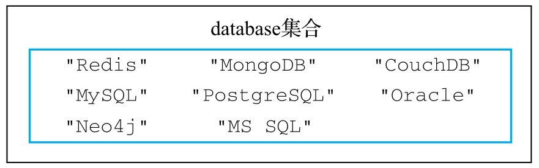

## SADD：将元素添加到集合
通过使用SADD命令，用户可以将一个或多个元素添加到集合中：
```
SADD set element [element ...]
```
+ 命令会返回成功添加的新元素数量作为返回值
+ 命令会自动忽略已存在的元素，只将不存在于集合的新元素添加到集合中

复杂度：O(N)，其中N为用户给定的元素数量。

版本要求：SADD命令从Redis 1.0.0版本开始可用，但是只有Redis 2.4或以上版本的SADD命令可以一次添加多个元素，Redis 2.4以下版本的SADD命令每次只能添加一个元素。

## SREM：从集合中移除元素
通过使用SREM命令，用户可以从集合中移除一个或多个已存在的元素：
```
SREM set element [element ...]
```
+ 这个命令会返回被移除的元素数量
+ 如果给定的元素并不存在于集合当中，那么SREM命令将忽略不存在的元素，只移除那些确实存在的元素

复杂度：O(N)，其中N为用户给定的元素数量。

版本要求：SREM命令从Redis 1.0.0版本开始可用，但是只有Redis 2.4或以上版本的SREM命令可以一次删除多个元素，Redis 2.4以下版本的SREM命令每次只能删除一个元素。

## SMOVE：将元素从一个集合移动到另一个集合
SMOVE命令允许用户将指定的元素从源集合移动到目标集合：
```
SMOVE source target element
```
+ SMOVE命令在移动操作成功执行时返回1
+ 如果指定的元素并不存在于源集合，那么SMOVE命令将返回0，表示移动操作执行失败
+ 如果指定的元素已经存在于目标集合，SMOVE命令仍然会将指定的元素从源集合移动到目标集合，并覆盖目标集合中的相同元素

复杂度：O(1)。

版本要求：SMOVE命令从Redis 1.0.0版本开始可用。

## SMEMBERS：获取集合包含的所有元素
通过使用SMEMBERS命令，用户可以取得集合包含的所有元素：
```	
SMEMBERS set
```
+ 因为Redis集合以无序的方式存储元素，2个包含相同元素的集合在执行SMEMBERS命令时的结果也可能会有所不同

复杂度：O(N)，其中N为集合包含的元素数量。

版本要求：SMEMBERS命令从Redis 1.0.0版本开始可用。

## SCARD：获取集合包含的元素数量
通过使用SCARD命令，用户可以获取给定集合的大小，即集合包含的元素数量：
```
SCARD set
```
+ 返回给定集合的大小

复杂度：O(1)。

版本要求：SCARD命令从Redis 1.0.0版本开始可用。

## SISMEMBER：检查给定元素是否存在于集合
通过使用SISMEMBER命令，用户可以检查给定的元素是否存在于集合当中：
```
SISMEMBER set element
```
+ 如果给定的元素存在于集合当中，则SISMEMBER命令返回1
+ 如果给定的元素不存在于集合当中，则SISMEMBER命令返回0

复杂度：O(1)。

版本要求：SISMEMBER命令从Redis 1.0.0版本开始可用。

## SRANDMEMBER：随机获取集合中的元素
通过使用SRANDMEMBER命令，用户可以从集合中随机地获取指定数量的元素：
```
SRANDMERBER set [count]
```
+ SRANDMEMBER命令接受一个可选的count参数，用于指定用户想要获取的元素数量
+ 如果没有count参数，那么SRANDMEMBER命令默认只获取一个元素
+ 如果count参数的值为正数，那么SRANDMEMBER命令将返回count个不重复的元素；返回元素不会超过集合元素数量
+ 如果count参数的值为负数，那么SRANDMEMBER命令将返回abs(count)个允许出现重复的元素；返回元素会超过集合元素数量（可重复）
+ 需要注意的一点是，被SRANDMEMBER命令返回的元素仍然会存在于集合当中

复杂度：O(N)，其中N为被返回的元素数量。

版本要求：不带count参数的SRANDMEMBER命令从Redis 1.0.0版本开始可用；带有count参数的SRANDMEMBER命令从Redis 2.6.0版本开始可用。

## SPOP：随机地从集合中移除指定数量的元素
通过使用SPOP命令，用户可以从集合中随机地移除指定数量的元素。
```
SPOP set [count]
```
+ SPOP命令接受一个可选的count参数，用于指定需要被移除的元素数量
+ 如果没有给定count参数，那么SPOP命令默认只移除一个元素
+ SPOP命令会移除被随机选中的元素
+ SPOP命令只接受正数count值

复杂度：O(N)，其中N为被移除的元素数量。

版本要求：不带count参数的SPOP命令从Redis 1.0.0版本开始可用；带有count参数的SPOP命令从Redis 3.2.0版本开始可用。

## SINTER、SINTERSTORE：对集合执行交集计算
SINTER命令可以计算出用户给定的所有集合的交集，然后返回这个交集包含的所有元素：
```
SINTER set [set ...]
```

SINTERSTORE命令可以把给定集合的交集计算结果存储到指定的键里面：
```
SINTERSTORE destination_key set [set ...]
```
+ 如果给定的键已经存在，那么SINTERSTORE命令在执行存储操作之前会先删除已有的键
+ SINTERSTORE命令在执行完毕之后会返回被存储的交集元素数量作为返回值

复杂度：SINTER命令和SINTERSTORE命令的复杂度都是O(N*M)，其中N为给定集合的数量，而M则是所有给定集合当中，包含元素最少的那个集合的大小。

版本要求：SINTER命令和SINTERSTORE命令从Redis 1.0.0版本开始可用。

## SUNION、SUNIONSTORE：对集合执行并集计算
SUNION命令可以计算出用户给定的所有集合的并集，然后返回这个并集包含的所有元素：
```
SUNION set [set ...]
```

SUNIONSTORE命令可以把给定集合的并集计算结果存储到指定的键中，并在键已经存在的情况下自动覆盖已有的键：
```
SUNIONSTORE destination_key set [set ...]
```
+ SUNIONSTORE命令在执行完毕之后，将返回并集元素的数量作为返回值

复杂度：SUNION命令和SUNIONSTORE命令的复杂度都是O(N)，其中N为所有给定集合包含的元素数量总和。

版本要求：SUNION命令和SUNIONSTORE命令从Redis 1.0.0版本开始可用。

## SDIFF、SDIFFSTORE：对集合执行差集计算
SDIFF命令可以计算出给定集合之间的差集，并返回差集包含的所有元素：
```
SDIFF set [set ...]
```
+ SDIFF命令会按照用户给定集合的顺序，从左到右依次地对给定的集合执行差集计算

SDIFFSTORE命令可以把给定集合之间的差集计算结果存储到指定的键中，并在键已经存在的情况下自动覆盖已有的键：
```
SDIFFSTORE destination_key set [set ...]
```
+ SDIFFSTORE命令会返回被存储的差集元素数量作为返回值

复杂度：SDIFF命令和SDIFFSTORE命令的复杂度都是O(N)，其中N为所有给定集合包含的元素数量总和。

版本要求：SDIFF命令和SDIFFSTORE命令从Redis 1.0.0版本开始可用。

# 有序集合 sorted set
Redis的有序集合（sorted set）同时具有“有序”和“集合”两种性质，这种数据结构中的每个元素都由一个**成员**和一个与成员相关联的**分值**组成，其中**成员以字符串方式存储，而分值则以64位双精度浮点数格式存储**。
+ 有序集合中的每个成员都是独一无二的，同一个有序集合中不会出现重复的成员。
+ 有序集合的分值除了可以是数字之外，还可以是字符串"+inf"或者"-inf"，这两个特殊值分别用于表示无穷大和无穷小。
+ 虽然同一个有序集合不能存储相同的成员，但不同成员的分值却可以是相同的。
+ 当两个或多个成员拥有相同的分值时，Redis将按照这些成员在字典序中的大小对其进行排列。


## ZADD：添加或更新成员
通过使用ZADD命令，用户可以向有序集合添加一个或多个新成员：
```
ZADD sorted_set score member [score member ...]
```
+ ZADD命令将返回成功添加的新成员数量作为返回值
+ 在默认情况下，如果成员已经存在于有序集合中，那么ZADD命令将使用给定的新分值去覆盖现有的旧分值，此时命令返回0

从Redis 3.0.2版本开始，可以通过使用 XX选项或者NX选项 来显式地指示命令只执行更新操作或者只执行添加操作：
```
ZADD sorted_set [XX|NX] score member [score member ...]
```
+ 带有XX选项的ZADD命令只会对有序集合已有的成员进行**更新**，而不会向有序集合添加任何新成员
+ 带有NX选项的ZADD命令只会向有序集合**添加**新成员，而不会对已有的成员进行任何更新

从Redis3.0.2版本开始，可以通过 CH选项，让ZADD命令返回被修改（changed）成员的数量作为返回值：
```
ZADD sorted_set [CH] score member [score member ...]
```

复杂度：O(M*log(N))，其中M为给定成员的数量，而N则为有序集合包含的成员数量。

版本要求：不带任何选项的ZADD命令从Redis 1.2.0版本开始可用，带有NX、XX、CH等选项的ZADD命令从Redis 3.0.2版本开始可用。Redis 2.4版本以前的ZADD命令只允许用户给定一个成员，而Redis 2.4及以上版本的ZADD命令则允许用户给定一个或多个成员。

## ZREM：移除指定的成员
通过使用ZREM命令，用户可以从有序集合中移除指定的一个或多个成员以及与这些成员相关联的分值：
```
ZREM sorted_set member [member ...]
```
+ ZREM命令会返回被移除成员的数量作为返回值
+ 如果用户给定的某个成员并不存在于有序集合中，那么ZREM将自动忽略该成员

复杂度：O(M*log(N))，其中M为给定成员的数量，N为有序集合包含的成员数量。

版本要求：ZREM命令从Redis 1.2.0版本开始可用。Redis 2.4版本以前的ZREM命令只允许用户给定一个成员，而Redis 2.4及以上版本的ZREM命令则允许用户给定一个或多个成员。

## ZSCORE：获取成员的分值
通过使用ZSCORE命令，用户可以获取与给定成员相关联的分值：
```
ZSCORE sorted_set member
```
+ 如果用户给定的有序集合并不存在，或者有序集合中并未包含给定的成员，那么ZSCORE命令将返回空值

复杂度：O(1)。

版本要求：ZSCORE命令从Redis 1.2.0版本开始可用。

## ZINCRBY：对成员的分值执行自增或自减操作
通过使用ZINCRBY命令，用户可以对有序集合中指定成员的分值执行自增操作，为其加上指定的增量：
```
ZINCRBY sorted_set increment member
```
+ ZINCRBY命令在执行完自增操作之后，将返回给定成员当前的分值
+ 如果需要减少一个成员的分值，那么可以将一个负数传递给ZINCRBY命令
+ 如果给定成员并不存在于有序集合中，或者给定的有序集合并不存在，那么命令将直接把给定的成员添加到有序集合中，并把给定的增量设置为该成员的分值，效果相当于执行ZADD命令

复杂度：O(log (N))，其中N为有序集合包含的成员数量。

版本要求：ZINCRBY命令从Redis 1.2.0版本开始可用。

## ZCARD：获取有序集合的大小
通过执行ZCARD命令可以取得有序集合的基数，即有序集合包含的成员数量：
```
ZCARD sorted_set
```
+ 如果用户给定的有序集合并不存在，那么ZCARD命令将返回0作为结果

复杂度：O(1)。

版本要求：ZCARD命令从Redis 1.2.0版本开始可用。

## 索引

## ZRANK、ZREVRANK：获取成员在有序集合中的排名
通过ZRANK命令和ZREVRANK命令，用户可以取得给定成员在有序集合中的排名：
```
ZRANK sorted_set member

ZREVRANK sorted_set member
```
+ ZRANK命令返回的是成员的升序排列排名
+ ZREVRANK命令返回的则是成员的降序排列排名
+ 如果用户给定的有序集合并不存在，或者用户给定的成员并不存在于有序集合当中，那么ZRANK命令和ZREVRANK命令将返回一个空值

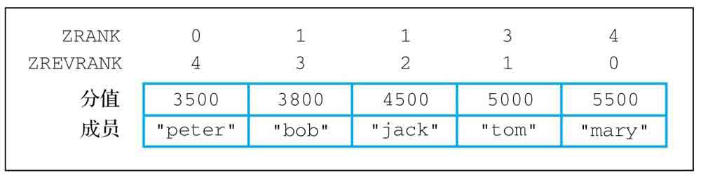

复杂度：O(log (N))，其中N为有序集合包含的成员数量。

版本要求：ZRANK命令和ZREVRANK命令从Redis 2.0.0版本开始可用。

## ZRANGE、ZREVRANGE：获取指定索引范围内的成员
通过ZRANGE命令和ZREVRANGE命令，用户可以以升序排列或者降序排列方式，从有序集合中获取指定索引范围内的成员：
```
ZRANGE sorted_set start end

ZREVRANGE sorted_set start end
```
+ ZRANGE命令用于获取按照分值大小实施升序排列的成员
+ ZREVRANGE命令则用于获取按照分值大小实施降序排列的成员
+ 命令中的start索引和end索引指定的是闭区间索引范围
+ ZRANGE命令和ZREVRANGE命令除了可以接受正数索引之外，还可以接受负数索引
+ 如果我们想要获取有序集合包含的所有成员，那么只需要将起始索引设置为0，结束索引设置为-1
+ 如果用户给定的有序集合并不存在，那么ZRANGE命令和ZREVRANGE命令将返回一个空列表

在默认情况下，ZRANGE命令和ZREVRANGE命令只会返回指定索引范围内的成员，如果用户想要在获取这些成员的同时也获取与之相关联的分值，那么可以在调用ZRANGE命令或者ZREVRANGE命令的时候，给定可选的WITHSCORES选项：
```
ZRANGE sorted_set start end [WITHSCORES]

ZREVRANGE sorted_set start end [WITHSCORES]
```

复杂度：O(log (N) + M)，其中N为有序集合包含的成员数量，而M则为命令返回的成员数量。

版本要求：ZRANGE命令和ZREVRANGE命令从Redis 1.2.0版本开始可用。

## ZREMRANGEBYRANK：移除指定排名范围内的成员
ZREMRANGEBYRANK命令可以从升序排列的有序集合中移除位于指定排名范围内的成员，然后返回被移除成员的数量：
```
ZREMRANGEBYRANK sorted_set start end
```
+ ZREMRANGEBYRANK命令接受的也是一个闭区间范围，也就是说，排名为start和end的成员也将被移除
+ 传给ZREMRANGEBYRANK命令的排名参数除了可以是正数之外还可以是负数

复杂度：O(log (N) + M)，其中N为有序集合包含的成员数量，M为被移除的成员数量。

版本要求：ZREMRANGEBYRANK命令从Redis 2.0.0版本开始可用。

## 分值

## ZRANGEBYSCORE、ZREVRANGEBYSCORE：获取指定分值范围内的成员
通过使用ZRANGEBYSCORE命令或者ZREVRANGEBYSCORE命令，用户可以以升序排列或者降序排列的方式获取有序集合中分值介于指定范围内的成员：
```
ZRANGEBYSCORE sorted_set min max

ZREVRANGEBYSCORE sorted_set max min
```
+ 命令的min参数和max参数分别用于指定用户想要获取的成员的最小分值和最大分值
+ ZRANGEBYSCORE命令先接受min参数然后再接受max参数，而ZREVRANGEBYSCORE命令则是先接受max参数然后再接受min参数
+ min参数和max参数除了可以是普通的分值，还可以是特殊值+inf或者-inf，前者用于表示无穷大，而后者则用于表示无穷小

ZRANGEBYSCORE命令和ZREVRANGEBY SCORE命令也可以通过在执行时给定可选的WITHSCORES选项来同时获取成员及其分值：
```
ZRANGEBYSCORE sorted_set min max [WITHSCORES]

ZREVRANGEBYSCORE sorted_set max min [WITHSCORES]
```

在默认情况下，ZRANGEBYSCORE命令和ZREVRANGEBYSCORE命令会直接返回给定分值范围内的所有成员，可以使用可选的LIMIT选项来限制命令返回的成员数量：
```
ZRANGEBYSCORE sorted_set min max [LIMIT offset count]

ZREVRANGEBYSCORE sorted_set max min [LIMIT offset count]
```

如果用户想要定义的是开区间而不是闭区间，那么可以在给定分值范围时，在分值参数的前面加上一个单括号“(”：
```
ZRANGEBYSCORE sorted_set (min (max
```

复杂度：ZRANGEBYSCORE命令和ZREVRANGEBYSCORE命令的复杂度都是O(log (N) +M)，其中N为有序集合包含的成员数量，而M则为命令返回的成员数量。

版本要求：ZRANGEBYSCORE命令从Redis 1.0.5版本开始可用，ZREVRANGEBYSCORE命令从Redis 2.2.0版本开始可用。

## ZCOUNT：统计指定分值范围内的成员数量
通过使用COUNT命令，用户可以统计出有序集合中分值介于指定范围之内的成员数量：
```
ZCOUNT sorted_set min max
```
+ ZCOUNT命令接受的分值范围格式和ZRANGEBYSCORE命令接受的分值范围格式完全相同

复杂度：O(log (N))，其中N为有序集合包含的成员数量。

版本要求：ZCOUNT命令从Redis 2.0.0版本开始可用。

## ZREMRANGEBYSCORE：移除指定分值范围内的成员
ZREMRANGEBYSCORE命令可以从有序集合中移除位于指定分值范围内的成员，并在移除操作执行完毕返回被移除成员的数量：
```
ZREMRANGEBYSCORE sorted_set min max
```
+ ZREMRANGEBYSCORE命令接受的分值范围与ZRANGEBYSCORE命令接受的分值范围一样

复杂度：O(log (N) + M)，其中N为有序集合包含的成员数量，M为被移除成员的数量。

版本要求：ZREMRANGEBYSCORE命令从Redis 1.2.0版本开始可用。

## ZUNIONSTORE、ZINTERSTORE：有序集合的并集运算和交集运算
Redis也为有序集合提供了并集运算命令ZUNIONSTORE和交集运算命令ZINTERSTORE：
```
ZUNIONSTORE destination numbers sorted_set [sorted_set ...]

ZINTERSTORE destination numbers sorted_set [sorted_set ...]
```
+ numbers参数用于指定参与计算的有序集合数量
+ sorted_set参数则用于指定参与计算的各个有序集合键
+ 计算得出的结果则会存储到destination参数指定的键中
+ ZUNIONSTORE命令和ZINTERSTORE命令都会返回计算结果包含的成员数量作为返回值
+ ZUNIONSTORE和ZINTERSTORE除了可以使用有序集合作为输入之外，还可以使用**集合**作为输入
+ 这两个命令将把给定**集合**看作所有成员的分值都为1来进行计算，可以使用WEIGHTS选项来改变给定集合的分值

Redis为ZUNIONSTORE命令和ZINTERSTORE命令提供了可选的AGGREGATE选项，通过这个选项，用户可以决定使用哪个聚合函数来**计算结果有序集合成员的分值**：
```
ZUNIONSTORE destination numbers sorted_set [sorted_set ...] [AGGREGATE SUM|MIN|MAX]

ZINTERSTORE destination numbers sorted_set [sorted_set ...] [AGGREGATE SUM|MIN|MAX]
```
+ 在没有显式地使用AGGREGATE选项指定聚合函数的情况下，ZUNIONSTORE和ZINTERSTORE默认使用SUM作为聚合函数

在默认情况下，ZUNIONSTORE和ZINTERSTORE将直接使用给定有序集合的成员分值去计算结果有序集合的成员分值，但是在有需要的情况下，用户也可以通过可选的WEIGHTS参数**为各个给定有序集合的成员分值设置权重**：
```
ZUNIONSTORE destination numbers sorted_set [sorted_set ...] [WEIGHTS weight [weight ...]]

ZINTERSTORE destination numbers sorted_set [sorted_set ...] [WEIGHTS weight [weight ...]]
```
+ 如果不想改变某个给定有序集合的分值，那么只需要将那个有序集合的权重设置为1即可

复杂度：ZUNIONSTORE命令的复杂度为O(N*log(N))，其中N为所有给定有序集合的成员总数量。

ZINTERSTORE命令的复杂度为O(N*log(N)*M)，其中N为所有给定有序集合中，基数最小的那个有序集合的基数，而M则是给定有序集合的数量。版本要求：ZUNIONSTORE命令和ZINTERSTORE命令从Redis 2.0.0版本开始可用。

## 字典

## ZRANGEBYLEX、ZREVRANGEBYLEX：返回指定字典序范围内的成员
当有序集合的所有成员都拥有相同的分值时，有序集合的成员将不再根据分值进行排序，而是根据字典序进行排序。

ZRANGEBYLEX命令，这个命令可以从字典序排列的有序集合中获取位于字典序指定范围内的成员：
```
ZRANGEBYLEX sorted_set min max
```

ZREVRANGEBYLEX命令是逆序版的ZRANGEBYLEX命令，它会以逆字典序的方式返回指定范围内的成员：
```
ZREVRANGEBYLEX sorted_set max min
```

命令的min参数和max参数用于指定用户想要获取的字典序范围，它们的值可以是以下4种值之一：
+ 带有[符号的值表示在结果中包含与给定值具有同等字典序大小的成员
+ 带有(符号的值表示在结果中不包含与给定值具有同等字典序大小的成员
+ 加号+表示无穷大
+ 减号-表示无穷小

ZRANGEBYLEX和ZREVRANGEBYLEX也可以通过可选的LIMIT选项来限制命令返回的成员数量：
```
ZRANGEBYLEX sorted_set min max [LIMIT offset count]

ZREVRANGEBYLEX sorted_set max min  [LIMIT offset count]
```

复杂度：ZRANGEBYLEX命令和ZREVRANGEBYLEX命令的复杂度都为O(log (N)+ M)，其中N为有序集合包含的元素数量，而M则为命令返回的成员数量。

版本要求：ZRANGEBYLEX命令和ZREVRANGEBYLEX命令从Redis 2.8.9版本开始可用。

## ZLEXCOUNT：统计位于字典序指定范围内的成员数量
对于按照字典序排列的有序集合，用户可以使用ZLEXCOUNT命令统计有序集合中位于字典序指定范围内的成员数量：
```
ZLEXCOUNT sorted_set min max
```
+ ZLEXCOUNT命令的min参数和max参数的格式与ZRANGEBYLEX命令接受的min参数和max参数的格式完全相同
```
复杂度：O(log (N))，其中N为有序集合包含的成员数量。版本要求：ZLEXCOUNT命令从Redis 2.8.9版本开始可用。
```

## ZREMRANGEBYLEX：移除位于字典序指定范围内的成员
对于按照字典序排列的有序集合，用户可以使用ZREMRANGEBYLEX命令去移除有序集合中位于字典序指定范围内的成员：
```
ZREMRANGEBYLEX sorted_set min max
```
+ 这个命令的min参数和max参数的格式与ZRANGEBYLEX命令以及ZLEXCOUNT命令接受的min参数和max参数的格式完全相同
+ ZREMRANGEBYLEX命令在移除用户指定的成员之后，将返回被移除成员的数量作为命令的返回值

复杂度：O(log (N) + M)，其中N为有序集合包含的成员数量，M为被移除成员的数量。

版本要求：ZREMRANGEBYLEX命令从Redis 2.8.9版本开始可用。

## 弹出

## ZPOPMAX、ZPOPMIN：弹出分值最高和最低的成员
ZPOPMAX和ZPOPMIN是Redis 5.0版本新添加的两个命令，分别用于移除并返回有序集合中分值最大和最小的N个元素：
```
ZPOPMAX sorted_set [count]

ZPOPMIN sorted_set [count]
```
+ 其中被移除元素的数量可以通过可选的count参数来指定
+ 如果用户没有显式地给定count参数，那么命令默认只会移除一个元素

复杂度：O(N)，其中N为命令移除的元素数量。

版本要求：ZPOPMAX命令和ZPOPMIN命令从Redis 5.0.0版本开始可用。

## BZPOPMAX、BZPOPMIN：阻塞式最大/最小元素弹出操作
BZPOPMAX命令和BZPOPMIN命令分别是ZPOPMAX命令以及ZPOPMIN命令的阻塞版本，这两个阻塞命令都接受任意多个有序集合和一个秒级精度的超时时限作为参数：
```
BZPOPMAX sorted_set [sorted_set ...] timeout

BZPOPMIN sorted_set [sorted_set ...] timeout
```
+ 命令在成功弹出元素时将返回一个包含3个项的列表，这3个项分别为被弹出元素所在的有序集合、被弹出元素的成员以及被弹出元素的分值
+ 如果这两个命令因为等待超时而未能弹出任何元素，那么它们将返回一个空值作为结果
+ 用户可以通过将超时时限设置为0来让命令一直阻塞，直到可弹出的元素出现为止

复杂度：O(N)，其中N为用户给定的有序集合数量。

版本要求：BZPOPMAX命令和BZPOPMIN命令从Redis 5.0.0版本开始可用。

# HyperLogLog counting 集合基数计数器 
## HyperLogLog简介
HyperLogLog是一个专门为了**计算集合的基数而创建的概率算法**。对于一个给定的集合，HyperLogLog可以计算出这个集合的近似基数。

HyperLogLog的优点在于它计算近似基数所需的内存并不会因为集合的大小而改变，无论集合包含的元素有多少个，HyperLogLog进行计算所需的内存总是固定的，并且是非常少的。

Redis的每个HyperLogLog只需要使用12KB内存空间，就可以对接近 2^64 个元素进行计数，而算法的标准误差仅为0.81%，因此它计算出的近似基数是相当可信的。

## PFADD：对集合元素进行计数
用户可以通过执行PFADD命令，使用HyperLogLog对给定的一个或多个集合元素进行计数：
```
PFADD hyperloglog element [element ...]
```
根据给定的元素是否已经进行过计数，PFADD命令可能返回0，也可能返回1：
+ 如果给定的所有元素都已经进行过计数，那么PFADD命令将返回0，表示HyperLog-Log计算出的近似基数没有发生变化。
+ 如果给定的元素中至少一个之前没有进行过计数的元素，那么PFADD命令将返回1，表示HyperLogLog计算出的近似基数发生了变化。

复杂度：O(N)，其中N为用户给定的元素数量。

版本要求：PFADD命令从Redis 2.8.9版本开始可用。

## PFCOUNT：返回集合的近似基数
在使用PFADD命令对元素进行计数之后，用户可以通过执行PFCOUNT命令来获取HyperLogLog为集合计算出的近似基数：
```
PFCOUNT hyperloglog [hyperloglog]
```
+ 当用户给定的HyperLogLog不存在时，PFCOUNT命令将返回0作为结果
+ 当用户向PFCOUNT传入多个HyperLogLog时，PFCOUNT命令将对所有给定的Hyper-LogLog执行并集计算，然后返回并集HyperLogLog计算出的近似基数

复杂度：O(N)，其中N为用户给定的HyperLogLog数量。

版本要求：PFCOUNT命令从Redis 2.8.9版本开始可用。

## PFMERGE：计算多个HyperLogLog的并集
PFMERGE命令可以对多个给定的HyperLogLog执行并集计算，然后把计算得出的并集HyperLogLog保存到指定的键中：
```
PFMERGE destination hyperloglog [hyperloglog ...]
```
+ PFMERGE命令在成功执行并集计算之后将返回OK作为结果
+ 如果指定的键已经存在，那么PFMERGE命令将覆盖已有的键
+ HyperLogLog并集计算的近似基数接近于所有给定HyperLogLog的被计数集合的并集基数

在有需要的情况下，用户可以使用PFMERGE命令代替针对多个HyperLogLog的PFCOUNT命令调用，从而避免重复执行相同的并集计算。

复杂度：O(N)，其中N为用户给定的HyperLogLog数量。

版本要求：PFMERGE命令从Redis 2.8.9版本开始可用。

# 位图 bitmap
Redis的位图（bitmap）是由多个二进制位组成的数组，数组中的每个二进制位都有与之对应的偏移量（也称索引），用户通过这些偏移量可以对位图中指定的一个或多个二进制位进行操作。

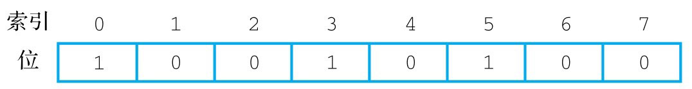

## SETBIT：设置二进制位的值
通过使用SETBIT命令，用户可以为位图指定偏移量上的二进制位设置值：
```
SETBIT bitmap offset value
```
+ SETBIT命令只能使用正数偏移量
+ SETBIT命令在对二进制位进行设置之后，将返回二进制位被设置之前的旧值作为结果
+ 当用户执行SETBIT命令尝试对一个位图进行设置的时候，如果位图不存在，或者位图当前的大小无法满足用户想要执行的设置操作，那么Redis将对被设置的位图**进行扩展**，使得位图可以满足用户的设置请求
+ 因为Redis对位图的**扩展操作是以字节为单位进行的**，所以扩展之后的位图包含的二进制位数量可能会比用户要求的稍微多一些，并且在扩展位图的同时，Redis还会将所有未被设置的二进制位的值**初始化为0**

复杂度：O(1)。

版本要求：SETBIT命令从Redis 2.2.0版本开始可用。

## GETBIT：获取二进制位的值
使用GETBIT命令，用户可以获取位图指定偏移量上的二进制位的值：
```
GETBIT bitmap offset
```
+ GETBIT命令只能接受正数作为偏移量
+ 如果用户输入的偏移量超过了位图目前拥有的最大偏移量，那么GETBIT命令将返回0作为结果

复杂度：O(1)。

版本要求：GETBIT命令从Redis 2.2.0版本开始可用。

## BITCOUNT：统计被设置的二进制位数量
用户可以通过执行BITCOUNT命令统计**位图中值为1的二进制位数量**：
```
BITCOUNT bitmap
```

在默认情况下，BITCOUNT命令将对位图包含的所有字节中的二进制位进行统计。
用户也可以通过可选的start参数和end参数，让BITCOUNT只对指定字节范围内的二进制位进行统计：
```
BITCOUNT bitmap [start end]
```
+ 注意start参数和end参数是用来指定**字节偏移量**而不是二进制位偏移量的
+ BITCOUNT命令的start参数和end参数的值除了可以是正数之外，还可以是负数

复杂度：O(N)，其中N为被统计字节的数量。

版本要求：BITCOUNT命令从Redis 2.6.0版本开始可用。

## BITPOS：查找第一个指定的二进制位值
用户可以通过执行BITPOS命令，在位图中查找第一个被设置为指定值的二进制位，并返回这个二进制位的偏移量：
```
BITPOS bitmap value
```

在默认情况下，BITPOS命令的查找范围将覆盖位图包含的所有二进制位。
用户也可以通过可选的start参数和end参数，让BITPOS命令只在指定字节范围内的二进制位中进行查找：
```
BITPOS bitmap value [start end]
```
+ BITPOS命令的start参数和end参数也可以是负数
+ 当用户尝试对一个不存在的位图或者一个所有位都被设置成了0的位图中查找值为1的二进制位时，BITPOS命令将返回-1作为结果
+ 如果用户在一个所有位都被设置成1的位图中查找值为0的二进制位，那么BITPOS命令将返回位图最大偏移量加上1作为结果

复杂度：O(N)，其中N为查找涉及的字节数量。

版本要求：BITPOS命令从Redis 2.8.7版本开始可用。

## BITOP：执行二进制位运算
用户可以通过BITOP命令，对一个或多个位图执行指定的二进制位运算，并将运算结果存储到指定的键中：
```
BITOP operation result_key bitmap [bitmap ...]
```
+ operation参数的值可以是AND、OR、XOR、NOT中的任意一个，这4个值分别对应逻辑并、逻辑或、逻辑异或和逻辑非4种运算，其中AND、OR、XOR这3种运算允许用户使用任意数量的位图作为输入，而NOT运算只允许使用一个位图作为输入
+ BITOP命令在将计算结果存储到指定键 result_key 中之后，会返回被存储位图的字节长度
+ 当BITOP命令在对两个长度不同的位图执行运算时，会将长度较短的那个位图中不存在的二进制位的值看作0

复杂度：O(N)，其中N为计算涉及的字节总数量。

版本要求：BITOP命令从Redis 2.6.0版本开始可用。

## BITFIELD：在位图中存储整数值
BITFIELD命令允许用户在位图中的任意区域（field）存储指定长度的整数值，并对这些整数值执行加法或减法操作。

BITFIELD命令支持**SET、GET、INCRBY、OVERFLOW**这4个子命令。

### SET：根据偏移量对区域进行设置
通过使用BITFIELD命令的SET子命令，用户可以在位图的指定偏移量offset上设置一个type类型的整数值value：
```
BITFIELD bitmap SET type offset value
```
+ **type参数用于指定被设置值的类型**，这个参数的值需要以i或者u为前缀，后跟被设置值的位长度，其中i表示被设置的值为有符号整数，而u则表示被设置的值为无符号整数。比如i8表示被设置的值为有符号8位整数，而u16则表示被设置的值为无符号16位整数，诸如此类。BITFIELD的各个子命令目前最大能够对64位长的有符号整数（i64）和63位长的无符号整数（u63）进行操作
+ **offset参数用于指定设置的起始偏移量**
+ **value参数用于指定被设置的整数值**，这个值的类型应该和type参数指定的类型一致。如果给定值的长度超过了type参数指定的类型，那么SET命令将根据type参数指定的类型截断给定值
+ 
+ SET子命令会返回指定区域被设置之前的旧值作为执行结果
+ 设置可以在位图的任意偏移量上进行，被设置区域之间不必是连续的，也不需要进行对齐（align）。各个区域之间可以有空洞，即未被设置的二进制位，这些二进制位会自动被初始化为0
+ 在同一个位图中可以存储多个不同类型和不同长度的整数

### SET：根据索引对区域进行设置
除了根据偏移量对位图进行设置之外，SET子命令还允许用户根据给定类型的位长度，对位图在指定索引上存储的整数值进行设置：
```
BITFIELD bitmap SET type #index value
```
+ SET子命令接受的索引是从0开始计算的

### GET：获取区域存储的值
通过使用BITFIELD命令的GET子命令，用户可以从给定的偏移量或者索引中取出指定类型的整数值：
```
BITFIELD bitmap GET type offset

BITFIELD bitmap GET type #index
```
+ 如果用户给定的偏移量或者索引超出了位图的边界，或者给定的位图并不存在，那么GET子命令将返回0作为结果

### INCRBY：执行加法操作或减法操作
BITFIELD命令还可以对位图存储的整数值执行加法操作或者减法操作，这两个操作都可以通过INCRBY子命令：
```
BITFIEDL bitmap INCRBY type offset increment

BITFIEDL bitmap INCRBY type #index increment
```
+ INCRBY子命令在执行完相应的操作之后会返回整数的当前值作为结果
+ 用户可以通过向INCRBY子命令传入负数增量来达到执行减法操作的效果

### OVERFLOW：溢出处理
BITFIELD命令可以使用OVERFLOW子命令去控制INCRBY子命令在发生计算溢出时的行为：
```
BITFIELD bitmap [...] OVERFLOW WRAP|SAT|FAIL [...]
```
+ 与之前介绍的SET、GET和INCRBY子命令不同，OVERFLOW子命令在执行时将不产生任何回复
+ 如果用户在执行BITFIELD命令时没有指定具体的溢出处理方式，那么INCRBY子命令默认使用WRAP方式处理计算溢出

OVERFLOW子命令的参数可以是WRAP、SAT或者FAIL中的一个：
+ WRAP表示使用回绕（wrap around）方式处理溢出，这也是C语言默认的溢出处理方式。在这一模式下，向上溢出的整数值将从类型的最小值开始重新计算，而向下溢出的整数值则会从类型的最大值开始重新计算
+ SAT表示使用饱和运算（saturation arithmetic）方式处理溢出，在这一模式下，向上溢出的整数值将被设置为类型的最大值，而向下溢出的整数值则会被设置为类型的最小值
+ FAIL表示让INCRBY子命令在检测到计算会引发溢出时拒绝执行计算，并返回空值表示计算失败

### 使用位图存储整的原因
在一般情况下，当用户使用字符串或者散列去存储整数的时候，Redis都会为被存储的整数分配一个long类型的值（通常为32位长或者64位长），并使用对象去包裹这个值，然后再把对象关联到数据库或者散列中。

与此相反，BITFIELD命令允许用户自行指定被存储整数的类型，并且不会使用对象去包裹这些整数，因此当我们想要存储长度比long类型短的整数，并且希望尽可能地减少对象包裹带来的内存消耗时，就可以考虑使用位图来存储整数。

### 其他信息
复杂度：O(N)，其中N为用户给定的子命令数量。版本要求：BITFIELD命令从Redis 3.2.0版本开始可用。

## 使用字符串命令对位图进行操作
因为Redis的位图是在字符串的基础上实现的，所以它会把位图键看作一个字符串键：
```
> SETBIT bitmap 0 1
0 
> TYPE bitmap
string
```
因此用户除了可以使用前面介绍的位图命令对位图进行操作之外，还可以使用字符串命令对位图进行操作。

当使用字符串命令获取位图的值时，命令返回的是一个字符串，而不是一个二进制形式的位图：
比如GET命令返回的就是字符串"\x04"而不是二进制位图00000100。

# 地理坐标 GEO
Redis GEO 是Redis在**3.2版本**中新添加的特性。

用户可以将经纬度格式的地理坐标存储到Redis中，并对这些坐标执行距离计算、范围查找等操作。

## GEOADD：存储坐标
通过使用GEOADD命令，用户可以将给定的一个或多个经纬度坐标存储到位置集合中，并为这些坐标设置相应的名字：
```
GEOADD location_set longitude latitude name [longitude latitude name ...]
```
+ GEOADD命令会返回新添加至位置集合的坐标数量作为返回值
+ 如果位置（name）在集合中已经有了与之相关联的坐标，将使用新坐标去代替已有的旧坐标

复杂度：O(log (N)*M)，其中N为位置集合目前包含的位置数量，M为用户给定的位置数量。

版本要求：GEOADD命令从Redis 3.2.0版本开始可用。

## GEOPOS：获取指定位置的坐标
在使用GEOADD命令将位置及其坐标存储到位置集合之后，用户可以使用GEOPOS命令去获取给定位置的坐标：
```
GEOPOS location_set name [name ...]
```
+ GEOPOS命令会返回一个数组作为执行结果，数组中的每个项都与用户给定的位置相对应：第一个数组项记录的就是用户给定的第一个位置的坐标，而第二个数组项记录的则是用户给定的第二个位置的坐标
+ 如果用户给定的位置并不存在于位置集合当中，那么GEOPOS命令将返回一个空值

复杂度：O(log (N)*M)，其中N为位置集合目前包含的位置数量，而M则为用户给定的位置数量。

版本要求：GEOPOS命令从Redis 3.2.0版本开始可用。

## GEODIST：计算两个位置之间的直线距离
在使用GEOADD命令将位置及其坐标存储到位置集合中之后，可以使用GEODIST命令计算两个给定位置之间的直线距离：
```
GEODIST location_set name1 name2
```
+ 在默认情况下，GEODIST命令将以米为单位，返回两个给定位置之间的直线距离
+ 在调用GEODIST命令时，如果用户给定的某个位置并不存在于位置集合中，那么命令将返回空值，表示计算失败

通过可选的unit参数来指定自己想要使用的单位：
```
GEODIST location_set name1 name2 [unit]
```
unit参数的值可以是以下单位中的任意一个：
+ m——以米为单位，为默认单位。
+ km——以千米为单位。
+ mi——以英里为单位。
+ ft——以英尺为单位。

复杂度：O(log (N))，其中N为位置集合目前包含的位置数量。

版本要求：GEODIST命令从Redis 3.2.0版本开始可用。

## GEORADIUS：查找指定坐标半径范围内的其他位置
通过使用GEORADIUS命令，用户可以指定一个经纬度作为中心点，并从位置集合中找出位于中心点指定半径范围内的其他位置：
```
GEORADIUS location_set longitude latitude radius unit
```
+ location_set参数用于指定执行查找操作的位置集合
+ longitude参数和latitude参数分别用于指定中心点的经度和纬度
+ radius参数用于指定查找半径
+ unit参数用于指定查找半径的单位，与GEODIST命令中的unit参数一样

如果在执行GEORADIUS命令时使用了 **WITHDIST** 选项，那么GEORADIUS命令还会返回这些位置与中心点之间的距离：
```
GEORADIUS location_set longitude latitude radius unit [WITHDIST]
```
+ GEORADIUS命令在返回距离时所使用的单位与进行范围查找时所使用的单位一致

如果在执行GEORADIUS命令时使用了 **WITHCOORD** 选项，那么GEORADIUS命令还会返回这些位置的坐标：
```
GEORADIUS location_set longitude latitude radius unit [WITHCOORD]
```

如果在执行GEORADIUS命令时使用了 **ASC或DESC** 选项，那么GEORADIUS命令还会以有序方式返回这些位置：
```
GEORADIUS location_set longitude latitude radius unit [ASC|DESC]
```
+ ASC选项，按照由近到远的顺序返回被匹配的位置
+ DESC选项，按照由远到近的顺序返回被匹配的位置

如果在执行GEORADIUS命令时使用了 **COUNT** 选项，那么GEORADIUS命令还会限制返回的最大位置数量：
```
GEORADIUS location_set longitude latitude radius unit [COUNT n]
```

用户可以通过同时使用GEORADIUS命令的多个可选项来实现更为细致和复杂的查找操作。

复杂度：O(N)，其中N为命令实施范围查找时检查的位置数量。

版本要求：GEORADIUS命令从Redis 3.2.0版本开始可用。

## GEORADIUSBYMEMBER：查找指定位置半径范围内的其他位置
GEORADIUSBYMEMBER命令的作用和GEORADIUS命令的作用一样，都是找出中心点指定半径范围内的其他位置。
这两个命令的主要区别在于GEORADIUS命令通过给定经纬度来指定中心点，
而GEORADIUSBYMEMBER命令则通过选择位置**集合中的一个位置**作为中心点：
```
GEORADIUSBYMEMBER location_set name radius unit [WITHDIST] [WITHCOORD] [ASC|DESC] [COUNT n]
```
+ GEORADIUSBYMEMBER命令在返回结果的时候，会把作为中心点的位置（name）也一并返回

复杂度：O(N)，其中N为命令实施范围查找时检查的位置数量。

版本要求：GEORADIUSBYMEMBER命令从Redis 3.2.0版本开始可用。

## GEOHASH：获取指定位置的Geohash值
用户可以通过向GEOHASH命令传入一个或多个位置来获得这些位置对应的经纬度坐标的Geohash表示：
```
GEOHASH location_set name [name ...]
```
+ Geohash是一种编码格式，这种格式可以将用户给定的经度和纬度转换成单个Geohash值，也可以根据给定的Geohash值还原出被转换的经度和纬度。

复杂度：O(N)，其中N为用户给定的位置数量。

版本要求：GEOHASH命令从Redis 3.2.0版本开始可用。

## 使用有序集合命令操作GEO数据
Redis使用有序集合存储GEO数据，**一个位置集合实际上就是一个有序集合**：
当用户调用GEO命令对位置集合进行操作时，这些命令实际上是在操作一个有序集合。

例如：当我们调用GEOADD命令时，Redis会把给定的经纬度转换成数字形式的Geohash值，然后调用ZADD命令，将位置名及其Geohash值添加到有序集合中：
```
GEOADD citys 113.2099647 23.593675 qingyuan
```
=>
```
ZADD citys 4046597933543051 qingyuan
```

# 流 stream
流（stream）是Redis 5.0版本中新增加的数据结构，也是该版本最重要的更新。

**流是一个包含零个或任意多个流元素的有序队列**，队列中的每个元素都包含一个ID和任意多个键值对。
这些元素会根据ID的大小在流中有序地进行排列。
流元素会以有序方式存储用户给定的键值对。

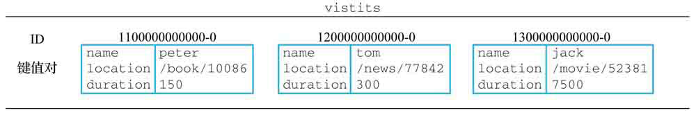

在以往的版本中，为了实现消息队列这一常见应用，用户往往会使用**列表、有序集合和发布与订阅**这3种功能，但这些不同的实现都有各自的缺陷：
+ 列表实现的消息队列虽然可以快速地将新消息追加到列表的末尾，但因为列表为线性结构，所以程序如果想要查找包含指定数据的元素，或者进行范围查找，就需要遍历整个列表
+ 有序集合虽然可以有效地进行范围查找，但缺少列表和发布与订阅提供的阻塞弹出原语，这使得程序无法使用有序集合去实现可阻塞的消息弹出操作
+ 发布与订阅虽然拥有将消息传递给多个客户端的能力，并且也拥有相应的阻塞弹出原语，但发布与订阅的“发送即忘（f ire and forget）”策略会导致离线的客户端丢失消息，所以它是无法实现可靠的消息队列的
还有一个问题是3种数据结构共有的：无论是列表、有序集合还是发布与订阅，它们的元素都只能是单个值。

Redis流的出现解决了上述提到的所有问题，它是上述3种数据结构的综合体，具备它们各自的所有优点以及特点，是使用Redis实现消息队列应用的最佳选择。

## XADD：追加新元素到流的末尾
用户可以通过执行XADD命令，将一个带有指定ID以及包含指定键值对的元素追加到流的末尾：
```
XADD stream id key value [key value ...]
```
+ XADD命令在成功执行时将返回新元素的ID作为结果
+ 如果给定的流不存在，那么Redis会先创建一个空白的流，然后将给定的元素追加到流中

### 流元素ID
流元素的ID由毫秒时间（millisecond）和顺序编号（sequcen number）两部分组成，
其中使用UNIX时间戳表示的毫秒时间用于标识与元素相关联的时间，
而以0为起始值的顺序编号则用于区分同一时间内产生的多个不同元素。
毫秒时间和顺序编号都使用64位的非负整数表示，所以整个流ID的总长为128位。
同一个流中的不同元素是不允许使用相同ID的。新元素的ID必须比流中所有已有元素的ID都要大。

用户在输入流ID的时候，除了可以给出带有毫秒时间和顺序编号的完整流ID之外，还可以给出只包含毫秒时间的不完整流ID：
在这种情况下，Redis会自动将ID的顺序编号部分设置为0。

**Redis为XADD命令的id参数设定了一个特殊值＊：当用户将符号＊用作id参数的值时，Redis将自动为新添加的元素生成一个可用的新ID。**

如果使用了＊作为ID参数的值，但是宿主机器的当前时间比流中已有最大ID的毫秒时间要小，那么Redis将使用该ID的毫秒时间来作为新ID的毫秒时间，以此来避免机器时间倒流产生错误。

### MAXLEN 限制流的长度
XADD命令还提供了MAXLEN选项，让用户可以在添加新元素的同时删除旧元素，以此来限制流的长度：
```
XADD stream [MAXLEN len] id key value [key value ...]
```
在将新元素追加到流的末尾之后，XADD命令就会按照MAXLEN选项指定的长度，按照先进先出规则移除超出长度限制的元素。

复杂度：O(log (N))，其中N为流目前包含的元素数量。

版本要求：XADD命令从Redis 5.0.0版本开始可用。

## XTRIM：对流进行修剪
通过执行XTRIM命令直接将流修剪至指定长度：
```
XTRIM stream MAXLEN len
```
+ XTRIM命令在执行之后会返回被移除元素的数量作为结果

复杂度：O(log (N) + M)，其中N为执行修剪操作前流包含的元素数量，而M则为被移除元素的数量。

版本要求：XTRIM命令从Redis 5.0.0版本开始可用。

## XDEL：移除指定元素
XDEL命令接受一个流以及任意多个元素ID作为输入，并从流中移除ID对应的元素：
```
XDEL stream [id id ... id]
```
+ XDEL命令在成功执行之后将返回被移除元素的数量作为结果

复杂度：O(log (N)*M)，其中N为流包含的元素数量，而M则为被移除元素的数量。

版本要求：XDEL命令从Redis 5.0.0版本开始可用。

## XLEN：获取流包含的元素数量
用户可以通过对流执行XLEN命令，获取流目前包含的元素数量：
```
XLEN stream
```
+ 如果给定的流没有包含任何元素，或者流并不存在，那么XLEN命令将返回0作为结果

复杂度：O(1)。

版本要求：XLEN命令从Redis 5.0.0版本开始可用。

## XRANGE、XREVRANGE：访问流中元素
Redis的XRANGE命令可以以遍历或者迭代的方式，访问流中的单个或者任意多个元素。
XRANGE命令接受一个流、一个起始ID、一个结束ID以及一个可选的COUNT选项作为参数：	
```
XRANGE stream start-id end-id [COUNT n]
```

XREVRANGE命令是XRANGE命令的逆序版本，前者除了会按照ID从大到小而不是从小到大的顺序访问流元素之外，其他作用后者是相同的：
```
XREVRANGE stream end-id start-id [COUNT n]
```
+ XREVRANGE命令先接受结束ID，后接受起始ID，这种做法跟XRANGE命令正好相同

### 获取ID指定的单个元素
XRANGE命令最简单的用法就是将命令的起始ID和结束ID设置为同一个流元素ID，这样XRANGE命令就会从流中获取并返回ID指定的元素。
+ 如果用户给定的ID不存在，那么XRANGE命令将返回一个空列表作为结果

### 获取指定ID范围内的多个元素
只需要将一个较小的元素ID设置为命令的起始ID，并将一个较大的元素ID设置为命令的结束ID，那么XRANGE命令就会从流中获取从起始ID到结束ID区间范围内的所有元素。

### 获取所有元素
XRANGE命令的起始ID和结束ID除了可以是流元素的ID之外，还可以是**特殊值减号-和加号+**，其中前者用于表示流中的最小ID，而后者则用于表示流中的最大ID。
在这两个特殊值的帮助下，用户可以通过XRANGE命令获取流包含的所有元素，或者ID大于等于或小于等于指定ID的所有元素。

### 获取指定数量的元素
用户可以通过XRANGE命令的COUNT选项去限制一次命令调用能够返回的最大元素数量：
```
XRANGE stream start-id end-id [COUNT n]
```

### 其他信息
复杂度：O(log (N) + M)，其中N为流包含的元素数量，而M则为命令返回的元素数量。

版本要求：XRANGE命令和XREVRANGE命令从Redis 5.0.0版本开始可用。

## XREAD：以阻塞或非阻塞方式获取流元素
Redis提供了XREAD命令用于获取流中元素：
```
XREAD [BLOCK ms] [COUNT n] STREAMS stream1 stream2 stream3 ... id1 id2 id3 ...
```
+ 如果用户尝试使用XREAD命令去获取一个不存在的流，或者给定的ID超过了流中已有元素的最大ID，那么命令将返回一个空值作为结果
+ XREAD命令只能从一个方向对流进行迭代
+ XREAD命令支持同时对多个流进行迭代
+ XREAD命令能够以阻塞和非阻塞两种方式执行
+ COUNT选项限制命令对于**每个流**最多可以返回多少个元素
+ BLOCK选项能够以可阻塞的方式执行XREAD命令，参数值是一个毫秒精度的时间戳，可以是任何大于等于0的数值，0则表示阻塞直到出现可返回的元素为止
+ 在执行阻塞式的XREAD命令时，只要将$符号用作ID参数的值，XREAD命令就会只获取给定流在命令执行之后新出现的元素

复杂度：对于用户给定的每个流，获取流元素的复杂度为O(log (N) + M)，其中N为流包含的元素数量，M为被获取的元素数量。

因此对于用户给定的I个流，获取流元素的总复杂度为O((log (N) + M)*I)。版本要求：XREAD命令从Redis 5.0.0版本开始可用。

## 消费者组
Redis流的消费者组（consumer group）允许用户将一个流从逻辑上划分为多个不同的流，并让**消费者组属下的消费者**去处理组中的消息。

一条消费者组消息从出现到处理完毕，需要经历以下阶段：不存在；未递送；待处理；已确认。

### 创建消费者组
创建消费者组的操作可以通过执行XGROUP CREATE命令来完成，该命令是XGROUP命令的一个子命令：
```
XGROUP CREATE stream group start_id 
```
+ stream参数用于指定流的名字
+ group参数用于指定将要创建的消费者组的名字
+ start_id参数用于指定消费者组在流中的起始ID，这个ID决定了消费者组要从流的哪个ID之后开始进行读取

**同一个流的消息在不同消费者组之间是共享而不是独占的**，
换句话说，流中的同一条消息可以被多个不同组的消费者读取，并且来自不同消费者组的读取操作不会对其他消费者组的读取操作产生任何影响。

### 读取消费者组
客户端可以通过执行XREADGROUP命令来读取消费者组中的消息：
```
XREADGROUP GROUP group consumer [COUNT n] [BLOCK ms] STREAMS stream [stream ...] id [id ...]
```
这个命令的基本参数及作用与XREAD命令大同小异，主要区别在于新增的 GROUP group consumer 选项，
该选项的两个参数分别用于指定被读取的消费者组以及负责处理消息的消费者。

### 消费者
从逻辑上来说，消费者就是负责处理消息的客户端。

与创建消费者组不一样，消费者不用显式地创建，用户只要在执行XREADGROUP命令时给定消费者的名字，Redis就会自动为新出现的消费者创建相应的数据结构。

消费者也会维护一个属于自己的待处理消息队列：
每当用户使用XREADGROUP命令读取出一条消息，并将这条消息指派给一个消费者处理时，该消费者就会把所指派的消息添加到自己的待处理消息队列中。

**同一消费者组中的每条消息只能有一个消费者**，换句话说，不同的消费者将独占组中的不同消息：
当一个消费者读取了组中的一条消息之后，同组的其他消费者将无法读取这条消息。

### 消息的状态转换
当消费者处理完一条消息之后，它需要向Redis发送一条针对该消息的XACK命令：
```
XACK stream group id [id id ...]
```
+ 当Redis接收到消费者发来的XACK命令之后，就会从消费者组的待处理消息队列以及消费者的待处理消息队列中移除指定的消息

一条消费者组消息从出现到处理完毕，需要经历以下阶段：
+ 首先，当一个生产者通过XADD命令向流中添加一条消息时，该消息就从原来的“不存在”状态转换成了“未递送”状态
+ 然后，当一个消费者通过XREADGROUP命令从流中读取一条消息时，该消息就从原来的“未递送”状态转换成了“待处理”状态
+ 最后，当消费者完成了对消息的处理，并通过XACK命令向服务器进行确认时，该消息就从原来的“待处理”状态转换成了“已确认”状态

## XGROUP：管理消费者组
### XGROUP CREATE：创建消费者组
通过执行XGROUP CREATE命令，用户可以为流创建一个具有指定名字的消费者组：
```
XGROUP CREATE stream group id
```
+ 命令的id参数指定了消费者组的最后递送消息ID，这个ID限定了消费者能够接收到的消息范围：消费者组属下的消费者只能接收到ID大于最后递送消息ID的消息，并且消费者组的最后递送消息ID还会随着消费者执行的读取操作而不断更新
+ 如果一切正常，那么XGROUP CREATE命令在成功执行之后将返回OK
+ XGROUP CREATE命令目前只能为已经存在的流创建消费者组，如果用户给定的流不存在，那么命令将返回一个错误

复杂度：O(1)。

版本要求：XGROUP CREATE命令从Redis 5.0.0版本开始可用。

### XGROUP SETID：修改消费者组的最后递送消息ID
对于一个已经存在的消费者组来说，用户可以通过执行XGROUP SETID命令来为消费者组设置新的最后递送消息ID：
```
XGROUP SETID stream group id
```
+ 命令给定的ID可以是任意合法的消息ID, ID对应的消息不必实际存在，并且新ID可以大于、小于甚至等于当前ID
+ 除了合法的消息ID之外，特殊符号$也可以用作id参数的值，这个符号可以把消费者组的最后递送消息ID设置为流最新消息的ID

使用XGROUP SETID命令显式地修改最后递送消息ID将对后续执行的XREADGROUP命令的结果产生影响：
+ 如果新ID大于旧ID，那么消费者可能会漏掉一些原本应该读取的消息
+ 如果新ID小于旧ID，那么消费者可能会重新读取到一些之前已经被确认过的消息

复杂度：O(1)。

版本要求：XGROUP SETID命令从Redis 5.0.0版本开始可用。

### XGROUP DELCONSUMER：删除消费者
当用户不再需要某个消费者的时候，可以通过执行以下命令将其删除：
```
XGROUP DELCONSUMER stream group consumer
```
+ 命令在执行之后将返回一个数字作为结果，这个数字就是消费者被删除时，它仍在处理的消息数量

复杂度：O(N)，其中N为被删除消费者正在处理的消息数量。

版本要求：XGROUP DELCONSUMER命令从Redis 5.0.0版本开始可用。

### XGROUP DESTROY：删除消费者组
用户可以通过执行以下命令来删除消费者组：
```
XGROUP DESTROY stream group	
```
+ 命令在成功执行时返回1，因为组不存在等原因导致命令执行失败时返回0

复杂度：O(N+ M)，其中N为消费者组被删除时，仍处于“待处理”状态的消息数量，而M则是该组属下消费者的数量。

版本要求：XGROUP DESTROY命令从Redis 5.0.0版本开始可用。

## XREADGROUP：读取消费者组中的消息
XREADGROUP命令是消费者组版本的XREAD命令，用户可以使用这个命令读取消费者组中的消息：
```
XREADGROUP GROUP group consumer [COUNT n] [BLOCK ms] STREAMS stream [stream ...] id [id ...]
```
+ GROUP 选项用于指定消费者组和消费者，group 参数表示想要读取的消费者组，consumer参数 表示执行该操作的消费者。

复杂度：对于用户给定的每个流，从流中获取消息的复杂度为O(log (N) + M)，其中N为流包含的消息数量，而M则为被获取消息的数量。因此对于用户给定的I个流，获取这些流消息的总复杂度为O((log (N) + M)*I)。

版本要求：XREADGROUP命令从Redis 5.0.0版本开始可用。

## XPENDING：显示待处理消息的相关信息
用户可以通过XPENDING命令，获取指定流的指定消费者组目前的待处理消息的相关信息：
```
XPENDING stream group [start stop count] [consumer]
```

返回信息包括：
+ 待处理消息的数量
+ 待处理消息队列中的首条消息和最后一条消息的ID（前者是队列中ID最小的消息，而后者则是队列中ID最大的消息）
+ 该组名下各个消费者正在处理的消息数量（没有在处理消息的消费者将被省略）

复杂度：执行XPENDING stream group格式的XPENDING的复杂度为O(N)，其中N为消费者组目前拥有的消费者数量；执行带有start、stop和count参数的XPENDING命令的复杂度为O(log (N) + M)，其中N为消费者组目前拥有的待处理消息总数量，而M则是命令返回的消息数量；执行带有consumer参数的XPENDING命令的复杂度为O(log(N) +M)，其中N为该消费者目前拥有的待处理消息数量，而M则为命令返回的消息数量。

版本要求：XPENDING命令从Redis 5.0.0版本开始可用。

## XACK：将消息标记为“已处理”
通过执行XACK命令，用户可以将消费者组中的指定消息标记为“已处理”：
```
XACK stream group id [id id ...]
```
+ XACK命令在执行之后将返回被标记的消息数量作为结果

复杂度：O(N)，其中N为用户给定的消息ID数量。

版本要求：XACK命令从Redis 5.0.0版本开始可用。

## XCLAIM：转移消息的归属权
用户可以通过执行XCLAIM命令，将指定消息的归属权从一个消费者转向另一个消费者：
```
XCLAIM stream group new_consumer max_pending_time id [id ...]
```
+ stream参数和group参数指定了消息所在的流和消费者组
+ new_consumer指定了消息的新消费者
+ id参数则指定了需要转移归属权的消息
+ 毫秒格式的max_pending_time参数指定了执行归属权转移操作所需的最大消息处理时限

用户也可以通过给定可选的 JUSTID 选项，让命令只返回被转移消息的ID：
```
XCLAIM stream group new_consumer max_pending_time id [id ...] [JUSTID]
```

复杂度：O(N)，其中N为用户给定的消息ID数量。

版本要求：XCLAIM命令从Redis 5.0.0版本开始可用。

## XINFO：查看流和消费者组的相关信息
XINFO命令用于查看流及其消费者组的相关信息，该命令提供了多个具备不同功能的子命令。

### XINFO CONSUMERS：打印消费者信息
XINFO CONSUMERS命令用于打印指定消费者组的所有消费者，以及这些消费者的相关信息：
```
XINFO CONSUMERS stream group-name
```
+ 命令打印的信息包括消费者的名字、它们正在处理的消息数量以及消费者的闲置时长

### XINFO GROUPS：打印消费者组信息
XINFO GROUPS命令用于打印与给定流相关联的所有消费者组，以及这些消费者组的相关信息：
```
XINFO GROUPS stream
```
+ 命令打印的信息包括消费者组的名字、它拥有的消费者数量、组中正在处理消息的数量以及该组最后递送消息的ID

### XINFO STREAM：打印流消息
XINFO STREAM命令用于打印给定流的相关信息：
```
XINFO STREAM stream
```
+ 命令打印的信息包括流的长度（包含的消息数量）、流在底层的基数树表示的相关信息、流相关的消费者组数量、流最后生成的消息的ID以及流的第一个节点和最后一个节点。

### 其他信息
复杂度：
XINFO CONSUMERS命令的复杂度为O(N)，其中N为给定消费者组的消费者数量；
XINFO GROUPS命令的复杂度为O(M)，其中M为给定流属下的消费者组数量；
XINFO STREAM命令的复杂度为O(1)。

版本要求：XINFO CONSUMERS、XINFO GROUPS和XINFO STREAM这3条命令从Redis 5.0.0版本开始可用。

# 附加功能--------------------------------------------------

# 数据库
无论是字符串键、散列键还是列表键，都会被存储到一个名为数据库的容器中。

因为Redis是一个键值对数据库服务器，所以它的数据库与之前介绍过的散列键一样，都可以根据键的名字对数据库中的键值对进行索引。

## SELECT：切换至指定的数据库
一个Redis服务器可以包含多个数据库。

Redis虽然不允许在同一个数据库中使用两个同名的键，但是由于不同数据库拥有不同的命名空间，因此在不同数据库中使用同名的键是完全没有问题的。

在默认情况下，Redis服务器在启动时将会创建16个数据库：
这些数据库都使用号码进行标识，其中第一个数据库为0号数据库，第二个数据库为1号数据库，以此类推。

当用户使用客户端与Redis服务器进行连接时，客户端一般默认都会使用0号数据库，
通过使用SELECT命令，用户可以从当前正在使用的数据库切换到自己想要使用的数据库：
```
SELECT db
```
+ SELECT命令在切换成功之后将返回OK

复杂度：O(1)。

版本要求：SELECT命令从Redis 1.0.0版本开始可用。

## KEYS：获取所有与给定匹配符相匹配的键
KEYS命令接受一个**全局匹配符**作为参数，然后返回数据库中所有与这个匹配符相匹配的键作为结果：
```
KEYS pattern
```

常用全局匹配符：
+ *：匹配零个或多个任意字符
+ ?：匹配任意单个字符
+ []：匹配给定字符中的单个字符
+ [?-?]：匹配给定范围中的单个字符

复杂度：O(N)，其中N为数据库包含的键数量。

版本要求：KEYS命令从Redis 1.0.0版本开始可用。

## SCAN：以渐进方式迭代数据库中的键
KEYS命令需要检查数据库包含的所有键，并一次性将符合条件的所有键全部返回给客户端，所以当数据库包含的键数量比较大时，使用KEYS命令可能会导致服务器被阻塞。

Redis从2.8.0版本开始提供SCAN命令，该命令是一个迭代器，它每次被调用的时候都会从数据库中获取一部分键，用户可以通过重复调用SCAN命令来迭代数据库包含的所有键：
```
SCAN cursor
```

SCAN命令的执行结果由两个元素组成：
+ 第一个元素是进行下一次迭代所需的游标，如果这个游标为0，那么说明客户端已经对数据库完成了一次完整的迭代。
+ 第二个元素是一个列表，这个列表包含了本次迭代取得的数据库键；如果SCAN命令在某次迭代中没有获取到任何键，那么这个元素将是一个空列表。

关于SCAN命令返回的键列表，有两点需要注意：
+ SCAN命令可能会返回重复的键，用户如果不想在结果中包含重复的键，那么就需要自己在客户端中进行检测和过滤。
+ SCAN命令返回的键数量是不确定的，有时甚至会不返回任何键，但只要命令返回的游标不为0，迭代就没有结束。

通过使用可选的MATCH选项，我们同样可以让SCAN命令只返回与给定全局匹配符相匹配的键：
```
SCAN cursor [MATCH pattern]
```

通过使用可选的COUNT选项，向SCAN命令提供一个期望值：
```
SCAN cursor [COUNT number]
```
+ 这里需要特别注意的是，COUNT选项向命令提供的只是期望的键数量，但并不是精确的键数量
+ 在用户没有显式地使用COUNT选项的情况下，SCAN命令将使用10作为COUNT选项的默认值

### 数据结构迭代命令
Redis为散列、集合和有序集合也提供了与SCAN命令类似的游标迭代命令，分别是HSCAN命令、SSCAN命令和ZSCAN命令。

### HSCAN：渐进式散列迭代命令
HSCAN命令可以以渐进的方式迭代给定散列包含的键值对：
```
HSCAN hash cursor [MATCH pattern] [COUNT number]
```

### SSCAN：渐进式集合迭代命令
SSCAN命令可以以渐进的方式迭代给定集合包含的元素：
```
SSCAN set cursor [MATCH pattern] [COUNT number]
```

### ZSCAN：渐进式有序集合迭代命令
ZSCAN命令可以以渐进的方式迭代给定有序集合包含的成员和分值：
```
ZSCAN sorted_set cursor [MATCH pattern] [COUNT number]
```

### 其他信息
复杂度：SCAN命令、HSCAN命令、SSCAN命令和ZSCAN命令单次执行的复杂度为O(1)，而使用这些命令进行一次完整迭代的复杂度则为O(N)，其中N为被迭代的元素数量。

版本要求：SCAN命令、HSCAN命令、SSCAN命令和ZSCAN命令从Redis 2.8.0版本开始可用。

## RANDOMKEY：随机返回一个键
RANDOMKEY命令可以从数据库中随机地返回一个键：
```
RANDOMKEY
```
+ RANDOMKEY命令不会移除被返回的键，它们会继续留在数据库中
+ 当数据库为空时，RANDOMKEY命令将返回一个空值

复杂度：O(1)。

版本要求：RANDOMKEY命令从Redis 1.0.0版本开始可用。

## SORT：对键的值进行排序
通过执行SORT命令对**列表元素、集合元素或者有序集合成员**进行排序：
```
SORT key
```
+ Redis为SORT命令提供了非常多的可选项，能够以不同的方式进行排序
+ 在默认情况下，SORT命令对指定键存储的元素执行数字值排序
+ 在默认情况下，SORT命令执行的是升序排序操作

### 指定排序方式
通过使用可选的ASC选项或者DESC选项，用户可以指定SORT命令的排序方式：
```
SORT key [ASC|DESC]
```
+ 其中ASC表示执行升序排序操作，而DESC则表示执行降序排序操作

### 对字符串值进行排序
SORT命令在默认情况下进行的是数字值排序，如果直接使用SORT命令去对字符串元素进行排序，那么命令将产生一个错误。

通过使用ALPHA选项来，让SORT命令能够对字符串值进行排序：
```
SORT key [ALPHA]
```

### 只获取部分排序结果
通过使用可选的LIMIT选项，返回其中一部分排序结果：
```
SORT key [LIMIT offset count] 
```
+ 其中offset参数用于指定返回结果之前需要跳过的元素数量，而count参数则用于指定需要获取的元素数量

### 获取外部键的值作为结果
SORT命令将返回被排序的元素作为结果，但如果用户有需要，也可以使用GET选项去获取其他值作为排序结果：
```
SORT key [[GET pattern] [GET pattern] ...] 
```

### 使用外部键的值作为排序权重
SORT命令将使用被排序元素本身作为排序权重，但在有需要时，用户可以通过可选的BY选项指定其他键的值作为排序的权重：
```
SORT key [BY pattern]
```

### 保存排序结果
SORT命令会直接将排序结果返回给客户端，但如果用户有需要，也可以通过可选的STORE选项，以列表形式将排序结果存储到指定的键中：
```
SORT key [STORE destination]
```
+ 如果用户给定的destination键已经存在，那么SORT命令会先移除该键，然后再存储排序结果
+ 带有STORE选项的SORT命令在成功执行之后将返回被存储的元素数量作为结果

### 其他信息
平均复杂度：O(N*log(N)+M)，其中N为被排序元素的数量，而M则为命令返回的元素数量。

版本要求：SORT命令从Redis 1.0.0版本开始可用。

## EXISTS：检查给定键是否存在
用户可以通过使用EXISTS命令，检查给定的一个或多个键是否存在于当前正在使用的数据库中：
```
EXISTS key [key ...] 
```
+ EXISTS命令将返回存在的给定键数量作为返回值
+ 如果只想确认某个键是否存在，那么只需要将那个键传递给EXISTS命令即可，键存在时返回1，不存在时返回0

复杂度：Redis 3.0.3版本以前，只能接受单个键作为输入的EXISTS命令的复杂度为O(1) ; Redis 3.0.3及以上版本，能够接受多个键作为输入的EXISTS命令的复杂度为O(N)，其中N为用户给定的键数量。

版本要求：EXISTS命令从Redis 1.0.0版本开始可用，但只有Redis 3.0.3及以上版本才能接受多个键作为输入，此前的版本只能接受单个键作为输入。

## DBSIZE：获取数据库包含的键值
对数量用户可以通过执行DBSIZE命令来获知当前使用的数据库包含了多少个键值对：
```
DBSIZE
```
复杂度：O(1)。

版本要求：DBSIZE命令从Redis 1.0.0版本开始可用。

## TYPE：查看键的类型
TYPE命令允许我们查看给定键的类型：
```
TYPE key
```

TYPE命令在面对不同类型的键时返回的各项结果：

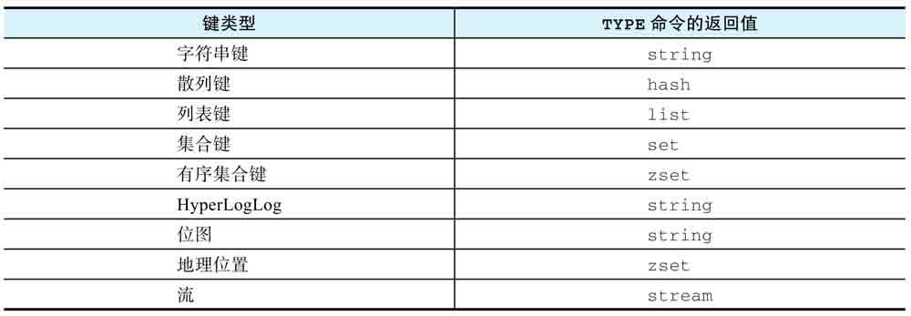

+ 有序集合也被称为zset，因此TYPE命令在接收到有序集合键作为输入时，将返回zset作为结果。
+ 因为HyperLogLog和位图这两种键在底层都是通过字符串键来实现的，所以TYPE命令对于这两种键将返回string作为结果。
+ 因为地理位置键使用了有序集合键作为底层实现，所以TYPE命令对于地理位置键将返回zset作为结果。

复杂度：O(1)。

版本要求：TYPE命令从Redis 1.0.0版本开始可用。

## RENAME、RENAMENX：修改键名
RENAME命令，用户可以使用这个命令修改键的名称：
```
RENAME origin_key new_key
```
+ RENAME命令在执行成功时将返回OK作为结果
+ 如果用户指定的新键名已经被占用，那么RENAME命令会先移除占用了新键名的那个键，然后再执行改名操作

RENAMENX命令，只会在新键名尚未被占用的情况下进行改名，如果用户指定的新键名已经被占用，那么RENAMENX将放弃执行改名操作：
```
RENAMENX origin_key new_key
```
+ RENAMENX命令在改名成功时返回1，失败时返回0

复杂度：O(1)。

版本要求：RENAME命令和RENAMENX命令都从Redis 1.0.0版本开始可用。

## MOVE：将给定的键移动到另一个数据库
用户可以使用MOVE命令，将一个键从当前数据库移动至目标数据库：
```
MOVE key db
```
+ 当MOVE命令成功将给定键从当前数据库移动至目标数据库时，命令返回1
+ 如果给定键并不存在于当前数据库，或者目标数据库中存在与给定键同名的键，那么MOVE命令将不做动作，只返回0表示移动失败

复杂度：O(1)。

版本要求：MOVE命令从Redis 1.0.0版本开始可用。

## DEL：移除指定的键
DEL命令允许用户从当前正在使用的数据库中移除指定的一个或多个键，以及与这些键相关联的值：
```
DEL key [key ...]
```
DEL命令将返回成功移除的键数量作为返回值

复杂度：O(N)，其中N为被移除键的数量。

版本要求：DEL命令从Redis 1.0.0版本开始可用。

## UNLINK：以异步方式移除指定的键
DEL命令会以同步方式执行移除操作，所以如果待移除的键非常庞大或者数量众多，那么服务器在执行移除操作的过程中就有可能被阻塞。

Redis从4.0版本开始新添加了一个UNLINK命令：
```
UNLINK key [key ...]
```
UNLINK与DEL命令的区别在于，当用户调用UNLINK命令去移除一个数据库键时，UNLINK只会在数据库中移除对该键的引用（reference），而对键的实际移除操作则会交给后台线程执行，因此UNLINK命令将不会造成服务器阻塞。

复杂度：O(N)，其中N为被移除键的数量。

版本要求：UNLINK命令从Redis 4.0版本开始可用。

## FLUSHDB：清空当前数据库
通过使用FLUSHDB命令，用户可以清空当前正在使用的数据库：
```
FLUSHDB
```
+ 返回OK表示数据库已被清空

Redis 4.0给FLUSHDB命令新添加了一个**async**选项：
```
FLUSHDB async
```
+ 如果在调用FLUSHDB命令时使用了async选项，那么实际的数据库清空操作将放在后台线程中以异步方式进行，就不会再阻塞服务器

复杂度：O(N），其中N为被清空数据库包含的键值对数量。

版本要求：不带任何选项的FLUSHDB命令从Redis 1.0.0版本开始可用，带有async选项的FLUSHDB命令从Redis 4.0版本开始可用。

## FLUSHALL：清空所有数据库
使用FLUSHALL命令，用户可以清空Redis服务器包含的所有数据库：
```
FLUSHALL
```
+ 返回OK表示所有数据库均已被清空

Redis 4.0也给FLUSHALL命令添加了同样的async选项：
```
FLUSHALL async
```
+ 通过指定async选项，FLUSHALL命令将以异步方式在后台线程中执行所有实际的数据库清空操作，将不会再阻塞服务器

复杂度：O(N)，其中N为被清空的所有数据库包含的键值对总数量。

版本要求：不带任何选项的FLUSHALL命令从Redis 1.0.0版本开始可用，带有async选项的FLUSHALL命令从Redis 4.0版本开始可用。

## SWAPDB：互换数据库
SWAPDB命令接受两个数据库号码作为输入，然后对指定的两个数据库进行互换：
```
SWAPDB x y
```
+ SWAPDB命令返回OK作为结果
+ 在SWAPDB命令执行完毕之后，原本存储在数据库x中的键值对将出现在数据库y中，而原本存储在数据库y中的键值对将出现在数据库x中
+ 互换数据库这一操作可以通过调整指向数据库的指针来实现，这个过程不需要移动数据库中的任何键值对，所以SWAPDB命令的复杂度是O(1)而不是O(N)，并且执行这个命令也不会导致服务器阻塞

复杂度：O(1)。

版本要求：SWAPDB命令从Redis 4.0版本开始可用。

# 自动过期
## EXPIRE、PEXPIRE：设置生存时间
用户可以通过执行EXPIRE命令或者PEXPIRE命令为键设置一个**生存时间（Time ToLive, TTL）**。
EXPIRE命令用于设置秒级精度的生存时间，PEXPIRE命令则用于设置毫秒级精度的生存时间：
```
EXPIRE key seconds 
PEXPIRE key milliseconds
```
+ EXPIRE命令和PEXPIRE命令在生存时间设置成功时返回1；如果用户给定的键并不存在，那么命令返回0表示设置失败
+ 对一个已经带有生存时间的键执行EXPIRE命令或PEXPIRE命令时，键原有的生存时间将会被移除，**并设置新的生存时间**

复杂度：EXPIRE命令和PEXPIRE命令的复杂度都为O(1)。

版本要求：EXPIRE命令从Redis 1.0.0版本开始可用，PEXPIRE命令从Redis 2.6.0版本开始可用。

## SET命令的EX选项和PX选项：执行SET命令同时设置生存时间
Redis从2.6.12版本开始为SET命令提供EX选项和PX选项，可以通过使用这两个选项的其中一个来达到同时执行SET命令和EXPIRE/PEXPIRE命令的效果：
```
SET key value [EX seconds] [PX milliseconds]
```
+ 使用带有EX选项或PX选项的SET命令除了可以减少命令的调用数量并提升程序的执行速度之外，更重要的是保证了操作的原子性

复杂度：O(1)。

版本要求：带有EX选项和PX选项的SET命令从Redis 2.6.12版本开始可用。

## EXPIREAT、PEXPIREAT：设置过期时间
Redis还可以通过设置**过期时间（expire time**），让Redis在指定UNIX时间来临之后自动移除给定的键。
设置过期时间这一操作可以通过EXPIREAT命令或者PEXPIREAT命令来完成。
EXPIREAT命令接受一个键和一个秒级精度的UNIX时间戳为参数，PEXPIREAT命令接受一个键和一个毫秒级精度的UNIX时间戳为参数：
```
EXPIREAT key seconds_timestamp
EXPIREAT key milliseconds_timestamp
```
+ 对一个已经带有过期时间的键执行EXPIRE命令或PEXPIRE命令时，会更新键的过期时间
+ 无论是本节介绍的EXPIREAT/PEXPIREAT，还是前面介绍的EXPIRE/PEXIRE，它们都只能对整个键进行设置，而无法对键中的某个元素进行设置

复杂度：EXPIREAT命令和PEXPIREAT命令的复杂度都为O(1)。

版本要求：EXPIREAT命令从Redis 1.2.0版本开始可用，PEXPIREAT命令从Redis2.6.0版本开始可用。

## TTL、PTTL：获取键的剩余生存时间
用户可以使用TTL命令或者PTTL命令查看键的剩余生存时间。
TTL命令将以秒为单位返回键的剩余生存时间，PTTL命令则会以毫秒为单位返回键的剩余生存时间：
```
TTL key
PTTL key
```
+ 如果给定的键存在，但是并没有设置生存时间或者过期时间，那么TTL命令和PTTL命令将返回-1
+ 如果给定的键并不存在，那么TTL命令和PTTL命令将返回-2

复杂度：TTL命令和PTTL命令的复杂度都为O(1)。

版本要求：TTL命令从Redis 1.0.0版本开始可用，PTTL命令从Redis 2.6.0版本开始可用。

# 流水线与事务
Redis的流水线特性可以有效地提升Redis程序的性能。
事务特性可以避免单独执行命令时可能会出现的一些错误。

## 流水线

## 事务

## 带有乐观锁的事务

# Lua脚本
Redis对Lua脚本的支持是从Redis 2.6.0版本开始引入的，它可以让用户在Redis服务器内置的Lua解释器中执行指定的Lua脚本。

被执行的Lua脚本可以直接调用Redis命令，并使用Lua语言及其内置的函数库处理命令结果。

**Lua的官方网站：http://www.lua.org/docs.html**

## EVAL：执行脚本

## SCRIPT LOAD和EVALSHA：缓存并执行脚本

## 脚本管理

### SCRIPT EXISTS：检查脚本是否已被缓存

### SCRIPT FLUSH：移除所有已缓存脚本

### SCRIPT KILL：强制停止正在运行的脚本

## 内置函数库

## 脚本调试

# 持久化
Redis提供了**RDB持久化、AOF持久化和RDB-AOF混合持久化**等多种持久化方式。
也可以完全关闭持久化功能，让服务器处于无持久化状态。

## RDB持久化
RDB持久化可以创建出一个经过压缩的二进制文件，其中包含了服务器在各个数据库中存储的键值对数据等信息。

RDB持久化是Redis默认使用的持久化功能。

Redis提供了多种创建RDB文件的方法，可以使用SAVE命令或者BGSAVE命令手动创建RDB文件，也可以通过设置save配置选项让服务器在满足指定条件时自动执行BGSAVE命令。

### SAVE：阻塞服务器并创建RDB文件
用户可以通过执行SAVE命令，要求Redis服务器以同步方式创建出一个记录了服务器当前所有数据库数据的RDB文件：
```
SAVE
```
+ SAVE命令是一个无参数命令
+ SAVE命令创建RDB文件成功时将返回OK作为结果
+ 在SAVE命令执行期间，Redis服务器将阻塞，直到RDB文件创建完毕为止
+ 如果Redis服务器在执行SAVE命令时已经拥有了相应的RDB文件，那么服务器将使用新创建的RDB文件代替已有的RDB文件

复杂度：O(N)，其中N为Redis服务器所有数据库包含的键值对总数量。

版本要求：SAVE命令从Redis 1.0.0版本开始可用。

### BGSAVE：以非阻塞方式创建RDB文件
BGSAVE不会直接使用Redis服务器进程创建RDB文件，而是使用子进程创建RDB文件：
```
BGSAVE
```
+ 这个命令与SAVE命令一样都是无参数命令

复杂度：O(N)，其中N为Redis服务器所有数据库包含的键值对总数量。

版本要求：BGSAVE命令从Redis 1.0.0版本开始可用。

### 通过配置选项自动创建RDB文件
可以通过设置save选项，让Redis服务器在满足指定条件时自动执行BGSAVE命令：
```
save <seconds> <changes>
```
+ save选项接受seconds和changes两个参数，前者用于指定触发持久化操作所需的时长，而后者则用于指定触发持久化操作所需的修改次数
+ Redis允许用户同时向服务器提供多个save选项，当给定选项中的任意一个条件被满足时，服务器就会执行一次BGSAVE
+ RDB持久化是Redis默认使用的持久化方式

### RDB文件结构
RDB文件的总体结构，整个文件共分为7个部分：
+ RDB文件标识符
+ 版本号
+ 设备附加信息
+ 数据库数据
+ Lua脚本缓存
+ EOF
+ CRC64校验和

### RDB文件载入流程
当Redis服务器启动时，它会在工作目录中查找是否有RDB文件出现，如果有就打开它，然后读取文件的内容并执行以下载入操作：
+ 检查文件开头的标识符是否为"REDIS"，如果是则继续执行后续的载入操作，不是则抛出错误并终止载入操作。
+ 检查文件的RDB版本号，以此来判断当前Redis服务器能否读取这一版本的RDB文件。
+ 根据文件中记录的设备附加信息，执行相应的操作和设置。
+ 检查文件的数据库数据部分是否为空，如果不为空就执行以下子操作：
	+ 根据文件记录的数据库号码，切换至正确的数据库。
	+ 根据文件记录的键值对总数量以及带有过期时间的键值对数量，设置数据库底层数据结构。
	+ 一个接一个地载入文件记录的所有键值对数据，并在数据库中重建这些键值对。
+ 如果服务器启用了复制功能，那么将之前缓存的Lua脚本重新载入缓存中。
+ 遇到EOF标识，确认RDB正文已经全部读取完毕。
+ 载入RDB文件末尾记录的CRC64校验和，把它与载入数据期间计算出的CRC64校验和进行对比，以此来判断被载入的数据是否完好无损。
+ RDB文件载入完毕，服务器开始接受客户端请求。

### 数据丢失
从RDB持久化的特征来看，它更像是一种数据备份手段而非一种普通的数据持久化手段。

停机时服务器丢失的数据量将取决于创建RDB文件的时间间隔：间隔越长，停机时丢失的数据也就越多。

## AOF持久化
**与全量式的RDB持久化功能不同，AOF提供的是增量式的持久化功能。**

这种持久化的核心原理在于：服务器每次执行完写命令之后，都会以协议文本的方式将被执行的命令追加到AOF文件的末尾。

### 开启AOF持久化功能
用户可以通过服务器的appendonly选项来决定是否打开AOF持久化功能：
```
appendonly <value>
```
+ 如果用户想要开启AOF持久化功能，那么只需要将这个值设置为yes
+ 如果用户想要关闭AOF持久化功能，那么只需要将这个值设置为no
+ 当AOF持久化功能处于打开状态时，Redis服务器在默认情况下将创建一个名为appendonly. aof的文件作为AOF文件

### 设置AOF文件的冲洗频率
Redis提供了appendfsync选项，以此来控制系统冲洗AOF文件的频率：


## RDB-AOF混合持久化

## 同时使用RDB持久化和AOF持久化

## 无持久化

## SHUTDOWN：关闭服务器
