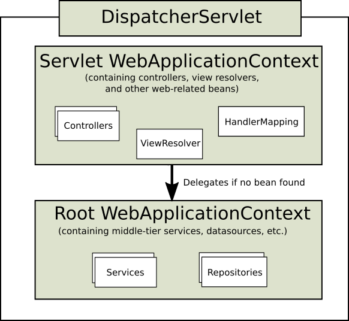

# 参考资料
> [Spring参考文档](https://docs.spring.io/spring-framework/docs/current/reference/html/)
> [Web on Servlet Stack](https://docs.spring.io/spring-framework/docs/current/reference/html/web.html#spring-web)

--------------------------------------------------
此部分的文档涵盖对基于Servlet API构建并部署到Servlet容器的Servlet堆栈Web应用程序的支持。

# Spring Web MVC
Spring Web MVC是基于Servlet API构建的原始Web框架，从一开始就已包含在Spring框架中。正式名称“ Spring Web MVC”来自其源模块（spring-webmvc）的名称，但更通常称为“ Spring MVC”。

Spring Framework 5.0引入了一个反应式堆栈Web框架，其名称“ Spring WebFlux”基于其源模块（spring-webflux）。

## DispatcherServlet 分发器
Spring MVC围绕着前端控制器模式设计一个核心Servlet：DispatcherServlet，提供了用于请求处理的共享算法，而实际工作是由可配置的委托组件执行的。

DispatcherServlet作为Servlet，需要通过使用Java配置或web.xml进行定义声明。
另外，DispatcherServlet使用Spring配置文件来发现它所需要的请求映射，视图解析，异常处理，委托组件等配置信息。

以下示例使用Java配置注册并初始化DispatcherServlet：
```
public class MyWebApplicationInitializer implements WebApplicationInitializer {

    @Override
    public void onStartup(ServletContext servletContext) {

        // Load Spring web application configuration
        AnnotationConfigWebApplicationContext context = new AnnotationConfigWebApplicationContext();
        context.register(AppConfig.class);

        // Create and register the DispatcherServlet
        DispatcherServlet servlet = new DispatcherServlet(context);
        ServletRegistration.Dynamic registration = servletContext.addServlet("app", servlet);
        registration.setLoadOnStartup(1);
        registration.addMapping("/app/*");
    }
}
```

以下示例使用web.xml配置注册并初始化DispatcherServlet：
```
<web-app>
    <listener>
        <listener-class>org.springframework.web.context.ContextLoaderListener</listener-class>
    </listener>

    <context-param>
        <param-name>contextConfigLocation</param-name>
        <param-value>/WEB-INF/app-context.xml</param-value>
    </context-param>

    <servlet>
        <servlet-name>app</servlet-name>
        <servlet-class>org.springframework.web.servlet.DispatcherServlet</servlet-class>
        <init-param>
            <param-name>contextConfigLocation</param-name>
            <param-value></param-value>
        </init-param>
        <load-on-startup>1</load-on-startup>
    </servlet>

    <servlet-mapping>
        <servlet-name>app</servlet-name>
        <url-pattern>/app/*</url-pattern>
    </servlet-mapping>
</web-app>
```

Spring Boot遵循不同的初始化顺序。
Spring Boot并没有陷入Servlet容器的生命周期，而是使用Spring配置来引导自身和嵌入式Servlet容器。

### 上下文结构
DispatcherServlet预定义了一个WebApplicationContext，可以对自身进行扩展配置。
WebApplicationContext具有指向ServletContext和Servlet的链接。
WebApplicationContext也与ServletContext绑定，这样applications可以使用RequestContextUtils的静态方法来查找WebApplicationContext。

对于许多应用程序而言，一个WebApplicationContext是足够的。
也可以是上下文层次结构，其中 根WebApplicationContext 在多个DispatcherServlet实例之间共享，每个实例都有其自己的 子WebApplicationContext 配置。

根WebApplicationContext 通常包含基础结构bean，例如需要在多个Servlet实例之间共享的数据存储库和业务服务。
这些Bean被有效地继承，并且可以在Servlet特定的子级中重写，子WebApplicationContext 通常包含给定本地的Servlet Bean。

下图显示了这种关系：


以下示例配置WebApplicationContext层次结构：
```
public class MyWebAppInitializer extends AbstractAnnotationConfigDispatcherServletInitializer {

    @Override
    protected Class<?>[] getRootConfigClasses() {
        return new Class<?>[] { RootConfig.class };
    }

    @Override
    protected Class<?>[] getServletConfigClasses() {
        return new Class<?>[] { App1Config.class };
    }

    @Override
    protected String[] getServletMappings() {
        return new String[] { "/app1/*" };
    }
}
```
如果不需要应用程序上下文层次结构，则应用程序可以通过getRootConfigClasses()和null从返回所有配置getServletConfigClasses()。

以下示例显示了web.xml等效项：
```
<web-app>
    <listener>
        <listener-class>org.springframework.web.context.ContextLoaderListener</listener-class>
    </listener>

    <context-param>
        <param-name>contextConfigLocation</param-name>
        <param-value>/WEB-INF/root-context.xml</param-value>
    </context-param>

    <servlet>
        <servlet-name>app1</servlet-name>
        <servlet-class>org.springframework.web.servlet.DispatcherServlet</servlet-class>
        <init-param>
            <param-name>contextConfigLocation</param-name>
            <param-value>/WEB-INF/app1-context.xml</param-value>
        </init-param>
        <load-on-startup>1</load-on-startup>
    </servlet>

    <servlet-mapping>
        <servlet-name>app1</servlet-name>
        <url-pattern>/app1/*</url-pattern>
    </servlet-mapping>
</web-app>
```
如果不需要应用程序上下文层次结构，则应用程序可以仅配置“根”上下文，并将Servlet的contextConfigLocation参数保留为空。

### 特殊Bean
DispatcherServlet特殊bean的委托处理请求并提供适当的响应。
所谓“特殊bean”，是指实现框架合同的Spring托管实例。
这些通常带有内置合同，但是您可以自定义它们的属性并扩展或替换它们。

下表列出了被检测到的特殊bean DispatcherServlet：
|豆类	|说明	|
|--	|--	|
|HandlerMapping	|将请求与拦截器列表一起映射到处理程序，以 进行预处理和后期处理。映射基于某些条件，具体标准因HandlerMapping 实现而异。两个主要HandlerMapping实现是RequestMappingHandlerMapping （支持带@RequestMapping注解的方法）和SimpleUrlHandlerMapping （维护对处理程序的URI路径模式的显式注册）。	|
|HandlerAdapter	|帮助DispatcherServlet调用映射到请求的处理程序，而不管实际如何调用该处理程序。例如，调用带注解的控制器需要解析注解。a的主要目的HandlerAdapter是保护DispatcherServlet这些细节。	|
|HandlerExceptionResolver	|解决异常的策略，可能将它们映射到处理程序，HTML错误视图或其他目标。	|
|ViewResolver	|String将从处理程序返回的基于逻辑的视图名称解析为实际的名称View ，以将其呈现给响应。	|
|LocaleResolver，LocaleContextResolver	|解析Locale一个客户正在使用的并且可能是他们所在的时区，以便能够提供国际化的视图。	|
|ThemeResolver	|解决Web应用程序可以使用的主题，例如，提供个性化的布局。	|
|MultipartResolver	|借助一些多部分解析库来解析多部分请求的抽象（例如，浏览器表单文件上传）。	|
|FlashMapManager	|存储和检索“输入”和“输出” FlashMap，它们通常用于通过重定向将属性从一个请求传递到另一个请求。	|

### Web MVC配置
应用程序可以声明处理请求所需的特殊Bean类型中列出的基础结构Bean。
DispatcherServlet检查WebApplicationContext中的特殊Bean，如果没有匹配的Bean类型，它将使用中 DispatcherServlet.properties 列出的默认类型。
DispatcherServlet.properties：
```
#Default implementation classes for DispatcherServlet's strategy interfaces.
#Used as fallback when no matching beans are found in the DispatcherServlet context.
#Not meant to be customized by application developers.

org.springframework.web.servlet.LocaleResolver=org.springframework.web.servlet.i18n.AcceptHeaderLocaleResolver

org.springframework.web.servlet.ThemeResolver=org.springframework.web.servlet.theme.FixedThemeResolver

org.springframework.web.servlet.HandlerMapping=org.springframework.web.servlet.handler.BeanNameUrlHandlerMapping,\
	org.springframework.web.servlet.mvc.method.annotation.RequestMappingHandlerMapping,\
	org.springframework.web.servlet.function.support.RouterFunctionMapping

org.springframework.web.servlet.HandlerAdapter=org.springframework.web.servlet.mvc.HttpRequestHandlerAdapter,\
	org.springframework.web.servlet.mvc.SimpleControllerHandlerAdapter,\
	org.springframework.web.servlet.mvc.method.annotation.RequestMappingHandlerAdapter,\
	org.springframework.web.servlet.function.support.HandlerFunctionAdapter


org.springframework.web.servlet.HandlerExceptionResolver=org.springframework.web.servlet.mvc.method.annotation.ExceptionHandlerExceptionResolver,\
	org.springframework.web.servlet.mvc.annotation.ResponseStatusExceptionResolver,\
	org.springframework.web.servlet.mvc.support.DefaultHandlerExceptionResolver

org.springframework.web.servlet.RequestToViewNameTranslator=org.springframework.web.servlet.view.DefaultRequestToViewNameTranslator

org.springframework.web.servlet.ViewResolver=org.springframework.web.servlet.view.InternalResourceViewResolver

org.springframework.web.servlet.FlashMapManager=org.springframework.web.servlet.support.SessionFlashMapManager
```
Spring Boot依靠Java配置来配置Spring MVC，并提供了许多额外的方便选项。

### Servlet配置
在Servlet 3.0+环境中，您可以选择以编程方式配置Servlet容器，以替代方式或与web.xml文件结合使用。以下示例注册一个DispatcherServlet：
```
import org.springframework.web.WebApplicationInitializer;

public class MyWebApplicationInitializer implements WebApplicationInitializer {

    @Override
    public void onStartup(ServletContext container) {
        XmlWebApplicationContext appContext = new XmlWebApplicationContext();
        appContext.setConfigLocation("/WEB-INF/spring/dispatcher-config.xml");

        ServletRegistration.Dynamic registration = container.addServlet("dispatcher", new DispatcherServlet(appContext));
        registration.setLoadOnStartup(1);
        registration.addMapping("/");
    }
}
```
WebApplicationInitializer是Spring MVC提供的接口，可确保检测到您的实现并将其自动用于初始化任何Servlet3容器。
通过WebApplicationInitializer命名方法 的抽象基类实现，AbstractDispatcherServletInitializer可以DispatcherServlet通过重写方法来指定servlet映射和DispatcherServlet配置位置，从而更加轻松地进行注册 。

### 请求处理过程
DispatcherServlet的请求处理过程如下：
+ 在WebApplicationContext被搜索并在请求的一个属性，在过程控制器和其它元件可以使用的约束。默认情况下，它是在DispatcherServlet.WEB_APPLICATION_CONTEXT_ATTRIBUTE键下绑定的。
+ 语言环境解析器绑定到请求，以使流程中的元素解析在处理请求（呈现视图，准备数据等）时要使用的语言环境。如果不需要语言环境解析，则不需要语言环境解析器。
+ 主题解析器绑定到请求，以使诸如视图之类的元素确定要使用的主题。如果不使用主题，则可以将其忽略。
+ 如果指定多部分文件解析器，则将检查请求中是否有多部分。如果找到多部分，则将请求包装在中，以MultipartHttpServletRequest供流程中的其他元素进一步处理。有关多部分处理的更多信息，请参见Multipart Resolver。
+ 搜索适当的处理程序。如果找到处理程序，则将运行与该处理程序（预处理器，后处理器和控制器）关联的执行链，以准备要渲染的模型。或者，对于带注解的控制器，可以在（之内HandlerAdapter）呈现响应，而不返回视图。
+ 如果返回模型，则呈现视图。如果未返回任何模型（可能是由于预处理器或后处理器拦截了该请求，可能出于安全原因），则不会呈现任何视图，因为该请求可能已被满足。

BeanWebApplicationContext中声明的HandlerExceptionResolver用于解决在请求处理期间引发的异常。这些异常解析器允许定制逻辑以解决异常。

DispatcherServlet还支持last-modification-date Servlet API指定的的返回。
确定特定请求的最后修改日期的过程很简单：DispatcherServlet查找适当的处理程序映射并测试找到的处理程序是否实现了LastModified接口。如果是这样，则将接口long getLastModified(request)方法的值 LastModified返回给客户端。

### HandlerInterceptor 拦截器
所有HandlerMapping实现均支持处理程序拦截器，当您要将特定功能应用于某些请求时，这些处理程序将非常有用。
拦截器必须实现org.springframework.web.servlet包的HandlerInterceptor中的三种方法：
+ preHandle(..)：在实际的处理程序运行之前
+ postHandle(..)：处理程序运行后
+ afterCompletion(..)：完整请求完成后

preHandle(..)方法返回一个布尔值，可以使用此方法来中断或继续执行链的处理。
当此方法返回时true，处理程序执行链继续。
当它返回false时，DispatcherServlet 假定拦截器本身已经处理了请求，并且不会继续执行其他拦截器和执行链中的实际处理程序。

postHandle(..)对使用@ResponseBody和ResponseEntity的方法用处不大。

### HandlerExceptionResolver 异常处理
如果在请求映射期间发生异常或从请求处理程序抛出异常，则将DispatcherServlet委托给 一系列 HandlerExceptionResolver 以解决异常并提供替代处理，通常是错误响应。

下表列出了可用的HandlerExceptionResolver实现：
|HandlerExceptionResolver	|描述	|
|--	|--	|
|SimpleMappingExceptionResolver	|异常类名称和错误视图名称之间的映射。对于在浏览器应用程序中呈现错误页面很有用。	|
|DefaultHandlerExceptionResolver	|解决Spring MVC引发的异常，并将其映射到HTTP状态代码。	|
|ResponseStatusExceptionResolver	|使用@ResponseStatus注解解决异常，并根据注解中的值将它们映射到HTTP状态代码。	|
|ExceptionHandlerExceptionResolver	|通过调用@ExceptionHandler、@Controller或@ControllerAdvice中的方法来解决异常。	|

#### 解析器链
在Spring配置中，通过声明多个 HandlerExceptionResolver并设置它们的 order 属性来形成异常解析器链。
order属性越高，异常解析器的定位就越晚。

HandlerExceptionResolver可以返回以下ModelAndView：
+ 一个指向错误视图的ModelAndView。
+ 一个空的（empty）ModelAndView，如果异常是在解析程序中处理的。
+ null：如果该异常仍未解决，则供后续的解析器尝试；如果没有后续解析器，则允许异常冒泡到Servlet容器。
	
#### 容器错误
如果所有HandlerExceptionResolver都无法解决异常，或者响应状态设置为错误状态（即4xx，5xx），则Servlet容器可以使用HTML呈现默认错误页面。

要自定义容器的默认错误页面，可以web.xml在中声明错误页面映射。以下示例显示了如何执行此操作：
```
<error-page>
    <location>/error</location>
</error-page>
```

进而将其映射到@Controller：
```
@RestController
public class ErrorController {

    @RequestMapping(path = "/error")
    public Map<String, Object> handle(HttpServletRequest request) {
        Map<String, Object> map = new HashMap<String, Object>();
        map.put("status", request.getAttribute("javax.servlet.error.status_code"));
        map.put("reason", request.getAttribute("javax.servlet.error.message"));
        return map;
    }
}
```

### ViewResolver 视图解析器
Spring MVC定义了ViewResolver和View接口，使您可以在浏览器中呈现模型，而无需将您绑定到特定的视图技术。
ViewResolver 提供视图名称和实际视图之间的映射。
View在移交给特定的视图技术之前，先解决数据准备问题。

有关ViewResolver的具体实现：
|ViewResolver	|描述	|
|--	|--	|
|AbstractCachingViewResolver	|AbstractCachingViewResolver解析缓存视图实例子类，缓存可以提高某些视图技术的性能。	|
|UrlBasedViewResolver	|ViewResolver接口的简单实现，将逻辑视图名称直接解析为URL而没有显式映射定义。	|
|InternalResourceViewResolver	|UrlBasedViewResolver的子类，支持InternalResourceView（Servlet和JSP）。	|
|FreeMarkerViewResolver	|UrlBasedViewResolver的子类，支持FreeMarkerView。	|
|ContentNegotiatingViewResolver	|ViewResolver基于请求文件名或Accept头解析视图的接口的实现。	|
|BeanNameViewResolver	|ViewResolver在当前应用程序上下文中将视图名称解释为Bean名称的接口的实现。	|

#### 处理方式
可以通过声明多个解析器bean以及必要时通过设置order属性以指定顺序来链接视图解析器。
order属性越高，视图解析器在链中的定位就越晚。

对于一个ViewResolver，可以指定它返回null来指示找不到该视图。
但是，对于JSP和InternalResourceViewResolver，确定JSP是否存在的唯一方法是通过进行调度 RequestDispatcher。
因此，您必须始终将InternalResourceViewResolver View解析器的总体顺序配置为末尾。

配置**视图解析器**，就像将ViewResolver bean添加到Spring配置中一样简单。

#### 重定向
视图名称中的特殊前缀 redirect: 可以执行重定向。
UrlBasedViewResolver 和它的子类会识别需要重定向的指令。
视图名称的其余部分是重定向URL。

最终效果与控制器返回相同RedirectView，但是现在控制器本身可以根据逻辑视图名称进行操作。
逻辑视图名称（例如redirect:/myapp/some/resource）相对于当前Servlet上下文redirect:https://myhost.com/some/arbitrary/path 重定向，而名称（例如）重定向到绝对URL。

请注意，如果使用注解控制器方法@ResponseStatus，则注解值优先于设置的响应状态RedirectView。

#### 转发
您还可以forward:对视图名称使用特殊的前缀，这些视图名称最终由UrlBasedViewResolver和子类解析。
这将创建一个 InternalResourceView，并执行一个RequestDispatcher.forward()。

此前缀在InternalResourceViewResolver和 InternalResourceView（对于JSP）中没有用，但是如果您使用另一种视图技术，但仍然希望强制转发由Servlet / JSP引擎处理的资源，则该前缀很有用。

#### 内容协商
ContentNegotiatingViewResolver 不会解析视图本身，而是委托其他视图解析器，并选择类似于客户端请求的表示形式的视图。可以根据Accept标题或查询参数（例如"/path?format=pdf"）来确定表示形式。

### LocaleResolver 语言环境
Spring Web MVC框架支持国际化。
DispatcherServlet使您可以使用客户端的语言环境自动解析消息。
这是通过**LocaleResolver**对象完成的。

收到请求时，将DispatcherServlet查找语言环境解析器，如果找到一个，则尝试使用它来设置语言环境。
通过使用该RequestContext.getLocale() 方法，您始终可以检索由语言环境解析器解析的语言环境。

除了自动的语言环境解析之外，您还可以在处理程序映射上附加一个拦截器，以在特定情况下（例如，基于请求中的参数）更改语言环境。

语言环境解析器和拦截器在org.springframework.web.servlet.i18n程序包中定义，并以常规方式在应用程序上下文中配置。

Spring包含以下选择的语言环境解析器：
+ 时区
+ 标头解析器
+ Cookie解析器
+ 会话解析器
+ 区域拦截器

#### 时区
除了获取客户的语言环境外，了解其时区通常也很有用。
LocaleContextResolver接口扩展了LocaleResolver，使解析程序可以提供更丰富的内容LocaleContext，其中可能包含时区信息。

可以使用RequestContext.getTimeZone()方法获得用户的TimeZone信息。
Spring的注册的任何日期/时间Converter和Formatter对象 都会自动使用时区信息ConversionService。

#### Header解析器
Header解析器 检查accept-language客户端（例如，Web浏览器）发送的请求中的标头。
通常，此头字段包含客户端操作系统的语言环境。

请注意，此解析器不支持时区信息。

#### Cookie解析器
Cookie解析器 检查Cookie客户端上可能存在的，以查看是否 指定Locale或TimeZone。如果是这样，它将使用指定的详细信息。

通过使用此语言环境解析器的属性，您可以指定cookie的名称以及最长期限。

以下示例定义了一个CookieLocaleResolver：
```
<bean id="localeResolver" class="org.springframework.web.servlet.i18n.CookieLocaleResolver">

    <property name="cookieName" value="clientlanguage"/>

    <!-- in seconds. If set to -1, the cookie is not persisted (deleted when browser shuts down) -->
    <property name="cookieMaxAge" value="100000"/>

</bean>
```

#### Session解析器
Session解析器 从可能与用户的请求相关的会话检索Locale和TimeZone，。

CookieLocaleResolver，此策略将本地选择的语言环境设置存储在Servlet容器的中HttpSession。
结果，这些设置对于每个会话都是临时的，因此在每个会话结束时会丢失。

#### Locale拦截器
可以通过向HandlerMapping添加LocaleChangeInterceptor来启用语言环境的更改。
它可以检测请求中的参数，并通过调用LocaleResolver中的setLocale方法，更改应用程序上下文中相应地语言环境。

下一个示例显示，包含siteLanguage参数的所有资源都会更改语言环境。
例如，对URL的请求https://www.sf.net/home.view?siteLanguage=nl将站点语言更改为荷兰语。
以下示例显示如何拦截语言环境：
```
<bean id="localeChangeInterceptor"
        class="org.springframework.web.servlet.i18n.LocaleChangeInterceptor">
    <property name="paramName" value="siteLanguage"/>
</bean>

<bean id="localeResolver" class="org.springframework.web.servlet.i18n.CookieLocaleResolver"/>

<bean id="urlMapping"
        class="org.springframework.web.servlet.handler.SimpleUrlHandlerMapping">
    <property name="interceptors">
        <list>
            <ref bean="localeChangeInterceptor"/>
        </list>
    </property>
    <property name="mappings">
        <value>/**/*.view=someController</value>
    </property>
</bean>
```

### 主题
略

### MultipartResolver Multipart解析器
MultipartResolver是一种从org.springframework.web.multipart软件包中提取的多部分请求（包括文件上传）的策略。
有一种基于Commons FileUpload的实现，另一种基于Servlet 3.0多部分请求解析。

要启用 MultipartResolver，需要MultipartResolver在DispatcherServletSpring配置中声明一个名为 multipartResolver 的bean。
在DispatcherServlet检测到它，并将其应用于传入请求。

当内容类型为multipart/form-data的POST被接收时，解析器解析该内容并把当前HttpServletRequest封装为MultipartHttpServletRequest，以提供对请求参数的访问。

#### Apache Commons FileUpload
要使用Apache Commons FileUpload，可以配置类型为CommonsMultipartResolver名称为multipartResolver的Bean。
还需要在类路径添加commons-fileupload依赖。

#### Servlet 3.0
要启用Servlet 3.0解析。需要如下配置：
+ 在Java中，在Servlet上设置一个MultipartConfigElement。
+ 在web.xml中，为Servlet声明添加一个"<multipart-config>"选项。

以下示例显示了如何在Servlet上设置一个MultipartConfigElement：
```
public class AppInitializer extends AbstractAnnotationConfigDispatcherServletInitializer {

    // ...

    @Override
    protected void customizeRegistration(ServletRegistration.Dynamic registration) {

        // Optionally also set maxFileSize, maxRequestSize, fileSizeThreshold
        registration.setMultipartConfig(new MultipartConfigElement("/tmp"));
    }
}
```

### 日志
DEBUG级别的日志被设计为紧凑，最少且人性化的。它侧重于高价值的信息，这些信息有用，而其他信息则仅在调试特定问题时才有用。

TRACE级别的日志记录通常遵循与DEBUG相同的原则，但可用于调试任何问题。此外，某些日志消息在TRACE和DEBUG上可能显示不同级别的详细信息。

#### 敏感数据
调试和跟踪日志记录可能会记录敏感信息。
默认情况下屏蔽请求参数和标头，需要通过设置 DispatcherServlet 的 enableLoggingRequestDetailson属性显式启用。

以下示例显示了如何通过使用Java配置来执行此操作：
```
public class MyInitializer
        extends AbstractAnnotationConfigDispatcherServletInitializer {

    @Override
    protected Class<?>[] getRootConfigClasses() {
        return ... ;
    }

    @Override
    protected Class<?>[] getServletConfigClasses() {
        return ... ;
    }

    @Override
    protected String[] getServletMappings() {
        return ... ;
    }

    @Override
    protected void customizeRegistration(ServletRegistration.Dynamic registration) {
        registration.setInitParameter("enableLoggingRequestDetails", "true");
    }
}
```

## 过滤器
### Form Data
浏览器只能通过 HTTP GET或HTTP POST 提交数据，而非浏览器客户端还可以使用HTTP PUT，PATCH和DELETE方式提交数据。
Servlet API 的 ServletRequest.getParameter*() 方法仅支持HTTP POST的表单字段访问。

spring-web 模块提供FormContentFilter，可以拦截 content type 为 application/x-www-form-urlencoded 的HTTP PUT，PATCH和DELETE请求，并从请求主体读取表单数据，并包装ServletRequest使其通过ServletRequest.getParameter*()读取表单数据。

### Forwarded Headers
当请求通过代理（例如负载平衡器）进行处理时，主机、端口和协议可能会更改，这给从客户端角度指向正确的主机，端口和方案的链接创建带来了挑战。

RFC 7239定义了HTTP header Forwarded，可以用来提供有关原始请求的信息。
还有其他一些非标HTTP header，包括X-Forwarded-Host，X-Forwarded-Port， X-Forwarded-Proto，X-Forwarded-Ssl，和X-Forwarded-Prefix。

ForwardedHeaderFilter是一个Servlet过滤器，用于修改请求。
1基于Forwarded标头更改主机，端口和方案
2删除那些标头以消除进一步的影响。
这个过滤器用于包装请求，因此必须先于其他过滤器（例如RequestContextFilter，该过滤器应适用于修改后的请求，而不适用于原始请求）。

对于转发的标头，出于安全方面的考虑，应用程序无法知道标头是由代理添加的，还是由恶意客户端添加的。
这就是为什么应配置位于信任边界的代理以删除Forwarded 来自外部的不受信任的标头的原因。
还可以配置ForwardedHeaderFilter with removeOnly=true，在这种情况下，它会删除但不使用标题。

为了支持异步请求和错误请求，此过滤器应与DispatcherType.ASYNC和DispatcherType.ERROR关联。
如果使用Spring Framework的AbstractAnnotationConfigDispatcherServletInitializer，则会为所有调度类型自动注册所有过滤器。
如果通过web.xml注册该过滤器 或者在 Spring Boot启动FilterRegistrationBean时，一定要包括DispatcherType.ASYNC和 DispatcherType.ERROR。

### Shallow ETag
ShallowEtagHeaderFilter过滤器通过缓存写入响应的内容，并从它计算MD5哈希创建一个Shallow ETag。
客户端下一次发送时，将执行相同的操作，但还会将计算出的值与If-None-Match 请求标头进行比较，如果二者相等，则返回304（NOT_MODIFIED）。

这种策略可以节省网络带宽，但不能节省CPU，因为必须为每个请求计算完整响应。

为了支持异步请求，必须对此过滤器进行映射，DispatcherType.ASYNC以便过滤器可以延迟并成功生成ETag到最后一个异步调度的末尾。

### CORS
Spring MVC通过控制器上的注解为CORS配置提供了细粒度的支持。
但是，当与Spring Security一起使用时，我们建议使用CorsFilter，CorsFilter要在Spring Security的过滤器链之前订购的内置组件。

## 控制器注解
Spring MVC提供了基于注解的编程模型，其中 @Controller和 @RestController 组件使用注解来表达请求映射，请求输入，异常处理等。
带注解的控制器具有灵活的方法签名，无需扩展基类或实现特定的接口。

以下示例显示了由注解定义的控制器：
```
@Controller
public class HelloController {

    @GetMapping("/hello")
    public String handle(Model model) {
        model.addAttribute("message", "Hello World!");
        return "index";
    }
}
```

### 控制器定义
您可以通过使用 WebApplicationContext 中定义的标准 Spring bean 来定义控制器bean。

@Controller原型允许自动检测，使用Spring的@Component对类路径中类和自动注册bean定义他们。
它还充当带注解类的构造型，表明其作为Web组件的作用。

要启用对此类@Controllerbean的自动检测，可以将组件扫描添加到Java配置中，如以下示例所示：
```
@Configuration
@ComponentScan("org.example.web")
public class WebConfig {

    // ...
}
```

以下示例显示了与先前示例等效的XML配置：
```
<?xml version="1.0" encoding="UTF-8"?>
<beans xmlns="http://www.springframework.org/schema/beans"
    xmlns:xsi="http://www.w3.org/2001/XMLSchema-instance"
    xmlns:p="http://www.springframework.org/schema/p"
    xmlns:context="http://www.springframework.org/schema/context"
    xsi:schemaLocation="
        http://www.springframework.org/schema/beans
        https://www.springframework.org/schema/beans/spring-beans.xsd
        http://www.springframework.org/schema/context
        https://www.springframework.org/schema/context/spring-context.xsd">

    <context:component-scan base-package="org.example.web"/>
    <!-- ... -->

</beans>
```

@RestController是一个组合式注解，它本身带有元注解，@Controller并@ResponseBody指示一个控制器。
该控制器的每个方法都继承了类型级别的@ResponseBody注解。

#### AOP代理
在某些情况下，可能需要在运行时用AOP代理装饰控制器。例如，直接在控制器上使用@Transactional。

对于控制器，建议使用基于类的代理，如果一个控制器必须实现一个接口，则需要显式配置基于类的代理。
例如，使用<tx:annotation-driven/>可以更改为<tx:annotation-driven proxy-target-class="true"/>，
使用 @EnableTransactionManagement可以更改为 @EnableTransactionManagement(proxyTargetClass = true)。

### Request Mapping 请求映射
@RequestMapping注解将请求映射到控制器方法。
@RequestMapping具有各种属性设置，可以通过**URL，HTTP方法，请求参数，标头和媒体类型**进行匹配。
可以在类级别使用它来表示共享的映射，也可以在方法级别使用它来缩小到特定的端点映射。

@RequestMapping还有特定HTTP方法的快捷方式变体：
+ @GetMapping
+ @PostMapping
+ @PutMapping
+ @DeleteMapping
+ @PatchMapping

以下示例具有类型和方法级别的映射：
```
@RestController
@RequestMapping("/persons")
class PersonController {

    @GetMapping("/{id}")
    public Person getPerson(@PathVariable Long id) {
        // ...
    }

    @PostMapping
    @ResponseStatus(HttpStatus.CREATED)
    public void add(@RequestBody Person person) {
        // ...
    }
}
```

#### URI Pattern
@RequestMapping可以使用URL模式映射方法。这有两种方式：
+ PathPattern —与URL路径匹配的预解析模式，该路径也预解析为 PathContainer。该解决方案专为Web使用而设计，可有效处理编码和路径参数，并有效匹配。
+ AntPathMatcher —将字符串模式与字符串路径匹配。这是在Spring配置中还用于在类路径，文件系统和其他位置上选择资源的原始解决方案。它效率较低，并且字符串路径输入对于有效处理URL的编码和其他问题是一个挑战。

PathPattern是Web应用程序的推荐解决方案，它是Spring WebFlux的唯一选择。
在5.3之前的版本中，AntPathMatcher是Spring MVC中的唯一选择，并且继续是默认设置。PathPattern可以在MVC配置中启用 。

PathPattern支持与AntPathMatcher相同的模式语法。
另外，它还支持捕获模式，例如{*spring}，用于匹配路径末端的0个或更多路径段。
PathPattern还限制了**用于匹配多个路径段的用法，以使其仅在模式末尾才允许使用。

一些PathPattern示例模式：
+ "/resources/ima?e.png" -匹配路径段中的一个字符
+ "/resources/*.png" -匹配路径段中的零个或多个字符
+ "/resources/**" -匹配多个路径段
+ "/projects/{project}/versions" -匹配路径段并将其捕获为变量
+ "/projects/{project:[a-z]+}/versions" -使用正则表达式匹配并捕获变量

使用@PathVariable可以获取的URI变量。例如：
```
@GetMapping("/owners/{ownerId}/pets/{petId}")
public Pet findPet(@PathVariable Long ownerId, @PathVariable Long petId) {
    // ...
}
```

可以在类和方法级别声明URI变量，如以下示例所示：
```
@Controller
@RequestMapping("/owners/{ownerId}")
public class OwnerController {

    @GetMapping("/pets/{petId}")
    public Pet findPet(@PathVariable Long ownerId, @PathVariable Long petId) {
        // ...
    }
}
```

URI变量会自动转换为适当的类型或TypeMismatchException 引发。
简单类型（int，long，Date，等）默认支持，你可以注册任何其它数据类型的支持。

#### Pattern比较
当多个模式与URL匹配时，必须选择最佳匹配。根据是否启用了已解析的`PathPattern's，使用以下方法之一完成此操作：
+ PathPattern.SPECIFICITY_COMPARATOR
+ AntPathMatcher.getPatternComparator(String path)

#### 后缀匹配
略

#### 后缀匹配 与 RFD
略

#### 请求媒体类型匹配
可以根据请求的Content-Type来缩小请求映射，如以下示例所示：
```
@PostMapping(path = "/pets", consumes = "application/json") 
public void addPet(@RequestBody Pet pet) {
    // ...
}
```

onsumes属性还支持否定表达式。例如，!text/plain表示以外的任何内容类型text/plain。

consumes属性可以在类级别声明共享属性。在类级使用时，方法级consumes属性将覆盖而不是扩展类级声明。

MediaType提供常用媒体类型（例如APPLICATION_JSON_VALUE和）的常量 APPLICATION_XML_VALUE。

#### 响应媒体类型匹配
可以根据Accept请求头和控制器方法生成的媒体类型列表来缩小请求映射，如以下示例所示：
```
@GetMapping(path = "/pets/{petId}", produces = "application/json") 
@ResponseBody
public Pet getPet(@PathVariable String petId) {
    // ...
}
```

媒体类型可以指定字符集，支持否定表达式。例如， !text/plain表示除“文本/纯文本”之外的任何内容类型。

produces属性可以在类级别声明共享。在类级使用时，方法级produces属性将覆盖而不是扩展类级声明。

#### 参数和请求头匹配
可以根据请求参数条件来缩小请求映射。
可以测试是否存在请求参数（myParam），是否存在请求参数（!myParam）或特定值（myParam=myValue）。

以下示例显示如何测试特定值：
```
@GetMapping(path = "/pets/{petId}", params = "myParam=myValue") 
public void findPet(@PathVariable String petId) {
    // ...
}
```

可以将其与请求标头条件一起使用，如以下示例所示：
```
@GetMapping(path = "/pets", headers = "myHeader=myValue") 
public void findPet(@PathVariable String petId) {
    // ...
}
```

#### HTTP HEAD, OPTIONS
@GetMapping（和@RequestMapping(method=HttpMethod.GET)）透明地支持HTTP HEAD以进行请求映射。控制器方法不需要更改。应用于的响应包装器javax.servlet.http.HttpServlet确保将Content-Length 标头设置为写入的字节数（实际上未写入响应）。

@GetMapping（和@RequestMapping(method=HttpMethod.GET)）被隐式映射到并支持HTTP HEAD。像处理HTTP GET一样处理HTTP HEAD请求，不同之处在于，不是写入正文，而是计算字节数并设置Content-Length 标头。

默认情况下，通过将Allow响应标头设置为所有@RequestMapping具有匹配URL模式的方法中列出的HTTP方法列表来处理HTTP OPTIONS 。

对于@RequestMapping不使用HTTP方法声明的情况，Allow标头设置为 GET,HEAD,POST,PUT,PATCH,DELETE,OPTIONS。控制器方法应该总是声明支持HTTP方法（例如，通过使用HTTP方法具体变体： @GetMapping，@PostMapping，及其他）。

您可以将@RequestMapping方法显式映射到HTTP HEAD和HTTP OPTIONS，但这在通常情况下不是必需的。

#### 自定义注解
Spring MVC支持将组合注解用于请求映射。

Spring MVC还支持带有自定义请求匹配逻辑的自定义请求映射属性。这是一个更高级的选项，它需要RequestMappingHandlerMapping对getCustomMethodCondition方法进行子类化 和覆盖，您可以在其中检查custom属性并返回您自己的方法RequestCondition。

#### 编程方式注册
可以以编程方式注册处理程序方法，这些方法可用于动态注册或高级案例。例如同一处理程序在不同URL下的不同实例。

下面的示例注册一个处理程序方法：
```
@Configuration
public class MyConfig {

    @Autowired
    public void setHandlerMapping(RequestMappingHandlerMapping mapping, UserHandler handler) 
            throws NoSuchMethodException {

        RequestMappingInfo info = RequestMappingInfo
                .paths("/user/{id}").methods(RequestMethod.GET).build(); 

        Method method = UserHandler.class.getMethod("getUser", Long.class); 

        mapping.registerMapping(info, handler, method); 
    }
}
```
+ 注入目标处理程序和控制器的处理程序映射。
+ 准备请求映射元数据。
+ 获取处理程序方法。
+ 添加注册。

### Handler Methods 控制器方法
控制器方法具有灵活的签名，可以从支持的**控制器方法参数和返回值**中进行选择。

#### 参数
下表描述了受支持的控制器方法参数，任何参数均不支持反应性类型。

|控制器方法参数	|描述	|
|--	|--	|
|WebRequest， NativeWebRequest	|通用访问请求参数以及请求和会话属性，而无需直接使用Servlet API。	|
|javax.servlet.ServletRequest， javax.servlet.ServletResponse	|选择任何特定的请求或响应类型	|
|javax.servlet.http.HttpSession	|强制会话的存在。	|
|javax.servlet.http.PushBuilder	|用于程序化HTTP / 2资源推送的Servlet 4.0推送构建器API。	|
|java.security.Principal	|当前经过身份验证的用户-可能是特定的Principal实现类	|
|HttpMethod	|请求的HTTP方法	|
|java.util.Locale	|当前请求的语言环境，由最具体的LocaleResolver可用语言确定。	|
|java.util.TimeZone + java.time.ZoneId	|与当前请求关联的时区，由LocaleContextResolver决定	|
|java.io.InputStream， java.io.Reader	|用于访问Servlet API公开的原始请求正文	|
|java.io.OutputStream， java.io.Writer	|用于访问Servlet API公开的原始响应正文。	|
|@PathVariable	|用于访问URI模板变量。	|
|@MatrixVariable	|用于访问URI路径段中的名称/值对。	|
|@RequestParam	|用于访问Servlet请求参数。参数值将转换为声明的方法参数类型	|
|@RequestHeader	|用于访问请求标头。标头值将转换为声明的方法参数类型。	|
|@CookieValue	|用于访问cookie。Cookies值将转换为声明的方法参数类型。	|
|@RequestBody	|用于访问HTTP请求正文。正文内容通过使用HttpMessageConverter实现转换为声明的方法参数类型。	|
|HttpEntity<B>	|用于访问请求标头和正文。主体用HttpMessageConverter转换。	|
|@RequestPart	|要访问multipart/form-data请求中的零件，请使用HttpMessageConverter转换零件的主体。	|
|java.util.Map，org.springframework.ui.Model，org.springframework.ui.ModelMap	|用于访问HTML控制器中使用的模型，并作为视图渲染的一部分公开给模板。	|
|RedirectAttributes	|指定在重定向的情况下使用的属性，并指定要临时存储的属性，直到重定向后的请求为止。	|
|@ModelAttribute	|用于访问应用了数据绑定和验证的模型中的现有属性（如果不存在，则进行实例化）。	|
|Errors， BindingResult	|用于访问命令对象（即，@ModelAttribute自变量）的验证和数据绑定中的错误，@RequestBody或访问a或自 @RequestPart变量的验证中的错误。您必须在经过验证的方法参数之后立即声明Errors或BindingResult参数。	|
|SessionStatus + class-level @SessionAttributes	|为了标记表单处理完成，将触发清除通过类级@SessionAttributes注解声明的会话属性。	|
|UriComponentsBuilder	|用于准备相对于当前请求的主机，端口，方案，上下文路径以及servlet映射的文字部分的URL。	|
|@SessionAttribute	|与访问由于类级@SessionAttributes声明而存储在会话中的模型属性相反，用于访问任何会话属性。	|
|@RequestAttribute	|用于访问请求属性	|
|任何其他参数	|如果方法参数与该表中的任何较早值都不匹配，并且为简单类型（由BeanUtils＃isSimpleProperty确定 ，则将其解析为@RequestParam。否则，将其解析为@ModelAttribute。	|

#### 返回值
下表描述了受支持的控制器方法返回值，所有返回值都支持反应性类型。
|控制器方法返回值	|描述	|
|--	|--	|
|@ResponseBody	|返回值通过HttpMessageConverter实现进行转换并写入响应。	|
|HttpEntity<B>， ResponseEntity<B>	|指定完整响应（包括HTTP标头和正文）的返回值将通过HttpMessageConverter实现进行转换，并写入响应中。	|
|HttpHeaders	|用于返回一个包含headers不包含body的响应。	|
|String	|一个视图名称，将通过ViewResolver实现来解析，并与隐式模型一起使用。通过命令对象和@ModelAttribute方法确定	|
|View	|View实例以使用用于与所述隐式模型一起渲染。通过命令对象和@ModelAttribute方法确定。	|
|java.util.Map， org.springframework.ui.Model	|要添加到隐式模型的属性，视图名称通过RequestToViewNameTranslator隐式确定	|
|@ModelAttribute	|要添加到模型的属性，视图名称通过RequestToViewNameTranslator隐式确定。	|
|ModelAndView object	|要使用的视图和模型属性，以及响应状态（可选）	|
|void	|如果具有void返回类型（或null返回值）的方法还具有ServletResponse，OutputStream参数或@ResponseStatus注解，则认为该方法已完全处理了响应	|
|DeferredResult<V>	|从任何线程异步生成任何上述返回值-例如，由于某些事件或回调的结果。	|
|Callable<V>	|在Spring MVC管理的线程中异步产生上述任何返回值。	|
|ListenableFuture<V>， java.util.concurrent.CompletionStage<V>， java.util.concurrent.CompletableFuture<V>	|DeferredResult便捷替代	|
|ResponseBodyEmitter， SseEmitter	|异步发出对象流，以将其写入 HttpMessageConverter实现中。	|
|StreamingResponseBody	|OutputStream异步写入响应。也支持作为的主体 ResponseEntity。	|
|反应类型-Reactor，RxJava或其他类型 ReactiveAdapterRegistry	|替代收集到的DeferredResult多值流（例如Flux，Observable）List。	|
|任何其他返回值	|如果返回值不是由BeanUtils＃isSimpleProperty确定的简单类型，则该返回值与该表中的任何较早值都不匹配且为aString或被void视为视图名称（通过RequestToViewNameTranslator应用默认视图名称选择 ），前提是该返回值不是简单类型 。简单类型的值仍然无法解析。	|

#### 类型转换
一些控制器方法的参数是以String为基础的输入（如 @RequestParam，@RequestHeader，@PathVariable，@MatrixVariable，和@CookieValue），如果参数被声明为非String类型，则可以进行类型转换。

默认情况下，已经支持简单的类型（int，long，Date等）。
可以自定义类型转换，通过使用一个WebDataBinder，或者通过注册Formatters与FormattingConversionService来实现。

#### Matrix变量
矩阵变量，也可以称为URI路径参数。

矩阵变量可以出现在任何路径段中，每个变量用分号分隔，多个值用逗号分隔（例如/cars;color=red,green;year=2012）。
也可以通过重复的变量名称（例如color=red;color=green;color=blue）来指定多个值 。

如果希望URL包含矩阵变量，则控制器方法的请求映射必须使用URI变量来屏蔽该变量内容，并确保可以成功地匹配请求，与矩阵变量的顺序和状态无关。

以下示例使用矩阵变量：
```
// GET /pets/42;q=11;r=22

@GetMapping("/pets/{petId}")
public void findPet(@PathVariable String petId, @MatrixVariable int q) {

    // petId == 42
    // q == 11
}
```

鉴于所有路径段都可能包含矩阵变量，因此有时需要消除矩阵变量应位于哪个路径变量的歧义。
以下示例显示了如何做到这一点：
```
// GET /owners/42;q=11/pets/21;q=22

@GetMapping("/owners/{ownerId}/pets/{petId}")
public void findPet(
        @MatrixVariable(name="q", pathVar="ownerId") int q1,
        @MatrixVariable(name="q", pathVar="petId") int q2) {

    // q1 == 11
    // q2 == 22
}
```

可以将矩阵变量定义为可选变量，并指定默认值，如以下示例所示：
```
// GET /pets/42

@GetMapping("/pets/{petId}")
public void findPet(@MatrixVariable(required=false, defaultValue="1") int q) {

    // q == 1
}
```

要获取所有矩阵变量，可以使用MultiValueMap，如以下示例所示：
```
// GET /owners/42;q=11;r=12/pets/21;q=22;s=23

@GetMapping("/owners/{ownerId}/pets/{petId}")
public void findPet(
        @MatrixVariable MultiValueMap<String, String> matrixVars,
        @MatrixVariable(pathVar="petId") MultiValueMap<String, String> petMatrixVars) {

    // matrixVars: ["q" : [11,22], "r" : 12, "s" : 23]
    // petMatrixVars: ["q" : 22, "s" : 23]
}
```

**如果需要启用矩阵变量：**
在Java配置中，设置一个 UrlPathHelper，并配置removeSemicolonContent=false。
在XML名称空间中，设置<mvc:annotation-driven enable-matrix-variables="true"/>。

#### @RequestParam
使用@RequestParam将Servlet请求参数绑定到控制器中的方法参数。

以下示例显示了如何执行此操作：
```
@Controller
@RequestMapping("/pets")
public class EditPetForm {

    // ...

    @GetMapping
    public String setupForm(@RequestParam("petId") int petId, Model model) { 
        Pet pet = this.clinic.loadPet(petId);
        model.addAttribute("pet", pet);
        return "petForm";
    }

    // ...

}
```

默认情况下，使用此注解的方法参数是必需的。可以将@RequestParam注解的required设置为 false或使用java.util.Optional包装器声明参数来指定方法参数是可选的。

如果方法参数类型不是String，则类型将自动转换。

将参数类型声明为**数组或列表**，可以为同一参数名称解​​析多个参数值。

如果将@RequestParam注解声明为Map<String, String>或 MultiValueMap<String, String>，而未在注解中指定参数名称，则将使用每个给定参数名称的请求参数值填充映射。

@RequestParam是可选的。**默认情况下，任何简单值类型的参数且未由任何其他参数解析器解析，就如同使用注解一样@RequestParam。**

#### @RequestHeader
使用@RequestHeader注解将请求头绑定到控制器中的方法参数。

考虑以下的请求：
```
Host                    localhost:8080
Accept                  text/html,application/xhtml+xml,application/xml;q=0.9
Accept-Language         fr,en-gb;q=0.7,en;q=0.3
Accept-Encoding         gzip,deflate
Accept-Charset          ISO-8859-1,utf-8;q=0.7,*;q=0.7
Keep-Alive              300
```

以下示例获取Accept-Encoding和Keep-Alive标头的值：
```
@GetMapping("/demo")
public void handle(
        @RequestHeader("Accept-Encoding") String encoding, 
        @RequestHeader("Keep-Alive") long keepAlive) { 
    //...
}
```

如果目标方法的参数类型不是String，则将自动应用类型转换。

当@RequestHeader注解上的使用Map<String, String>， MultiValueMap<String, String>或 HttpHeaders参数，则填充有所有header值。

#### @CookieValue
您可以使用@CookieValue注解将HTTP cookie的值绑定到控制器中的方法参数。

考虑带有以下cookie的请求：
```
JSESSIONID = 415A4AC178C59DACE0B2C9CA727CDD84
```

以下示例显示如何获取cookie值：
```
@GetMapping("/demo")
public void handle(@CookieValue("JSESSIONID") String cookie) { 
    //...
}
```

如果目标方法的参数类型不是String，则类型转换将自动应用。

#### @ModelAttribute
可以在方法参数上使用@ModelAttribute注解，从模型访问属性，或者将其实例化（如果不存在）。
model属性还覆盖了名称与字段名称匹配的HTTP Servlet请求参数中的值。
这称为数据绑定，它使您不必处理解析和转换单个查询参数和表单字段的工作。

以下示例显示了如何执行此操作：
```
@PostMapping("/owners/{ownerId}/pets/{petId}/edit")
public String processSubmit(@ModelAttribute Pet pet) {
	
} 
```

虽然通常使用模型来用属性填充模型，但另一种替代方法是依赖于Converter<String, T>URI路径变量约定的组合。
在下面的示例中，模型属性名称 account匹配URI路径变量account，并且Account通过将String帐号传递给已注册的来加载Converter<String, Account>：
```
@PutMapping("/accounts/{account}")
public String save(@ModelAttribute("account") Account account) {
    // ...
}
```

数据绑定可能导致错误。默认情况下，引发一个BindException。
要检查controller方法中的此类错误，可以在@ModelAttribute后面添加一个BindingResult参数：
```
@PostMapping("/owners/{ownerId}/pets/{petId}/edit")
public String processSubmit(@ModelAttribute("pet") Pet pet, BindingResult result) { 
    if (result.hasErrors()) {
        return "petForm";
    }
    // ...
}
```

在某些情况下，您可能希望访问没有数据绑定的模型属性。
可以将Model注入到控制器中并直接访问它，或者设置@ModelAttribute(binding=false)，如以下示例所示：
```
@ModelAttribute
public AccountForm setUpForm() {
    return new AccountForm();
}

@ModelAttribute
public Account findAccount(@PathVariable String accountId) {
    return accountRepository.findOne(accountId);
}

@PostMapping("update")
public String update(@Valid AccountForm form, BindingResult result,
        @ModelAttribute(binding=false) Account account) { 
    // ...
}
```

您可以在数据绑定之后通过添加javax.validation.Valid注解或Spring的@Validated注解（ Bean Validation和 Spring validate）自动应用验证 。以下示例显示了如何执行此操作：
```
@PostMapping("/owners/{ownerId}/pets/{petId}/edit")
public String processSubmit(@Valid @ModelAttribute("pet") Pet pet, BindingResult result) { 
    if (result.hasErrors()) {
        return "petForm";
    }
    // ...
}
```

@ModelAttribute是可选的。**默认情况下，任何不是简单值类型且未被其他任何参数解析器解析的参数都将被视为@ModelAttribute。**

#### @SessionAttributes
@SessionAttributes用于在请求之间的HTTP Servlet会话中存储模型属性。
**它是类型级别的注解，用于声明特定控制器使用的会话属性。**
这通常列出应透明地存储在会话中以供后续访问请求的模型属性的名称或模型属性的类型。

以下示例使用@SessionAttributes注解：
```
@Controller
@SessionAttributes("pet") 
public class EditPetForm {
    // ...
}
```

在第一个请求上，将名称为的模型属性pet添加到模型时，该属性会自动提升到HTTP Servlet会话并保存在该会话中。它会一直保留在那里，直到另一个控制器方法使用SessionStatus方法参数来清除存储，如以下示例所示：
```
@Controller
@SessionAttributes("pet") 
public class EditPetForm {

    // ...

    @PostMapping("/pets/{id}")
    public String handle(Pet pet, BindingResult errors, SessionStatus status) {
        if (errors.hasErrors) {
            // ...
        }
            status.setComplete(); 
            // ...
        }
    }
}
```

#### @SessionAttribute
如果您需要访问全局存在（即，在控制器外部，例如，通过过滤器）可能存在或不存在的预先存在的会话属性，则可以@SessionAttribute在方法参数上使用注解，如下所示示例显示：
```
@RequestMapping("/")
public String handle(@SessionAttribute User user) { 
    // ...
}
```

对于用例需要添加或删除会话属性，可以考虑注入 org.springframework.web.context.request.WebRequest或 javax.servlet.http.HttpSession到控制器的方法。

#### @RequestAttribute
可以使用@RequestAttribute注解来访问先前创建的预先存在的请求属性（例如，通过ServletFilter 或HandlerInterceptor）：
```
@GetMapping("/")
public String handle(@RequestAttribute Client client) { 
    // ...
}
```

#### Redirect变量
默认情况下，所有模型属性均被视为在重定向URL中作为URI模板变量公开。
在其余属性中，那些属于原始类型或原始类型的集合或数组的属性会自动附加为查询参数。

如果专门为重定向准备了模型实例，则将原始类型属性作为查询参数附加可能是理想的结果。但是，在带注解的控制器中，模型可以包含为渲染目的添加的其他属性（例如，下拉字段值）。为避免此类属性出现在URL中的可能性，@RequestMapping方法可以声明类型的自变量，RedirectAttributes并使用它来指定要提供给的确切属性RedirectView。如果该方法确实重定向，RedirectAttributes则使用的内容。否则，将使用模型的内容。

在RequestMappingHandlerAdapter提供了一个名为标志 ignoreDefaultModelOnRedirect，你可以用它来表示默认的内容 Model不应该，如果一个控制器方法重定向使用。相反，控制器方法应该声明一个类型的属性，RedirectAttributes或者如果没有声明，则不应将任何属性传递给RedirectView。MVC命名空间和MVC Java配置都将此标志设置为false，以保持向后兼容性。但是，对于新应用程序，我们建议将其设置为true。

请注意，展开重定向URL时，本请求中的URI模板变量会自动变为可用，并且您无需通过Model或显式添加它们RedirectAttributes。

以下示例显示了如何定义重定向：
```
@PostMapping("/files/{path}")
public String upload(...) {
    // ...
    return "redirect:files/{path}";
}
```

#### Flash变量
Flash属性为一个请求提供了一种存储打算在另一个请求中使用的属性的方式。重定向时最常需要此功能，例如Post-Redirect-Get模式。Flash属性在重定向之前（通常在会话中）被临时保存，以便在重定向之后可供请求使用，并立即被删除。

Spring MVC有两个主要的抽象来支持Flash属性。FlashMap用于保存Flash属性，而FlashMapManager用于存储，检索和管理 FlashMap实例。

Flash属性支持始终处于“打开”状态，无需显式启用。但是，如果不使用它，则永远不会导致HTTP会话创建。在每个请求上，都有一个“输入” FlashMap，该属性具有从前一个请求（如果有）传递过来的属性，而“输出”则FlashMap具有为后续请求保存的属性。FlashMap 可以通过Spring中的静态方法从Spring MVC中的任何位置访问这两个实例 RequestContextUtils。

带注解的控制器通常不需要FlashMap直接使用。取而代之的是， @RequestMapping方法可以接受类型的参数，RedirectAttributes并使用它为重定向方案添加Flash属性。通过添加的Flash属性将 RedirectAttributes自动传播到“输出” FlashMap。同样，重定向后，来自“输入”的属性FlashMap会自动添加到 Model服务于目标URL的控制器的。

#### Multipart
当一个MultipartResolver启用后，应用程序可以对POST的multipart/form-data内容进行解析。
以下示例访问一个常规表单字段和一个上载文件：
```
@Controller
public class FileUploadController {

    @PostMapping("/form")
    public String handleFormUpload(@RequestParam("name") String name,
            @RequestParam("file") MultipartFile file) {

        if (!file.isEmpty()) {
            byte[] bytes = file.getBytes();
            // store the bytes somewhere
            return "redirect:uploadSuccess";
        }
        return "redirect:uploadFailure";
    }
}
```
将参数类型声明为List<MultipartFile>，则可以解析相同参数名称的多个文件。
如果将@RequestParam注解声明为Map<String, MultipartFile>或 MultiValueMap<String, MultipartFile>，而未在注解中指定参数名称，则将使用每个给定参数名称的多部分文件来填充映射。

还可以将数据绑定到对象的一部分。例如，前面示例中的表单字段和文件可以是表单对象上的字段，如以下示例所示：
```
class MyForm {

    private String name;

    private MultipartFile file;

    // ...
}

@Controller
public class FileUploadController {

    @PostMapping("/form")
    public String handleFormUpload(MyForm form, BindingResult errors) {
        if (!form.getFile().isEmpty()) {
            byte[] bytes = form.getFile().getBytes();
            // store the bytes somewhere
            return "redirect:uploadSuccess";
        }
        return "redirect:uploadFailure";
    }
}
```

**在RESTful服务方案中，也可以从非浏览器客户端提交多部分请求。**
以下示例显示了带有JSON的文件：
```
POST /someUrl
Content-Type: multipart/mixed

--edt7Tfrdusa7r3lNQc79vXuhIIMlatb7PQg7Vp
Content-Disposition: form-data; name="meta-data"
Content-Type: application/json; charset=UTF-8
Content-Transfer-Encoding: 8bit

{
    "name": "value"
}
--edt7Tfrdusa7r3lNQc79vXuhIIMlatb7PQg7Vp
Content-Disposition: form-data; name="file-data"; filename="file.properties"
Content-Type: text/xml
Content-Transfer-Encoding: 8bit
... File Data ...
```

可以通过@RequestParam访问参数“meta-data”。在使用HttpMessageConverter将multipart转换后，可以使用注解@RequestPart来访问"file-data"：
```
@PostMapping("/")
public String handle(@RequestPart("meta-data") MetaData metadata,
        @RequestPart("file-data") MultipartFile file) {
    // ...
}
```

可以将@RequestPart与@Validated注解结合使用或一起使用，这两种注解都会导致应用标准Bean验证。
默认情况下，验证错误会导致MethodArgumentNotValidException，并变成400（BAD_REQUEST）响应。
可以通过Errors或BindingResult参数在控制器内本地处理验证错误，如以下示例所示：
```
@PostMapping("/")
public String handle(@Valid @RequestPart("meta-data") MetaData metadata,
        BindingResult result) {
    // ...
}
```


#### @RequestBody
使用@RequestBody注解，通过HttpMessageConverter读取请求体并反序列化到一个Object。
下面的示例使用一个@RequestBody参数：
```
@PostMapping("/accounts")
public void handle(@RequestBody Account account) {
    // ...
}
```

@RequestBody可以与java的@Valid注解（javax.validation.Valid）或Spring的@Validated注解结合使用，这两种注解都会应用标准Bean验证。
默认情况下，验证错误会导致MethodArgumentNotValidException，并变成400（BAD_REQUEST）响应。
或者，您可以通过Errors或BindingResult参数在控制器内本地处理验证错误，如以下示例所示：
```
@PostMapping("/accounts")
public void handle(@Valid @RequestBody Account account, BindingResult result) {
    // ...
}
```

#### HttpEntity
HttpEntity与@RequestBody大致相同，但基于公开请求标头和正文的容器对象。
以下显示了一个示例：
```
@PostMapping("/accounts")
public void handle(HttpEntity<Account> entity) {
    // ...
}
```

#### @ResponseBody
@ResponseBody注解在方法上使用，通过HttpMessageConverter将返回序列化为响应主体。
以下显示了一个示例：
```
@GetMapping("/accounts/{id}")
@ResponseBody
public Account handle() {
    // ...
}
```
@ResponseBody在类级别也受支持，在这种情况下，它由所有控制器方法继承。

#### ResponseEntity
ResponseEntity使用和@ResponseBody类似，但带有状态和标题。例如：
```
@GetMapping("/something")
public ResponseEntity<String> handle() {
    String body = ... ;
    String etag = ... ;
    return ResponseEntity.ok().eTag(etag).build(body);
}
```

#### Jackson JSON
Spring提供了对 Jackson JSON库的支持。

#### JSON视图
Spring MVC为Jackson的序列化视图提供了内置支持，该视图支持只呈现一个Object所有字段中的一部分。
要将其与 @ResponseBody或ResponseEntity 一起使用，可以使用Jackson的 @JsonView注解来激活序列化视图类。
如以下示例所示：
```
public class User {

    public interface WithoutPasswordView {};
    public interface WithPasswordView extends WithoutPasswordView {};

    private String username;
    private String password;

    public User() {
    }

    public User(String username, String password) {
        this.username = username;
        this.password = password;
    }

    @JsonView(WithoutPasswordView.class)
    public String getUsername() {
        return this.username;
    }

    @JsonView(WithPasswordView.class)
    public String getPassword() {
        return this.password;
    }
}
```
```
@RestController
public class UserController {

    @GetMapping("/user")
    @JsonView(User.WithoutPasswordView.class)
    public User getUser() {
        return new User("eric", "7!jd#h23");
    }
}
```

@JsonView允许一组视图类，但是每个控制器方法只能指定一个。如果需要激活多个视图，则可以使用复合界面。

如果要以编程方式执行上述操作，而不是声明@JsonView注解，则将返回值包装为MappingJacksonValue并用于提供序列化视图：
```
@RestController
public class UserController {

    @GetMapping("/user")
    public MappingJacksonValue getUser() {
        User user = new User("eric", "7!jd#h23");
        MappingJacksonValue value = new MappingJacksonValue(user);
        value.setSerializationView(User.WithoutPasswordView.class);
        return value;
    }
}
```

对于依赖视图的控制器，可以将序列化视图类添加到模型中，如以下示例所示：
```
@Controller
public class UserController extends AbstractController {

    @GetMapping("/user")
    public String getUser(Model model) {
        model.addAttribute("user", new User("eric", "7!jd#h23"));
        model.addAttribute(JsonView.class.getName(), User.WithoutPasswordView.class);
        return "userView";
    }
}
```

### Model 模型
您可以使用@ModelAttribute注解：
+ 在方法中的方法参数@RequestMapping上创建或访问Object来自模型的，并通过绑定到请求 WebDataBinder。
+ 作为@Controller或@ControllerAdvice类中的方法级注解，可在任何@RequestMapping方法调用之前帮助初始化模型。
+ @RequestMapping标记其返回值的方法是模型属性。

控制器可以有多种@ModelAttribute方法。
@RequestMapping在同一个控制器中，所有这些方法均在方法之前被调用。
@ModelAttribute 也可以通过跨控制器共享一种方法@ControllerAdvice。

@ModelAttribute方法具有灵活的方法签名。它们支持许多与@RequestMapping方法相同的参数，除了@ModelAttribute自身或与请求主体相关的任何东西。

以下示例显示了一种@ModelAttribute方法：
```
@ModelAttribute
public void populateModel(@RequestParam String number, Model model) {
    model.addAttribute(accountRepository.findAccount(number));
    // add more ...
}
```

以下示例仅添加一个属性：
```
@ModelAttribute
public Account addAccount(@RequestParam String number) {
    return accountRepository.findAccount(number);
}
```

还可以@ModelAttribute在方法上用作方法级注解@RequestMapping，在这种情况下，方法的返回值将@RequestMapping解释为模型属性。通常不需要这样做，因为这是HTML控制器的默认行为，除非返回值是a String，否则它将被解释为视图名称。 @ModelAttribute还可以自定义模型属性名称，如以下示例所示：
```
@GetMapping("/accounts/{id}")
@ModelAttribute("myAccount")
public Account handle() {
    // ...
    return account;
}
```

### DataBinder 数据绑定
@Controller或@ControllerAdvice类可以有@InitBinder注解的方法，这个方法用于初始化WebDataBinder实例。

WebDataBinder实例的功能如下：
+ 将请求参数（即表单或查询数据）绑定到模型对象。
+ 将基于字符串的请求值（例如请求参数，路径变量，标头，Cookie等）转换为控制器方法参数的目标类型。
+ String呈现HTML表单时，将模型对象值格式化为值。

@InitBinder方法可以注册控制器特异性java.beans.PropertyEditor或SpringConverter和Formatter组件。
此外，您可以使用 MVC配置 在全局共享中注册Converter和Formatter键入FormattingConversionService。

@InitBinder@RequestMapping除了@ModelAttribute（命令对象）参数外，方法还支持许多与方法相同的参数。
通常，它们使用一个WebDataBinder参数（用于注册）和一个void返回值进行声明。
以下清单显示了一个示例：
```
@Controller
public class FormController {

    @InitBinder 
    public void initBinder(WebDataBinder binder) {
        SimpleDateFormat dateFormat = new SimpleDateFormat("yyyy-MM-dd");
        dateFormat.setLenient(false);
        binder.registerCustomEditor(Date.class, new CustomDateEditor(dateFormat, false));
    }

    // ...
}
```

或者，当您Formatter通过shared使用基于设置时 FormattingConversionService，可以重新使用相同的方法并注册特定于控制器的Formatter实现，如以下示例所示：
```
@Controller
public class FormController {

    @InitBinder 
    protected void initBinder(WebDataBinder binder) {
        binder.addCustomFormatter(new DateFormatter("yyyy-MM-dd"));
    }

    // ...
}
```

### Exceptions 异常
@Controller和@ControllerAdvice类可以声明使用@ExceptionHandler注解的方法，用于处理控制器方法的异常。

如以下示例所示：
```
@Controller
public class SimpleController {

    // ...

    @ExceptionHandler
    public ResponseEntity<String> handle(IOException ex) {
        // ...
    }
}
```

异常可以匹配顶级异常（即IOException），也可以与顶级序异常的子类异常匹配（例如IllegalStateException）。

对于匹配的异常类型，最好将目标异常声明为方法参数。当多个异常方法匹配时，根源异常匹配通常比原因异常匹配更可取。

另外，注解声明可以缩小异常类型以使其匹配，如以下示例所示：
```
@ExceptionHandler({FileSystemException.class, RemoteException.class})
public ResponseEntity<String> handle(IOException ex) {
    // ...
}
```

可以使用带有非常通用的参数签名的特定异常类型的列表，如以下示例所示：
```
@ExceptionHandler({FileSystemException.class, RemoteException.class})
public ResponseEntity<String> handle(Exception ex) {
    // ...
}
```

我们通常建议您在参数签名中尽可能具体，以减少根类型和原因异常类型之间不匹配的可能性。
考虑将多重匹配方法分解为单个@ExceptionHandler 方法，每个方法都通过其签名匹配单个特定的异常类型。

在多种@ControllerAdvice安排中，我们建议声明@ControllerAdvice优先级并以相应顺序声明您的主根异常映射。
尽管根异常匹配优先于原因，但这是在给定控制器或@ControllerAdvice类的方法之间定义的。
这意味着优先级较高的@ControllerAdviceBean上的原因匹配优于优先级 较低的@ControllerAdviceBean上的任何匹配（例如，根） 。

最后但并非最不重要的一点是，@ExceptionHandler方法实现可以选择通过以原始形式重新抛出异常来退出处理给定异常实例。
在仅对根级别匹配或无法静态确定的特定上下文中的匹配感兴趣的情况下，这很有用。
重新抛出的异常会在其余的解决方案链中传播，就像给定的@ExceptionHandler方法最初不会匹配一样。

**Spring MVC对@ExceptionHandler的支持使用了HandlerExceptionResolver机制，建立在DispatcherServlet级别上。**

#### 方法参数
@ExceptionHandler 方法支持以下参数：

|方法参数	|描述	|
|--	|--	|
|异常类型	|用于访问引发的异常。	|
|HandlerMethod	|用于访问引发异常的控制器方法。	|
|WebRequest， NativeWebRequest	|对请求参数以及请求和会话属性的一般访问，而无需直接使用Servlet API。	|
|javax.servlet.ServletRequest， javax.servlet.ServletResponse	|选择任何特定的请求或响应类型（例如ServletRequest或 HttpServletRequest或Spring的MultipartRequest或MultipartHttpServletRequest）。	|
|javax.servlet.http.HttpSession	|强制会话的存在。结果，这种论据永远不会null。
请注意，会话访问不是线程安全的。考虑将RequestMappingHandlerAdapter实例的synchronizeOnSession标志设置 为true是否允许多个请求同时访问会话。	|
|java.security.Principal	|当前经过身份验证的用户-可能是特定的Principal实现类（如果已知）。	|
|HttpMethod	|请求的HTTP方法。	|
|java.util.Locale	|当前请求的语言环境，取决于最具体的LocaleResolver可用语言（实际上是配置的LocaleResolver或）LocaleContextResolver。	|
|java.util.TimeZone， java.time.ZoneId	|与当前请求关联的时区，由决定LocaleContextResolver。	|
|java.io.OutputStream， java.io.Writer	|用于访问原始响应主体，如Servlet API所公开。	|
|java.util.Map，org.springframework.ui.Model，org.springframework.ui.ModelMap	|用于访问模型以进行错误响应。永远是空的。	|
|RedirectAttributes	|指定在重定向的情况下要使用的属性（将附加到查询字符串中）和flash属性，这些属性将临时存储直到重定向后的请求。	|
|@SessionAttribute	|与访问由于类级@SessionAttributes声明而存储在会话中的模型属性相反，用于访问任何会话属性。	|
|@RequestAttribute	|用于访问请求属性。	|

#### 返回值
@ExceptionHandler 方法支持以下返回值：

|返回值	|描述	|
|--	|--	|
|@ResponseBody	|返回值通过HttpMessageConverter实例转换并写入响应。	|
|HttpEntity<B>， ResponseEntity<B>	|返回值指定完整的响应（包括HTTP标头和正文）将通过HttpMessageConverter实例转换并写入响应。	|
|String	|一个视图名称，将通过ViewResolver实现来解析，并与隐式模型一起使用-通过命令对象和@ModelAttribute方法确定。该处理程序方法还可以通过声明一个Model 参数（如前所述）以编程方式丰富模型。	|
|View	|View实例以使用用于与所述隐式模型一起渲染-通过命令对象和确定@ModelAttribute方法。该处理程序方法还可以通过声明一个自Model变量（如前所述）以编程方式丰富模型。	|
|java.util.Map， org.springframework.ui.Model	|要添加到隐式模型的属性，其视图名称是通过隐式确定的RequestToViewNameTranslator。	|
|@ModelAttribute	|要添加到模型的属性，其视图名称通过隐式确定RequestToViewNameTranslator。	|
|ModelAndView object	|要使用的视图和模型属性，以及响应状态（可选）。	|
|void	|方法返回void（或null返回值）被认为已经完全处理的响应，如果它也具有ServletResponse一个OutputStream参数，或@ResponseStatus注解。如果控制器进行了肯定ETag或lastModified时间戳检查，则情况也是如此 	|
|任何其他返回值	|如果返回值与上述任何一个都不匹配且不是简单类型，则默认情况下会将其视为要添加到模型的模型属性。如果是简单类型，则仍然无法解析。	|

#### REST API 异常
REST服务的常见要求是在响应正文中包含错误详细信息。

Spring框架不会自动执行此操作，因为响应主体中错误详细信息的表示是特定于应用程序的。

@RestController可以**使用@ExceptionHandler带有ResponseEntity返回值的方法来设置响应的状态和主体**。
也可以在@ControllerAdvice类中声明此类方法以将其全局应用。

实现在响应主体中具有错误详细信息的全局异常处理的应用程序，可以考虑继承 ResponseEntityExceptionHandler，它提供对Spring MVC引发的异常的处理，并提供用于自定义响应主体的钩子。
要使用此功能，请创建一个的子类 ResponseEntityExceptionHandler，用对其进行注解@ControllerAdvice，覆盖必要的方法，然后将其声明为Spring bean。

### Controller Advice
通常@ExceptionHandler，@InitBinder和@ModelAttribute方法适用于@Controller声明的类。
如果要使此类方法应用于全局，则可以在带有@ControllerAdvice或@RestControllerAdvice的类中声明它们。

@ControllerAdvice带有注解@Component，这意味着可以通过组件扫描将此类注册为Spring Bean。
@RestControllerAdvice是用@ControllerAdvice和@ResponseBody注解组合的注解。
从本质上讲@ExceptionHandler方法是通过消息转换（视图解析或模板渲染）呈现给响应体的。

默认情况下，@ControllerAdvice方法适用于每个请求（即所有控制器），可以通过使用批注上的属性将其范围缩小到控制器的子集，如以下示例所示：
```
// Target all Controllers annotated with @RestController
@ControllerAdvice(annotations = RestController.class)
public class ExampleAdvice1 {}

// Target all Controllers within specific packages
@ControllerAdvice("org.example.controllers")
public class ExampleAdvice2 {}

// Target all Controllers assignable to specific classes
@ControllerAdvice(assignableTypes = {ControllerInterface.class, AbstractController.class})
public class ExampleAdvice3 {}
```

## Functional Endpoints
Spring Web MVC包含WebMvc.fn，这是一个轻量级的函数编程模型，其中的函数用于路由和处理请求，而契约则是为不变性而设计的。

它是基于注解的编程模型的替代方案，但可以在同一DispatcherServlet上运行。

略

## URI链接
Spring框架中可用于URI的各种选项。

### UriComponents
UriComponentsBuilder 有助于从带有变量的URI模板构建URI，如以下示例所示：
```
UriComponents uriComponents = UriComponentsBuilder
        .fromUriString("https://example.com/hotels/{hotel}")  
        .queryParam("q", "{q}")  
        .encode() 
        .build(); 

URI uri = uriComponents.expand("Westin", "123").toUri();  
```

可以将前面的示例合并为一个链，并通过进行缩短buildAndExpand，如以下示例所示：
```
URI uri = UriComponentsBuilder
        .fromUriString("https://example.com/hotels/{hotel}")
        .queryParam("q", "{q}")
        .encode()
        .buildAndExpand("Westin", "123")
        .toUri();
```

可以通过直接转到URI（这意味着编码）来进一步缩短它，如以下示例所示：
```
URI uri = UriComponentsBuilder
        .fromUriString("https://example.com/hotels/{hotel}")
        .queryParam("q", "{q}")
        .build("Westin", "123");
```

可以使用完整的URI模板进一步缩短它，如以下示例所示：
```
URI uri = UriComponentsBuilder
        .fromUriString("https://example.com/hotels/{hotel}?q={q}")
        .build("Westin", "123");
```

### UriBuilder
UriComponentsBuilder实现了UriBuilder。

使用UriBuilder可以创建一个UriBuilderFactory。

UriBuilderFactory 与 UriBuilder提供一个可插入的机构以从URI模板，基于共享的配置，构建的URI诸如基本URL等。

可以为RestTemplate和WebClient配置一个UriBuilderFactory，从而使用自定义的URI。

DefaultUriBuilderFactory是UriBuilderFactory使用UriComponentsBuilder并公开共享配置选项的默认实现。

以下示例显示了如何配置RestTemplate：
```
// import org.springframework.web.util.DefaultUriBuilderFactory.EncodingMode;

String baseUrl = "https://example.org";
DefaultUriBuilderFactory factory = new DefaultUriBuilderFactory(baseUrl);
factory.setEncodingMode(EncodingMode.TEMPLATE_AND_VALUES);

RestTemplate restTemplate = new RestTemplate();
restTemplate.setUriTemplateHandler(factory);
```

以下示例配置了WebClient：
```
// import org.springframework.web.util.DefaultUriBuilderFactory.EncodingMode;

String baseUrl = "https://example.org";
DefaultUriBuilderFactory factory = new DefaultUriBuilderFactory(baseUrl);
factory.setEncodingMode(EncodingMode.TEMPLATE_AND_VALUES);

WebClient client = WebClient.builder().uriBuilderFactory(factory).build();
```

另外，您也可以直接使用DefaultUriBuilderFactory。
它类似于使用， UriComponentsBuilder但不是静态工厂方法，它是一个包含配置和首选项的实际实例，如以下示例所示：
```
String baseUrl = "https://example.com";
DefaultUriBuilderFactory uriBuilderFactory = new DefaultUriBuilderFactory(baseUrl);

URI uri = uriBuilderFactory.uriString("/hotels/{hotel}")
        .queryParam("q", "{q}")
        .build("Westin", "123");
```

### URI编码
UriComponentsBuilder 在两个级别公开编码选项：
+ UriComponentsBuilder＃encode（）：首先对URI模板进行预编码，然后在扩展时严格对URI变量进行编码。
+ UriComponents＃encode（）：扩展URI变量后，对URI组件进行编码。

这两个选项都使用八位转义字节替换非ASCII和非法字符。但是，第一个选项还会替换出现在URI变量中的具有保留含义的字符。
例如“;”，这在路径上是合法的，但具有保留的含义。第一个选项代替“;” URI变量中带有“％3B”，但URI模板中没有。第二个选项永远不会替换“;”，因为它是路径中的合法字符。
在大多数情况下，第一个选项可能会产生预期的结果，因为它将URI变量视为要完全编码的不透明数据，而第二个选项仅在URI变量有意包含保留字符的情况下才有用。

以下示例使用第一个选项：
```
URI uri = UriComponentsBuilder.fromPath("/hotel list/{city}")
        .queryParam("q", "{q}")
        .encode()
        .buildAndExpand("New York", "foo+bar")
        .toUri();

// Result is "/hotel%20list/New%20York?q=foo%2Bbar"
```

可以通过直接转到URI（这意味着编码）来缩短前面的示例，如以下示例所示：
```
URI uri = UriComponentsBuilder.fromPath("/hotel list/{city}")
        .queryParam("q", "{q}")
        .build("New York", "foo+bar")
```

可以使用完整的URI模板进一步缩短它，如以下示例所示：
```
URI uri = UriComponentsBuilder.fromPath("/hotel list/{city}?q={q}")
        .build("New York", "foo+bar")
```

在WebClient与RestTemplate扩大和编码URI通过内部模板UriBuilderFactory策略。两者都可以使用自定义策略进行配置。如下例所示：
```
String baseUrl = "https://example.com";
DefaultUriBuilderFactory factory = new DefaultUriBuilderFactory(baseUrl)
factory.setEncodingMode(EncodingMode.TEMPLATE_AND_VALUES);

// Customize the RestTemplate..
RestTemplate restTemplate = new RestTemplate();
restTemplate.setUriTemplateHandler(factory);

// Customize the WebClient..
WebClient client = WebClient.builder().uriBuilderFactory(factory).build();
```

DefaultUriBuilderFactory实现在UriComponentsBuilder内部使用以扩展和编码URI模板。
作为工厂，它提供了一个位置，可以根据以下一种编码模式来配置编码方法：
+ TEMPLATE_AND_VALUES：使用UriComponentsBuilder#encode()，对应于先前列表中的第一个选项，对URI模板进行预编码，并在扩展时严格编码URI变量。
+ VALUES_ONLY：不对URI模板进行编码，而是在将URI变量UriUtils#encodeUriUriVariables扩展到模板之前对其进行严格编码。
+ URI_COMPONENT：使用UriComponents#encode()，对应于先前列表中的第二个选项，在扩展URI变量后使用URI组件值进行编码。
+ NONE：未应用编码。

### 相对请求
使用ServletUriComponentsBuilder来创建**相对于当前请求**的URI，如以下示例所示：
```
HttpServletRequest request = ...

// 省略 host, scheme, port, path and query string...
ServletUriComponentsBuilder ucb = ServletUriComponentsBuilder.fromRequest(request)
        .replaceQueryParam("accountId", "{id}").build()
        .expand("123")
        .encode();
```

可以创建**相对于上下文路径**的URI，如以下示例所示：
```
// 省略 host, port and context path...

ServletUriComponentsBuilder ucb = ServletUriComponentsBuilder.fromContextPath(request)
        .path("/accounts").build()
```

可以创建**与Servlet相关**的URI（例如/main/*），如以下示例所示：
```
// 省略 host, port, context path, and Servlet prefix...

ServletUriComponentsBuilder ucb = ServletUriComponentsBuilder.fromServletMapping(request)
        .path("/accounts").build()
```

### 控制器连接
Spring MVC提供了一种链接到控制器方法的的机制。例如，以下MVC控制器允许创建链接：
```
@Controller
@RequestMapping("/hotels/{hotel}")
public class BookingController {

    @GetMapping("/bookings/{booking}")
    public ModelAndView getBooking(@PathVariable Long booking) {
        // ...
    }
}
```

使用 MvcUriComponentsBuilder 可以通过按名称引用方法来准备链接。如以下示例所示：
```
UriComponents uriComponents = MvcUriComponentsBuilder
    .fromMethodName(BookingController.class, "getBooking", 21).buildAndExpand(42);

URI uri = uriComponents.encode().toUri();
```

在前面的示例中，我们提供了实际的方法参数值（在本例中为long值21：）用作路径变量并插入到URL中。此外，我们提供了值，42以填充所有剩余的URI变量，例如hotel从类型级别请求映射继承的变量。如果该方法具有更多参数，则可以为URL不需要的参数提供null。通常，只有@PathVariable和@RequestParam参数与构造URL有关。

还有其他使用方法MvcUriComponentsBuilder。例如，您可以使用类似于代理的测试技术来避免按名称引用控制器方法，如以下示例所示（该示例假定静态导入MvcUriComponentsBuilder.on）：
```
UriComponents uriComponents = MvcUriComponentsBuilder
    .fromMethodCall(on(BookingController.class).getBooking(21)).buildAndExpand(42);

URI uri = uriComponents.encode().toUri();
```

前面的示例在中使用静态方法MvcUriComponentsBuilder。
实际上，它们依靠ServletUriComponentsBuilder获取当前请求的方案，主机，端口，上下文路径和Servlet路径准备基本URL。

### 视图链接
在Thymeleaf，FreeMarker或JSP之类的视图中，可以通过引用每个请求映射的隐式或显式分配的名称来构建到带注解的控制器的链接。

以下示例：
```
@RequestMapping("/people/{id}/addresses")
public class PersonAddressController {

    @RequestMapping("/{country}")
    public HttpEntity<PersonAddress> getAddress(@PathVariable String country) { ... }
}
```

给定前面的控制器，您可以按照以下步骤准备来自JSP的链接：
```
<%@ taglib uri="http://www.springframework.org/tags" prefix="s" %>
...
<a href="${s:mvcUrl('PAC#getAddress').arg(0,'US').buildAndExpand('123')}">Get Address</a>
```

## 异步请求
Spring MVC与Servlet 3.0异步请求处理具有广泛的集成 ：
+ DeferredResult和Callable 控制器方法中的返回值，并为单个异步返回值提供基本支持。
+ 控制器可以流式传输多个值，包括 SSE和原始数据。
+ 控制器可以使用反应式客户端并返回 反应式类型以进行响应处理。

### DeferredResult
一旦在Servlet容器中启用了异步请求处理功能，控制器方法就可以使用DeferredResult来包装任何受支持的控制器方法返回值。
如以下示例所示：
```
@GetMapping("/quotes")
@ResponseBody
public DeferredResult<String> quotes() {
    DeferredResult<String> deferredResult = new DeferredResult<String>();
    // Save the deferredResult somewhere..
    return deferredResult;
}

// From some other thread...
deferredResult.setResult(result);
```

控制器可以从另一个线程异步生成返回值，例如，响应外部事件（JMS消息），计划任务或其他事件。

### Callable
控制器可以使用java.util.concurrent.Callable来包装任何受支持的返回值，如以下示例所示：
```
@PostMapping
public Callable<String> processUpload(final MultipartFile file) {

    return new Callable<String>() {
        public String call() throws Exception {
            // ...
            return "someView";
        }
    };
}
```

然后，可以通过配置 TaskExecutor 来运行给定任务来获取返回值 。

### 调用流程
Servlet异步请求处理的非常简洁的概述：
+ ServletRequest可以通过调用将A置于异步模式request.startAsync()。这样做的主要作用是可以退出Servlet（以及所有过滤器），但是响应保持打开状态，以便以后完成处理。
+ 要调用request.startAsync()的回报AsyncContext，您可以使用超过异步处理的进一步控制。例如，它提供了dispatch与Servlet API中的转发类似的方法，不同之处在于，它允许应用程序恢复Servlet容器线程上的请求处理。
+ 在ServletRequest提供对电流DispatcherType，它可以使用处理该初始请求，异步调度之间进行区分，前向，以及其他的调度类型。

DeferredResult 处理工作如下：
+ 控制器返回aDeferredResult并将其保存在一些可以访问它的内存队列或列表中。
+ Spring MVC调用request.startAsync()。
+ 同时，DispatcherServlet和所有配置的过滤器退出请求处理线程，但响应保持打开状态。
+ 应用程序DeferredResult从某个线程设置，Spring MVC将请求分派回Servlet容器。
+ 将DispatcherServlet被再次调用，并且处理与异步生产返回值恢复。

Callable 处理工作如下：
+ 控制器返回Callable。
+ Spring MVC调用request.startAsync()并将其提交Callable到TaskExecutor一个单独的线程中进行处理。
+ 同时，DispatcherServlet和所有过滤器退出Servlet容器线程，但是响应保持打开状态。
+ 最终Callable产生一个结果，Spring MVC将请求分派回Servlet容器以完成处理。
+ 将DispatcherServlet被再次调用，并且处理从所述异步生产返回值恢复Callable。

#### 异常处理
使用时DeferredResult，可以选择呼叫setResult还是setErrorResult。
这两种情况下，Spring MVC都将请求分派回Servlet容器以完成处理。然后将其视为控制器方法返回了给定值，或者好像它产生了给定的异常。
然后，异常将通过常规的异常处理机制（如调用@ExceptionHandler方法）进行处理。

当您使用时Callable，会发生类似的处理逻辑，主要区别是从中返回了结果，Callable或者引发了异常。

#### 拦截器
HandlerInterceptor实例可以是AsyncHandlerInterceptor类型，在初始请求启动异步处理时，接收afterConcurrentHandling回调。

HandlerInterceptor实例也可以是CallableProcessingInterceptor 或 DeferredResultProcessingInterceptor，可以更深入地与异步请求的生命周期集成。

DeferredResult提供onTimeout(Runnable)和onCompletion(Runnable)回调。
Callable可以替换为WebAsyncTask暴露超时和完成回调的其他方法。

#### 与WebFlux对比
Servlet API最初是为通过Filter-Servlet链进行一次传递而构建的。Servlet 3.0中添加了异步请求处理，使应用程序可以退出Filter-Servlet链，但保留响应以进行进一步处理。Spring MVC异步支持围绕该机制构建。当控制器返回a时DeferredResult，退出Filter-Servlet链，并释放Servlet容器线程。稍后，当DeferredResult设置了时，将进行一次ASYNC调度（到相同的URL），在此期间再次映射控制器，但是DeferredResult使用该值（就像控制器返回了它一样）而不是调用它来恢复处理。

相比之下，Spring WebFlux既不是基于Servlet API构建的，也不需要这种异步请求处理功能，因为它在设计上是异步的。异步处理已内置在所有框架协定中，并在请求处理的所有阶段得到内在支持。

从编程模型的角度来看，Spring MVC和Spring WebFlux都支持异步和响应类型作为控制器方法中的返回值。
Spring MVC甚至支持流，包括反应背压。、但是，与WebFlux不同，WebFlux依赖于非阻塞I / O，并且每次写入都不需要额外的线程，因此对响应的单个写入仍然处于阻塞状态（并在单独的线程上执行）。

另一个根本区别在于Spring MVC的不支持在控制器方法参数异步或反应性类型（例如，@RequestBody，@RequestPart，和其它物质），也不会具有用于异步和反应类型作为模型属性的任何显式支持。Spring WebFlux确实支持所有这些。

### HTTP流
您可以将DeferredResult和Callable用于**单个异步返回值**。
如果要产生多个异步值并将那些值写入响应，该怎么办？本节介绍如何执行此操作。

#### Objects
您可以使用ResponseBodyEmitter返回值生成一个对象流，其中每个对象都使用HttpMessageConverter进行序列化并写入响应，如以下示例所示：
```
@GetMapping("/events")
public ResponseBodyEmitter handle() {
    ResponseBodyEmitter emitter = new ResponseBodyEmitter();
    // Save the emitter somewhere..
    return emitter;
}

// In some other thread
emitter.send("Hello once");

// and again later on
emitter.send("Hello again");

// and done at some point
emitter.complete();
```

还可以将ResponseBodyEmitter作为ResponseEntity中的主体，得以自定义响应的状态和标题。

当emitter引发异常时IOException（例如，如果远程客户端消失了），应用程序不负责清理连接，因此不应调用emitter.complete 或emitter.completeWithError。
取而代之的是，Servlet容器自动启动 AsyncListener错误通知，Spring MVC在其中进行completeWithError调用。
依次，此调用ASYNC对应用程序执行最后的调度，在此期间，Spring MVC调用已配置的异常解析器并完成请求。

#### SSE
SseEmitter（ResponseBodyEmitter的子类）提供对服务器发送事件的支持 ，其中从服务器发送的事件根据W3C SSE规范进行格式化。
要从控制器生成SSE流，请返回SseEmitter，如以下示例所示：
```
@GetMapping(path="/events", produces=MediaType.TEXT_EVENT_STREAM_VALUE)
public SseEmitter handle() {
    SseEmitter emitter = new SseEmitter();
    // Save the emitter somewhere..
    return emitter;
}

// In some other thread
emitter.send("Hello once");

// and again later on
emitter.send("Hello again");

// and done at some point
emitter.complete();
```

虽然SSE是流式传输到浏览器的主要选项，但请注意Internet Explorer不支持服务器发送事件。
考虑将Spring的WebSocket消息与 针对各种浏览器的SockJS后备传输（包括SSE）一起使用。

#### Raw Data
有时，绕过消息转换并直接流式传输到响应很有用（例如，用于文件下载）。
您可以使用StreamingResponseBody 返回值类型来执行此操作，如以下示例所示：
```
@GetMapping("/download")
public StreamingResponseBody handle() {
    return new StreamingResponseBody() {
        @Override
        public void writeTo(OutputStream outputStream) throws IOException {
            // write...
        }
    };
}
```

您可以将StreamingResponseBody用作ResponseEntity的正文，来自定义响应的状态和标题。

### Reactive Types 反应类型
Spring MVC支持在控制器中使用反应式客户端库。这包括WebClient和例如Spring Data反应数据存储库等。
在这种情况下，能够从控制器方法返回反应类型是很方便的。

反应性返回值的处理方式如下：
+ 单值类型与使用DeferredResult相似。示例包括Mono（Reactor）或Single（RxJava）。
+ 流媒体类型（例如 application/x-ndjson 或 text/event-stream）与使用ResponseBodyEmitter or SseEmitter 相似。
+ 其他流媒体类型（例如 application/json）与使用DeferredResult<List<?>>相似。

为了流式传输到响应，支持了反应性背压，但响应的写仍处于阻塞状态，并通过configure TaskExecutor，在单独的线程上运行，以避免阻塞上游源。
默认情况下，SimpleAsyncTaskExecutor用于阻止写操作，但是在负载下不适合使用。如果计划使用响应类型进行流传输，则应使用 MVC配置来配置任务执行程序。

### Disconnects 连接断开
当远程客户端离开时，Servlet API不提供任何通知。

因此，在通过SseEmitter 或 反应性类型流式传输 到响应时，定期发送数据非常重要，因为如果客户端断开连接，写入将失败。
发送可以采取空（仅评论）SSE事件或另一端必须将其解释为心跳和忽略的任何其他数据的形式。

或者，考虑使用具有内置心跳机制的Web消息传递解决方案（例如，基于WebSocket的STOMP或具有SockJS的WebSocket ）。

### Configuration 配置项
必须在Servlet容器级别启用异步请求处理功能。MVC配置为异步请求提供了多个选项。

#### Servlet容器
Filter和Servlet声明具有一个asyncSupported标志，需要将其设置true，启用异步请求处理。
此外，过滤器映射应声明为ASYNC javax.servlet.DispatchType。

在Java配置中，当使用AbstractAnnotationConfigDispatcherServletInitializer 初始化Servlet容器时，这是自动完成的。

在web.xml配置中，您可以添加<async-supported>true</async-supported>到DispatcherServlet和Filter声明以及添加 <dispatcher>ASYNC</dispatcher>到过滤器映射。

#### Spring MVC
MVC配置公开了以下与异步请求处理相关的选项：
+ Java配置：在configureAsyncSupport上使用回调WebMvcConfigurer。
+ XML名称空间：使用下的<async-support>元素<mvc:annotation-driven>。

可以配置以下内容：
+ 异步请求的默认超时值（如果未设置）取决于基础Servlet容器。
+ AsyncTaskExecutor用于在使用响应类型进行流式传输时阻止写操作 以及用于执行Callable从控制器方法返回的实例。我们强烈建议您配置此属性，如果您使用响应类型进行流式处理或具有返回的控制器方法，则Callable默认情况下为a SimpleAsyncTaskExecutor。
+ DeferredResultProcessingInterceptor实施和CallableProcessingInterceptor实施。

请注意，可以在DeferredResult，ResponseBodyEmitter 和 SseEmitter 上设置默认超时值。
对于Callable，可以使用 WebAsyncTask提供超时值。

## CORS 跨域
Spring MVC可以处理CORS（Cross-Origin Resource Sharing 跨源资源共享）。

### 简介
出于安全原因，浏览器禁止AJAX调用当前来源以外的资源。
例如，您可以在一个标签页中拥有银行帐户，在另一个标签页中拥有evil.com。来自evil.com的脚本不应使用您的凭据向您的银行API发出AJAX请求，例如从您的帐户中提取资金！

跨域资源共享（CORS）是 由大多数浏览器实现的W3C规范，可让您指定授权哪种类型的跨域请求。
这优于使用基于IFRAME或JSONP的安全性较低且功能较弱的办法。

### 调用流程
CORS规范定义了三种请求：预检请求、简单请求和实际请求。

Spring MVC的HandlerMapping为CORS实现提供了内置支持。
HandlerMapping 将请求映射到处理程序后，会根据给定CORS配置，并采取进一步的措施。
预检请求直接处理，而简单请求和实际请求则被拦截，验证并设置必需的CORS响应标头。

为了启用跨域请求（即，Origin标头存在并且与请求的主机不同），您需要具有一些显式声明的CORS配置。
如果找不到匹配的CORS配置，则预检请求请求将被拒绝。没有将CORS标头添加到简单和实际CORS请求的响应中，因此，浏览器拒绝了它们。

每个HandlerMapping都可以使用基于URL模式的映射进行单独配置CorsConfiguration。
在大多数情况下，应用程序使用MVC Java配置或XML名称空间声明此类映射，这将单个全局映射传递给所有HandlerMappping实例。

可以将全局CORS配置HandlerMapping与更细粒度的处理程序级CORS配置结合使用。
例如，带注解的控制器可以使用类或方法级的@CrossOrigin注解（其他处理程序可以实现 CorsConfigurationSource）。

组合全局和本地配置的规则通常是相加的，例如，所有全局和所有本地来源。
对于那些只能接受单个值的属性，例如allowCredentials和maxAge，局部变量将覆盖全局值。

### @CrossOrigin
@CrossOrigin 注解能够对带注解的控制器方法跨域请求，如下面的示例所示：
```
@RestController
@RequestMapping("/account")
public class AccountController {

    @CrossOrigin
    @GetMapping("/{id}")
    public Account retrieve(@PathVariable Long id) {
        // ...
    }

    @DeleteMapping("/{id}")
    public void remove(@PathVariable Long id) {
        // ...
    }
}
```

默认情况下，@CrossOrigin允许：
+ 所有origins。
+ 所有headers。
+ 控制器方法映射到的所有HTTP方法。

allowCredentials默认情况下不会启用，因为这会建立一个信任级别，以公开敏感的用户特定信息（例如cookie和CSRF令牌），并且仅在适当的地方使用。
启用后，allowOrigins必须将其设置为一个或多个特定域（而不是特殊值"*"），或者可以使用allowOriginPatterns属性来匹配动态的一组原点。

maxAge 设置为30分钟。

@CrossOrigin 在类级别也受支持，并且被所有方法继承，如以下示例所示：
```
@CrossOrigin(origins = "https://domain2.com", maxAge = 3600)
@RestController
@RequestMapping("/account")
public class AccountController {

    @GetMapping("/{id}")
    public Account retrieve(@PathVariable Long id) {
        // ...
    }

    @DeleteMapping("/{id}")
    public void remove(@PathVariable Long id) {
        // ...
    }
}
```

可以@CrossOrigin在类级别和方法级别上使用，如以下示例所示：
```
@CrossOrigin(maxAge = 3600)
@RestController
@RequestMapping("/account")
public class AccountController {

    @CrossOrigin("https://domain2.com")
    @GetMapping("/{id}")
    public Account retrieve(@PathVariable Long id) {
        // ...
    }

    @DeleteMapping("/{id}")
    public void remove(@PathVariable Long id) {
        // ...
    }
}
```

### 全局配置
除了细粒度的控制器方法级别配置之外，您可能还想定义一些全局CORS配置。
您可以在任何HandlerMapping中分别设置基于URL的CorsConfiguration映射。
但是，大多数应用程序都使用Java配置或XML名称空间来做到这一点。

默认情况下，全局配置启用以下功能：
+ 所有origins。
+ 所有headers。
+ GET，HEAD和POST方法。

allowCredentials默认情况下不会启用，因为这会建立一个信任级别，以公开敏感的用户特定信息（例如cookie和CSRF令牌），并且仅在适当的地方使用。
启用后，allowOrigins必须将其设置为一个或多个特定域（而不是特殊值"*"），或者allowOriginPatterns可以使用该属性来匹配动态的一组原点。

maxAge 设置为30分钟。

#### Java配置
要在Java配置中启用CORS，可以使用CorsRegistry回调，如以下示例所示：
```
@Configuration
@EnableWebMvc
public class WebConfig implements WebMvcConfigurer {

    @Override
    public void addCorsMappings(CorsRegistry registry) {

        registry.addMapping("/api/**")
            .allowedOrigins("https://domain2.com")
            .allowedMethods("PUT", "DELETE")
            .allowedHeaders("header1", "header2", "header3")
            .exposedHeaders("header1", "header2")
            .allowCredentials(true).maxAge(3600);

        // Add more mappings...
    }
}
```

#### XML配置
要在XML名称空间中启用CORS，可以使用<mvc:cors>元素，如以下示例所示：
```
<mvc:cors>
    <mvc:mapping path="/api/**"
        allowed-origins="https://domain1.com, https://domain2.com"
        allowed-methods="GET, PUT"
        allowed-headers="header1, header2, header3"
        exposed-headers="header1, header2" allow-credentials="true"
        max-age="123" />

    <mvc:mapping path="/resources/**"
        allowed-origins="https://domain1.com" />
</mvc:cors>
```

### CORS过滤器
可以通过内置过滤器CorsFilter来应用CORS支持。

要配置过滤器，请传递一个CorsConfigurationSource给其构造函数，如以下示例所示：
```
CorsConfiguration config = new CorsConfiguration();

// Possibly...
// config.applyPermitDefaultValues()

config.setAllowCredentials(true);
config.addAllowedOrigin("https://domain1.com");
config.addAllowedHeader("*");
config.addAllowedMethod("*");

UrlBasedCorsConfigurationSource source = new UrlBasedCorsConfigurationSource();
source.registerCorsConfiguration("/**", config);

CorsFilter filter = new CorsFilter(source);
```

## 网络安全
在Spring Security的项目提供了保护Web应用程序免受恶意攻击的支持。
请参阅[Spring Security参考文档](https://spring.io/projects/spring-security)。

## HTTP缓存
HTTP缓存可以显着提高Web应用程序的性能。

HTTP缓存围绕Cache-Control响应标头以及随后的条件请求标头（例如Last-Modified和ETag）展开。
Cache-Control为私有（例如浏览器）和公共（例如代理）缓存提供有关如何缓存和重用响应的建议。
一个ETag头用于使没有身体可能导致一个304（NOT_MODIFIED）一个条件请求，如果内容没有改变。
ETag可以看作是Last-Modified标题的更复杂的后继者。

### CacheControl
CacheControl提供对配置与Cache-Control标头相关的设置的支持，并在许多地方作为参数被接受：
+ WebContentInterceptor
+ WebContentGenerator
+ Controllers
+ Static Resources

尽管RFC 7234描述了Cache-Control响应标头的所有可能的指令，但该CacheControl类型采用面向用例的方法，重点关注常见方案：
```
// 缓存1个小时 - "Cache-Control: max-age=3600"
CacheControl ccCacheOneHour = CacheControl.maxAge(1, TimeUnit.HOURS);

// 防止缓存 - "Cache-Control: no-store"
CacheControl ccNoStore = CacheControl.noStore();

// 在公共和私有缓存中缓存十天,公共缓存不应转换响应
// "Cache-Control: max-age=864000, public, no-transform"
CacheControl ccCustom = CacheControl.maxAge(10, TimeUnit.DAYS).noTransform().cachePublic();
```

WebContentGenerator还接受如下更简单的cachePeriod属性（以秒为单位定义）：
+ -1：不产生Cache-Control响应头。
+  0：可以防止通过使用缓存'Cache-Control: no-store'指令。
+ >0：通过使用 'Cache-Control: max-age=n'指令，缓存指定响应n秒。

### Controllers
控制器可以添加对HTTP缓存的显式支持。

建议这样做，因为需要先计算资源的lastModified 或 ETag值，然后才能将其与条件请求标头进行比较。

控制器可以将ETag标头和Cache-Control 设置添加到中ResponseEntity，如以下示例所示：
```
@GetMapping("/book/{id}")
public ResponseEntity<Book> showBook(@PathVariable Long id) {

    Book book = findBook(id);
    String version = book.getVersion();

    return ResponseEntity
            .ok()
            .cacheControl(CacheControl.maxAge(30, TimeUnit.DAYS))
            .eTag(version) // lastModified is also available
            .body(book);
}
```

如果与条件请求标头的比较表明内容未更改，则前面的示例发送带有空正文的304（NOT_MODIFIED）响应。
否则， ETag和Cache-Control标头将添加到响应中。

还可以在控制器中针对条件请求标头进行检查，如以下示例所示：
```
@RequestMapping
public String myHandleMethod(WebRequest request, Model model) {

	// 基于实际业务的计算
    long eTag = ... 

    if (request.checkNotModified(eTag)) {
		// 没有变化，响应设置为304（NOT_MODIFIED）-无需进一步处理
        return null; 
    }
	
	// 发生变化，继续进行请求处理
    model.addAttribute(...); 
    return "myViewName";
}
```

有三种变体，用于根据eTag值和lastModified /或值检查条件请求。
对于条件GET和HEAD要求，可以设置为304（NOT_MODIFIED）的响应。
对于有条件的POST，PUT和DELETE，可以改为将响应设置为412（PRECONDITION_FAILED），以防止并发修改。

### Static Resources
您应该为静态资源提供Cache-Control和条件响应标头，以实现最佳性能。

### ETag Filter
您可以使用ShallowEtagHeaderFilter来添加eTag根据响应内容计算得出的“浅”值，从而节省带宽，但不节省CPU时间。

## 视图技术
### Thymeleaf
Thymeleaf是一种现代的服务器端Java模板引擎，它强调可以在浏览器中预览的自然HTML模板，而无需使用正在运行的服务器，这对于独立处理UI模板（例如，由设计人员）非常有用。

如果要替换JSP，Thymeleaf提供了最广泛的功能集之一，以使这种过渡更加容易。

Thymeleaf是积极开发和维护的。

详情参考 [Thymeleaf项目主页](https://www.thymeleaf.org/)。

### FreeMarker
[Apache FreeMarker](https://freemarker.apache.org/)是一个模板引擎，用于生成从HTML到电子邮件等的任何类型的文本输出。

Spring框架具有内置的集成，可以将Spring MVC与FreeMarker模板一起使用。

#### View配置
以下示例显示了如何将FreeMarker配置为一种视图技术：
```
@Configuration
@EnableWebMvc
public class WebConfig implements WebMvcConfigurer {

    @Override
    public void configureViewResolvers(ViewResolverRegistry registry) {
        registry.freeMarker();
    }

    // Configure FreeMarker...

    @Bean
    public FreeMarkerConfigurer freeMarkerConfigurer() {
        FreeMarkerConfigurer configurer = new FreeMarkerConfigurer();
        configurer.setTemplateLoaderPath("/WEB-INF/freemarker");
        return configurer;
    }
}
```

以下示例显示了如何在XML中进行配置：
```
<mvc:annotation-driven/>

<mvc:view-resolvers>
    <mvc:freemarker/>
</mvc:view-resolvers>

<!-- Configure FreeMarker... -->
<mvc:freemarker-configurer>
    <mvc:template-loader-path location="/WEB-INF/freemarker"/>
</mvc:freemarker-configurer>
```

另外，您也可以声明FreeMarkerConfigurerBean以完全控制所有属性，如以下示例所示：
```
<bean id="freemarkerConfig" class="org.springframework.web.servlet.view.freemarker.FreeMarkerConfigurer">
    <property name="templateLoaderPath" value="/WEB-INF/freemarker/"/>
</bean>
```

模板需要存储在FreeMarkerConfigurer 上例所示的目录中。
依照上述配置，如果您的控制器返回的视图名称为welcome，则解析器将查找 /WEB-INF/freemarker/welcome.ftl模板。

#### FreeMarker配置
您可以通过Configuration在bean上设置适当的bean属性，将FreeMarker的“Settings”和“SharedVariables”直接传递给FreeMarker 对象（由Spring管理）FreeMarkerConfigurer。

freemarkerSettings属性需要一个java.util.Properties对象，而该freemarkerVariables属性需要一个 java.util.Map。

以下示例显示了如何使用FreeMarkerConfigurer：
```
<bean id="freemarkerConfig" class="org.springframework.web.servlet.view.freemarker.FreeMarkerConfigurer">
    <property name="templateLoaderPath" value="/WEB-INF/freemarker/"/>
    <property name="freemarkerVariables">
        <map>
            <entry key="xml_escape" value-ref="fmXmlEscape"/>
        </map>
    </property>
</bean>

<bean id="fmXmlEscape" class="freemarker.template.utility.XmlEscape"/>
```

#### 表单处理
略

### Groovy Markup
略

### Script Views
### JSP and JSTL
### Tiles
略

### RSS and Atom
略

### PDF and Excel
Spring提供了返回HTML以外的输出的方法，包括PDF和Excel电子表格。

#### 文档视图简介
HTML页面并非始终是用户查看模型输出的最佳方法，而Spring使从模型数据动态生成PDF文档或Excel电子表格变得简单。
该文档是视图，并从服务器以正确的内容类型进行流传输，以（希望）使客户端PC能够运行其电子表格或PDF查看器应用程序作为响应。

为了使用Excel视图，您需要将Apache POI库添加到您的类路径中。

为了生成PDF，您需要添加（最好是）OpenPDF库。

#### PDF视图
单词列表的简单PDF视图可以扩展 org.springframework.web.servlet.view.document.AbstractPdfView和实现该 buildPdfDocument()方法，如以下示例所示：
```
public class PdfWordList extends AbstractPdfView {

    protected void buildPdfDocument(Map<String, Object> model, Document doc, PdfWriter writer,
            HttpServletRequest request, HttpServletResponse response) throws Exception {

        List<String> words = (List<String>) model.get("wordList");
        for (String word : words) {
            doc.add(new Paragraph(word));
        }
    }
}
```

控制器可以从外部视图定义（按名称引用）或作为View处理程序方法的实例返回这种视图。

#### Excel视图
从Spring Framework 4.2开始， org.springframework.web.servlet.view.document.AbstractXlsView它作为Excel视图的基类提供。它基于Apache POI，具有取代过时类的专用子类（AbstractXlsxView 和AbstractXlsxStreamingView）AbstractExcelView。

编程模型类似于AbstractPdfView，buildExcelDocument() 作为中央模板方法，控制器能够从外部定义（按名称）或View从处理程序方法作为实例返回这种视图。

### Jackson
Spring提供了对Jackson JSON库的支持。

#### 基于Jackson的JSON MVC视图
MappingJackson2JsonView 使用Jackson库的ObjectMapper将响应内容渲染为JSON。
默认情况下，模型映射的所有内容（特定于框架的类除外）均编码为JSON。

对于需要过滤地图内容的情况，可以使用属性指定一组特定的模型属性进行编码modelKeys。
还可以使用该extractValueFromSingleKeyModel 属性来直接提取和序列化单键模型中的值，而不是将其作为模型属性的映射。

可以根据需要使用Jackson提供的注解来自定义JSON映射。
当需要进一步控制时，可以为需要为特定类型提供自定义JSON序列化器和反序列化器的情况，ObjectMapper 通过ObjectMapper属性注入自定义。

#### 基于Jackson的XML视图
MappingJackson2XmlView 使用 Jackson的XML扩展XmlMapper 将响应内容渲染为XML。

如果模型包含多个条目，则应使用modelKeybean属性显式设置要序列化的对象。如果模型包含单个条目，则会自动序列化。

可以根据需要使用JAXB或Jackson提供的注解自定义XML映射。
当需要进一步控制时，可以XmlMapper 通过ObjectMapper属性注入自定义，对于自定义XML的情况，您需要为特定类型提供序列化器和反序列化器。

### XML Marshalling
略

### XSLT Views
略

## !!!MVC配置
MVC Java配置和MVC XML名称空间提供适用于大多数应用程序的默认配置以及用于自定义它的配置API。

### 启用MVC配置
在Java配置中，可以使用@EnableWebMvc注解启用MVC配置，如以下示例所示：
```
@Configuration
@EnableWebMvc
public class WebConfig {
}
```

在XML配置中，可以使用<mvc:annotation-driven>元素来启用MVC配置，如以下示例所示：
```
<?xml version="1.0" encoding="UTF-8"?>
<beans xmlns="http://www.springframework.org/schema/beans"
    xmlns:mvc="http://www.springframework.org/schema/mvc"
    xmlns:xsi="http://www.w3.org/2001/XMLSchema-instance"
    xsi:schemaLocation="
        http://www.springframework.org/schema/beans
        https://www.springframework.org/schema/beans/spring-beans.xsd
        http://www.springframework.org/schema/mvc
        https://www.springframework.org/schema/mvc/spring-mvc.xsd">

    <mvc:annotation-driven/>

</beans>
```

### MVC Config API
### Type Conversion
### Validation
### Interceptors
### Content Types
### Message Converters
### View Controllers
### View Resolvers
### Static Resources
### Default Servlet
### Path Matching
### Advanced Java Config
### Advanced XML Config

## HTTP/2

# REST Clients
# Testing
# WebSockets
# 其他Web框架