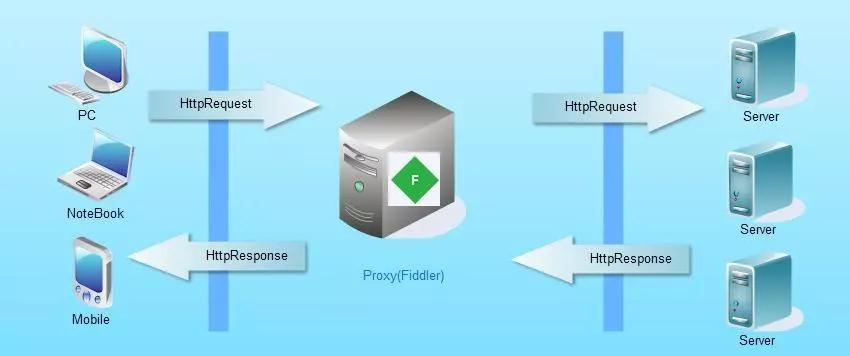
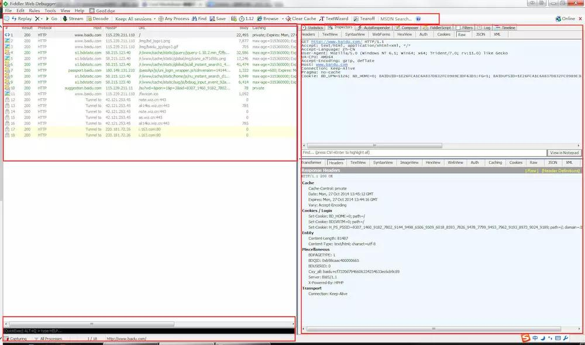
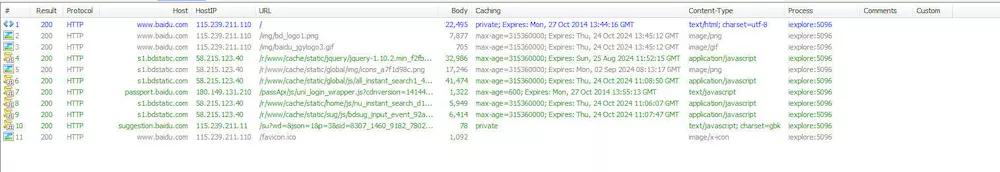
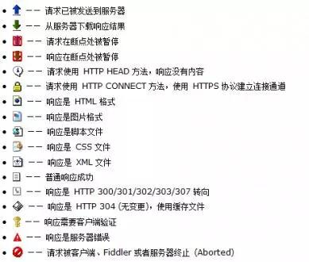
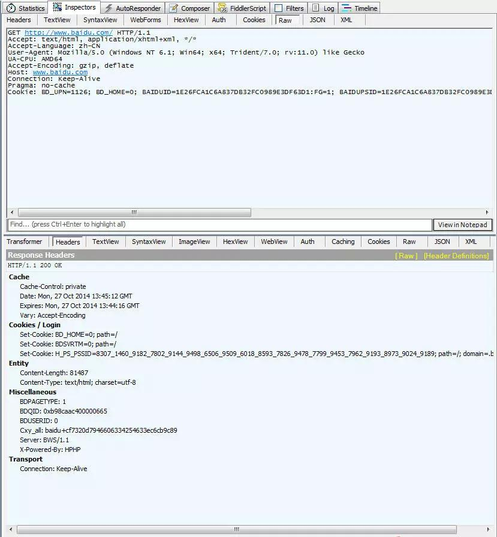
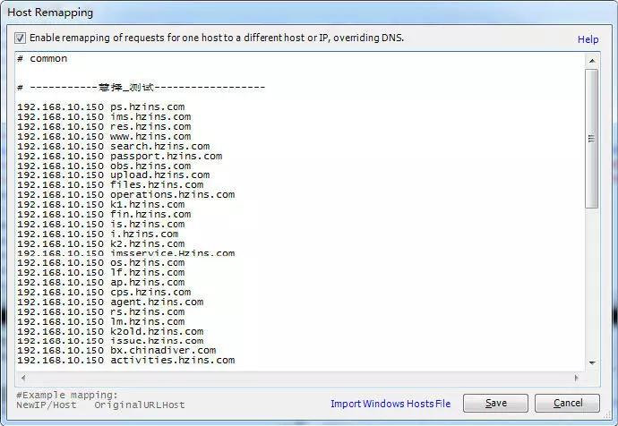

# 工具简介
**Fiddler [fidlər]（中文名称：小提琴）**
是一个HTTP的调试代理，以代理服务器的方式，监听系统的Http网络数据流动，
Fiddler可以也可以让你检查所有的HTTP通讯，设置断点，以及Fiddle所有的“进出”的数据（我一般用来抓包），
Fiddler还包含一个简单却功能强大的基于JScript .NET事件脚本子系统，它可以支持众多的HTTP调试任务。

Fiddler官方网站提供了大量的帮助文档和视频教程，这是学习Fiddler的最好资料。
- [下载地址](https://www.telerik.com/download/fiddler)
- [官方网站](http://www.telerik.com/fiddler)
- [官方文档](http://docs.telerik.com/fiddler/configure-fiddler/tasks/configurefiddler)
- [官方视频](https://www.youtube.com/playlist?list=PLvmaC-XMqeBbw72l2G7FG7CntDTErjbHc)
- [官方插件](http://www.telerik.com/fiddler/add-ons)

# 工作原理

Fiddler是以代理WEB服务器的形式工作的，浏览器与服务器之间通过建立TCP连接以HTTP协议进行通信，
浏览器默认通过自己发送HTTP请求到服务器，它使用代理地址:127.0.0.1, 端口:8888。
当Fiddler开启会自动设置代理， 退出的时候它会自动注销代理，这样就不会影响别的程序。
不过如果Fiddler非正常退出，这时候因为Fiddler没有自动注销，会造成网页无法访问。解决的办法是重新启动下Fiddler。

**fidder = 代理服务器：**
- 截取web端发送的请求，然后发送给服务器。
- 服务器返回的请求也要通过fidder传递给web端。

**两种代理模式：**
- 缓冲模式（Buffering Mode）Fiddler直到HTTP响应完成时才将数据返回给应用程序。可以控制响应，修改响应数据。但是时序图有时候会出现异常。
- 流模式（Streaming Mode）Fiddler会即时将HTTP响应的数据返回给应用程序。更接近真实浏览器的性能。时序图更准确，但是不能控制响应。

# 界面介绍
## 主界面


Fiddler的主界面分为工具面板（上）、会话面板（左）、监控面板（右）、状态面板（下）

## 工具面板


说明注释、重新请求、删除会话、继续执行、流模式/缓冲模式、解码、保留会话、监控指定进程、寻找、保存会话、切图、计时、打开浏览器、清除IE缓存、编码/解码工具、弹出控制监控面板、MSDN、帮助

## 会话面板


**会话面板图标**


## 监控面板


# 常用功能
## 用于 开发环境host配置（常用）
通常情况下，配置host需要改系统文件很不方便，在多个开发环境下切换很低效，Fiddler提供了相对高效的host配置方法。
```
Tools -> HOSTS -> Enable
```



## 用于 前后端接口测试（常用，和postman有点像）
通常情况下，调试前后端接口需真实的环境、一大堆假数据、写JavaScript代码。Fiddler只需一个UI界面进行配置即可。

## 用于 线上Bugfix
Fiddler可将发布文件代理到本地，快速定位线上BUG。

## 用于 性能分析和优化
Fiddler会提供请求的实际图，清晰明了网站需优化的部分。

# 参考资料
[Fiddler 教程](https://www.jianshu.com/p/99b6b4cd273c)