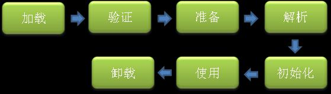
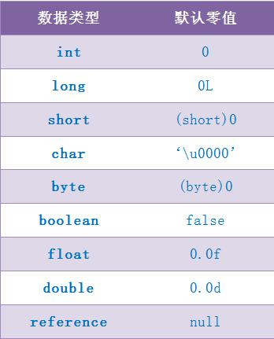

# 类加载过程
类从被加载到虚拟机内存中开始，到卸载出内存为止，它的整个生命周期包括：加载、验证、准备、解析、初始化、使用和卸载七个阶段。


其中类加载的过程包括了加载、验证、准备、解析、初始化五个阶段。在这五个阶段中，加载、验证、准备和初始化这四个阶段发生的顺序是确定的，而解析阶段则不一定，它在某些情况下可以在初始化阶段之后开始，这是为了支持 Java 语言的运行时绑定（也成为动态绑定或晚期绑定）。另外注意这里的几个阶段是按顺序开始，而不是按顺序进行或完成，因为这些阶段通常都是互相交叉地混合进行的，通常在一个阶段执行的过程中调用或激活另一个阶段。

这里简要说明下 Java 中的绑定：绑定指的是把一个方法的调用与方法所在的类(方法主体)关联起来，对 Java 来说，绑定分为静态绑定和动态绑定：
- 静态绑定：即前期绑定。在程序执行前方法已经被绑定，此时由编译器或其它连接程序实现。针对 Java，简单的可以理解为程序编译期的绑定。Java 当中的方法只有 final，static，private 和构造方法是前期绑定的。
- 动态绑定：即晚期绑定，也叫运行时绑定。在运行时根据具体对象的类型进行绑定。在 Java 中，几乎所有的方法都是后期绑定的。

--------------------------------------------------
**下面详细讲述类加载过程中每个阶段所做的工作。**

# 加载
加载时类加载过程的第一个阶段，在加载阶段，虚拟机需要完成以下三件事情：
- 通过一个类的全限定名来获取其定义的二进制字节流。
- 将这个字节流所代表的静态存储结构转化为方法区的运行时数据结构。
- 在 Java 堆中生成一个代表这个类的 java.lang.Class 对象，作为对方法区中这些数据的访问入口。

注意，这里第 1 条中的二进制字节流并不只是单纯地从 Class 文件中获取，比如它还可以从 Jar 包中获取、从网络中获取（最典型的应用便是 Applet）、由其他文件生成（JSP 应用）等。

相对于类加载的其他阶段而言，加载阶段（准确地说，是加载阶段获取类的二进制字节流的动作）是可控性最强的阶段，因为开发人员既可以使用系统提供的类加载器来完成加载，也可以自定义自己的类加载器来完成加载。

加载阶段完成后，虚拟机外部的 二进制字节流就按照虚拟机所需的格式存储在方法区之中，而且在 Java 堆中也创建一个 java.lang.Class 类的对象，这样便可以通过该对象访问方法区中的这些数据。

说到加载，不得不提到类加载器，下面就具体讲述下类加载器。

类加载器虽然只用于实现类的加载动作，但它在 Java 程序中起到的作用却远远不限于类的加载阶段。对于任意一个类，都需要由它的类加载器和这个类本身一同确定其在就 Java 虚拟机中的唯一性，也就是说，即使两个类来源于同一个 Class 文件，只要加载它们的类加载器不同，那这两个类就必定不相等。这里的“相等”包括了代表类的 Class 对象的 equals（）、isAssignableFrom（）、isInstance（）等方法的返回结果，也包括了使用 instanceof 关键字对对象所属关系的判定结果。

**站在 Java 虚拟机的角度来讲，只存在两种不同的类加载器：**
- 启动类加载器：它使用 C++ 实现（这里仅限于 Hotspot，也就是 JDK1.5 之后默认的虚拟机，有很多其他的虚拟机是用 Java 语言实现的），是虚拟机自身的一部分。
- 所有其他的类加载器：这些类加载器都由 Java 语言实现，独立于虚拟机之外，并且全部继承自抽象类 java.lang.ClassLoader，这些类加载器需要由启动类加载器加载到内存中之后才能去加载其他的类。

**站在 Java 开发人员的角度来看，类加载器可以大致划分为以下三类：**
- 启动类加载器：Bootstrap ClassLoader，跟上面相同。它负责加载存放在JDK\jre\li(JDK 代表 JDK 的安装目录，下同)下，或被-Xbootclasspath参数指定的路径中的，并且能被虚拟机识别的类库（如 rt.jar，所有的java.*开头的类均被 Bootstrap ClassLoader 加载）。启动类加载器是无法被 Java 程序直接引用的。
- 扩展类加载器：Extension ClassLoader，该加载器由sun.misc.Launcher$ExtClassLoader实现，它负责加载JDK\jre\lib\ext目录中，或者由 java.ext.dirs 系统变量指定的路径中的所有类库（如javax.*开头的类），开发者可以直接使用扩展类加载器。
- 应用程序类加载器：Application ClassLoader，该类加载器由 sun.misc.Launcher$AppClassLoader 来实现，它负责加载用户类路径（ClassPath）所指定的类，开发者可以直接使用该类加载器，如果应用程序中没有自定义过自己的类加载器，一般情况下这个就是程序中默认的类加载器。

应用程序都是由这三种类加载器互相配合进行加载的，如果有必要，我们还可以加入自定义的类加载器。因为 JVM 自带的 ClassLoader 只是懂得从本地文件系统加载标准的 java class 文件，**因此如果编写了自己的 ClassLoader，便可以做到如下几点：**
- 在执行非置信代码之前，自动验证数字签名。
- 动态地创建符合用户特定需要的定制化构建类。
- 从特定的场所取得 java class，例如数据库中和网络中。

事实上当使用 Applet 的时候，就用到了特定的 ClassLoader，因为这时需要从网络上加载 java class，并且要检查相关的安全信息，应用服务器也大都使用了自定义的 ClassLoader 技术。

**这几种类加载器的层次关系如下图所示：**


**这种层次关系称为类加载器的双亲委派模型。**

我们把每一层上面的类加载器叫做当前层类加载器的父加载器，当然，它们之间的父子关系并不是通过继承关系来实现的，而是使用组合关系来复用父加载器中的代码。该模型在 JDK1.2 期间被引入并广泛应用于之后几乎所有的 Java 程序中，但它并不是一个强制性的约束模型，而是 Java 设计者们推荐给开发者的一种类的加载器实现方式。

双亲委派模型的工作流程是：如果一个类加载器收到了类加载的请求，它首先不会自己去尝试加载这个类，而是把请求委托给父加载器去完成，依次向上，因此，所有的类加载请求最终都应该被传递到顶层的启动类加载器中，只有当父加载器在它的搜索范围中没有找到所需的类时，即无法完成该加载，子加载器才会尝试自己去加载该类。

使用双亲委派模型来组织类加载器之间的关系，有一个很明显的好处，就是 Java 类随着它的类加载器（说白了，就是它所在的目录）一起具备了一种带有优先级的层次关系，这对于保证 Java 程序的稳定运作很重要。例如，类java.lang.Object 类存放在JDK\jre\lib下的 rt.jar 之中，因此无论是哪个类加载器要加载此类，最终都会委派给启动类加载器进行加载，这边保证了 Object 类在程序中的各种类加载器中都是同一个类。

# 验证
验证的目的是为了确保 Class 文件中的字节流包含的信息符合当前虚拟机的要求，而且不会危害虚拟机自身的安全。不同的虚拟机对类验证的实现可能会有所不同，但大致都会完成以下四个阶段的验证：**文件格式的验证、元数据的验证、字节码验证和符号引用验证**。

- 文件格式的验证：验证字节流是否符合 Class 文件格式的规范，并且能被当前版本的虚拟机处理，该验证的主要目的是保证输入的字节流能正确地解析并存储于方法区之内。经过该阶段的验证后，字节流才会进入内存的方法区中进行存储，后面的三个验证都是基于方法区的存储结构进行的。
- 元数据验证：对类的元数据信息进行语义校验（其实就是对类中的各数据类型进行语法校验），保证不存在不符合 Java 语法规范的元数据信息。
- 字节码验证：该阶段验证的主要工作是进行数据流和控制流分析，对类的方法体进行校验分析，以保证被校验的类的方法在运行时不会做出危害虚拟机安全的行为。
- 符号引用验证：这是最后一个阶段的验证，它发生在虚拟机将符号引用转化为直接引用的时候（解析阶段中发生该转化，后面会有讲解），主要是对类自身以外的信息（常量池中的各种符号引用）进行匹配性的校验。

# 准备
准备阶段是正式为类变量分配内存并设置类变量初始值的阶段，这些内存都将在方法区中分配。对于该阶段有以下几点需要注意：
- 这时候进行内存分配的仅包括类变量（static），而不包括实例变量，实例变量会在对象实例化时随着对象一块分配在 Java 堆中。
- 这里所设置的初始值通常情况下是数据类型默认的零值（如 0、0L、null、false 等），而不是被在 Java 代码中被显式地赋予的值。

假设一个类变量的定义为：
```
public static int value = 3；
```
那么变量 value 在准备阶段过后的初始值为 0，而不是 3，因为这时候尚未开始执行任何 Java 方法，而把 value 赋值为 3 的 putstatic 指令是在程序编译后，存放于类构造器 （）方法之中的，所以把 value 赋值为 3 的动作将在初始化阶段才会执行。

下表列出了 Java 中所有基本数据类型以及 reference 类型的默认零值：



这里还需要注意如下几点：
- 对基本数据类型来说，对于类变量（static）和全局变量，如果不显式地对其赋值而直接使用，则系统会为其赋予默认的零值，而对于局部变量来说，在使用前必须显式地为其赋值，否则编译时不通过。
- 对于同时被 static 和 final 修饰的常量，必须在声明的时候就为其显式地赋值，否则编译时不通过；而只被 final 修饰的常量则既可以在声明时显式地为其赋值，也可以在类初始化时显式地为其赋值，总之，在使用前必须为其显式地赋值，系统不会为其赋予默认零值。
- 对于引用数据类型 reference 来说，如数组引用、对象引用等，如果没有对其进行显式地赋值而直接使用，系统都会为其赋予默认的零值，即null。
- 如果在数组初始化时没有对数组中的各元素赋值，那么其中的元素将根据对应的数据类型而被赋予默认的零值。